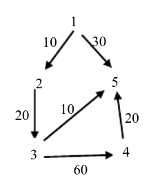

[【参考】](https://zdszero.github.io/posts/ustc-test-2015/)

## 2015年

### 1. 字符组合【回溯】

输出 abcdefghij 任取 5 个字符所有**组合**，不能有重复，输出到控制台

```
格式：
第 1 种组合：a,b,c,d,e
第 n 种组合：....
......
// 252 
```

```cpp
#include<cstdio>
#include<vector>
#include<string>
using namespace std;
string s="abcdefghij";
int cnt=0;
void backtracking(vector<char> ans,int idx,int target)
{
    if(target==0){
        printf("第%-3d种组合: ",++cnt);
        for(int i=0;i<4;i++)	printf("%c,",ans[i]);
        printf("%c\n",ans[4]);
    }
    for(int i=idx;i<s.size();i++){
        ans.push_back(s[i]);
        backtracing(ans,i+1,target-1);
        ans.pop_back();
    }
}
int main()
{
    vector<char> ans;
    backtracking(ans,0,5);
    return 0;
}
```


### 2.模拟测试系统【随机数】

设计一个模拟测试系统。输出 0-50 以内 2 个随机数的加或减。从键盘输入答案，每题有2次机会，第一次答对得10分，第二次答对得5分，总共10题，最终输出总得分。

```cpp
#include<iostream>
#include<time.h>
using namespace std;

const int QNUM=10;
const char opname[]={'+','-'};
int main()
{
    srand((unsigned)time(NULL));

    int score=0;
    for(int i=0;i<QNUM;i++)
    {
        int op1=rand()%50;
        int op2=rand()%50;
        int opx=rand()%2;
        int flag=0; // 记录回答次数
        do{
            printf("Question %d: %d %c %d = ?",i+1,op1,opname[opx],op2);
            int input;
            cin>>input; // 输入答案
        	int ans=opname[opx]=='+'?op1+op2:op1-op2; // 计算正确答案
        	if(input==ans) // 答对
            {
                printf("RIGHT ANSWER\n");
                score+=flag==0?10:5;
                break;
            }
            else
            {
                printf("ERROR ANSWER\n");
                flag++;
            }
        }while(flag<2); // 答错则再答一次
        cout<<endl;
    }
    printf("最终得分：%d",score);
    return 0;
}
```

### 3. 树的层次遍历【树】

输出树的层次遍历的奇数层的所有结点。从`input.txt`输入，输出到`output.txt`。

```cpp
输入格式：
A B C
B E
C F G

树
    A
   / \
  B   C
 /   / \
E   F   G

输出格式：
第 1 层结点：A
第 3 层结点：E,F,G
```

```cpp
#include<fstream>
#include<cstdio>
#include<queue>
#include<unordered_map>
using namespace std;

struct node{
    char val;
    node* lchild;
    node* rchild;
    node(char ch):val(ch),lchild(NULL),rchild(NULL){} // 定义构造函数
};
void BFS(node* root)
{
    if(root==NULL) return ;
    int deep=0; // 记录遍历到的树的层数
    queue<node*> Q;
    Q.push(root);
    while(!Q.empty()){
        deep++;
        if((deep&1)==1) printf("第 %d 层结点: ",deep);
        int n=Q.size();
        while(n){
            node* cur=Q.front();
            Q.pop();
            if((deep&1)==1){ // 奇数层的结点则输出
                printf("%c ",cur->val);
            }
            if(cur->lchild!=NULL) Q.push(cur->lchild);
            if(cur->rchild!=NULL) Q.push(cur->rchild);
            n--;
        }
        if((deep&1)==1) printf("\n");
    }
}
int main()
{
    ifstream ifs("input.in");
    ofstream ofs("output.out");
    string line;
    unordered_map<char,node*> tree; // 记录每个字符对应的根节点
    char rootf; // 记录根节点的字符
    int i=0; // 记录读入的行数，方便找到根节点
    while(getline(ifs,line)) // 一行读入根节点 左孩子 右孩子
    {
        if(i==0) rootf=line[0]; // 记录根节点的字符

        // 查询根节点 不存在则创建
        auto iter=tree.find(line[0]);
        if(iter==tree.end())	{
            node* r=new node(line[0]);
            tree.emplace(line[0],r);
            iter=tree.find(line[0]);
        }
        // 找到根节点以后添加左右孩子结点
        int len=line.size();
        node* l=NULL,*r=NULL;
        if(len>=3) {
            l=new node(line[2]);
            tree.emplace(line[2],l);
        }
        if(len>=5) {
            r=new node(line[4]);
            tree.emplace(line[4],r);
        }
        iter->second->lchild=l;
        iter->second->rchild=r;

        i++;
    }
    // 层序遍历二叉树
    BFS(tree.find(rootf)->second);
    return 0;
}
```

```cpp
#include<fstream>
#include<cstdio>
#include<queue>
using namespace std;

struct node{
    char val;
    node* lchild;
    node* rchild;
    node(char ch):val(ch),lchild(NULL),rchild(NULL){} // 定义构造函数
};
void BFS(node* root)
{
    if(root==NULL) return ;
    int deep=0; // 记录遍历到的树的层数
    queue<node*> Q;
    Q.push(root);
    while(!Q.empty()){
        deep++;
        if((deep&1)==1) printf("第 %d 层结点: ",deep);
        int n=Q.size();
        while(n){
            node* cur=Q.front();
            Q.pop();
            if((deep&1)==1){ // 奇数层的结点则输出
                printf("%c ",cur->val);
            }
            if(cur->lchild!=NULL) Q.push(cur->lchild);
            if(cur->rchild!=NULL) Q.push(cur->rchild);
            n--;
        }
        if((deep&1)==1) printf("\n");
    }
}
node* insertNode(node* root,node* new_node){

    if(root==NULL) return new_node;
    if(new_node==NULL) return root;
    //printf("%c ",new_node->val);
    // 层序遍历查找结点
    queue<node*> Q;
    Q.push(root);
    while(!Q.empty()){
        node* cur=Q.front();
        Q.pop();
        if(cur->val==new_node->val) // 查找到对应的根节点 则插入左右结点
        {
            if(new_node->lchild!=NULL) cur->lchild=new node(new_node->lchild->val);
            if(new_node->rchild!=NULL) cur->rchild=new node(new_node->rchild->val);
            return root;
        }
        if(cur->lchild!=NULL) Q.push(cur->lchild);
        if(cur->rchild!=NULL) Q.push(cur->rchild);
    }
    return root;
}
int main()
{
    ifstream ifs("input.in");
    ofstream ofs("output.out");
    string line;
    node *root=NULL;
    // 构造二叉树
    while(getline(ifs,line)) // 一行读入根节点 左孩子 右孩子
    {
        int len=line.size();
        node* r=new node(line[0]);
        if(len>=3) r->lchild=new node(line[2]);
        if(len>=5) r->rchild=new node(line[4]);
        root=insertNode(root,r); // 插入此结点
    }
    // 层序遍历二叉树
    BFS(root);
    return 0;
}
```


### 4. 最短路径

从文件`input_4.txt`输入一个图，要求输出从1经过k到n的最短路径，可以有环，输出到文件`output_4.txt`。

```
输入：
n=5
k=3
1 2 10 5 30
2 3 20
3 4 60 5 10
4 5 20
5
输出：
1 2 3 5
```

思路：利用dijstra算法分别计算1-k,k-n之间的最短路径



```cpp
#include<fstream>
#include<sstream>
#include<cstdio>
#include<vector>
#include<queue>
#include<climits>
using namespace std;
const int INF=INT_MAX>>1;
int n,k;
ifstream ifs("input.in");
ofstream ofs("output.out");
vector<int> dijstra(vector<vector<int> > &g,int start)
{
    vector<int> path(n+1,INF);
    vector<int> parent(n+1,-1);
    vector<bool> visited(n+1,false);
    priority_queue<int,vector<int>,greater<int> > Q; // 小顶堆
    Q.push(start);
    path[start]=0;
    int num=n; // 记录当前剩余未找到最短路径的顶点个数
    while(num)
    {
        // 取出路径最小的顶点进行访问
        int u,min_path=INF;
        for(int i=1;i<=n;i++){
            if(visited[i]==false&&path[i]<min_path)   {
                min_path=path[i];
                u=i;
            }
        }
        visited[u]=true; // 表示该节点已经找到最短路径
        num--;
        for(int v=1; v<=n; v++) // 遍历相邻的顶点 更新最短路径数组
        {
            if(g[u][v]==INF||visited[v]==true) continue;
            if(g[u][v]+path[u]<path[v])
            {
                path[v]=g[u][v]+path[u]; // 更新从u到达v的最短路径
                parent[v]=u; // 更新最短路径的父节点
            }
        }
    }
    return parent;
}
int main()
{
    ifs.ignore(2);
    ifs >> n;
    ifs.ignore(3);
    ifs >> k;
    ifs.ignore(1);
    printf("%d %d \n",n,k);
    vector<vector<int>> g(n+1, vector<int>(n+1, INF)); // 邻接矩阵记录有向图
    string line;
    while (getline(ifs, line))
    {
        istringstream iss(line);
        int from, to, w;
        iss >> from;
        g[from][from]=0;
        while (iss >> to >> w)
        {
            g[from][to] = w;
        }
    }
    vector<int> parent1=dijstra(g,1); // 求以1为起点 达到所有的结点的最短路径
    vector<int> parent2=dijstra(g,k); // 求以k为起点 到达所有结点的最短路径
    vector<int> ans; // 记录最短路径的顺序
    // k--->n
    ans.push_back(n);
    for(int i=n;i>k+1;i--) ans.push_back(parent2[i]);
    // 1-->k
    for(int i=k;i>1;i--)   ans.push_back(parent1[i]);

    for(int i=ans.size()-1;i>=0;i--)  printf("%d ",ans[i]);

    return 0;
}
```

- Floyd算法

```cpp
#include <vector>
#include <fstream>
#include <sstream>
#include <climits>
using namespace std;

int main(int argc, char *argv[])
{
    ifstream ifs("input.in");
    ofstream ofs("output.out");
    int n, k;
    ifs.ignore(2);
    ifs >> n;
    ifs.ignore(3);
    ifs >> k;
    ifs.ignore(1);
    vector<vector<int>> g(n+1, vector<int>(n+1, INT_MAX));
    vector<vector<int>> next(n+1, vector<int>(n+1, 0));
    for (int i = 1; i <= n; i++)
    {
        g[i][i] = 0;
        next[i][i] = i;
    }
    string line;
    while (getline(ifs, line))
    {
        istringstream iss(line);
        int src, dst, distance;
        iss >> src;
        while (iss >> dst >> distance)
        {
            g[src][dst] = distance;
            next[src][dst] = dst;
        }
    }
    // 利用弗洛伊德算法计算多源最短路径
    for (int x = 1; x <= n; x++)
    {
        for (int i = 1; i <= n; i++)
        {
            for (int j = 1; j <= n; j++)
            {
                if (g[i][x] == INT_MAX || g[x][j] == INT_MAX)
                    continue;
                int sum = g[i][x] + g[x][j];
                if (sum < g[i][j])
                {
                    g[i][j] = sum;
                    next[i][j] = x;
                }
            }
        }
    }
    int cur = 1;
    ofs << cur;
    while (cur != k)
    {
        cur = next[cur][k];
        ofs << " " << cur;
    }
    while (cur != n)
    {
        cur = next[cur][n];
        ofs << " " << cur;
    }
    return 0;
}
```

