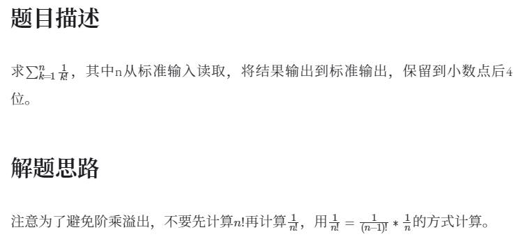
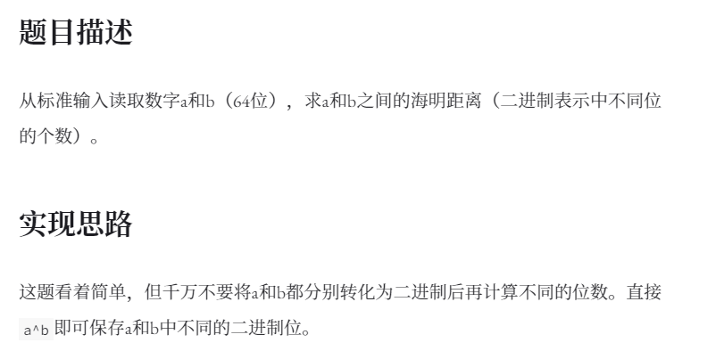
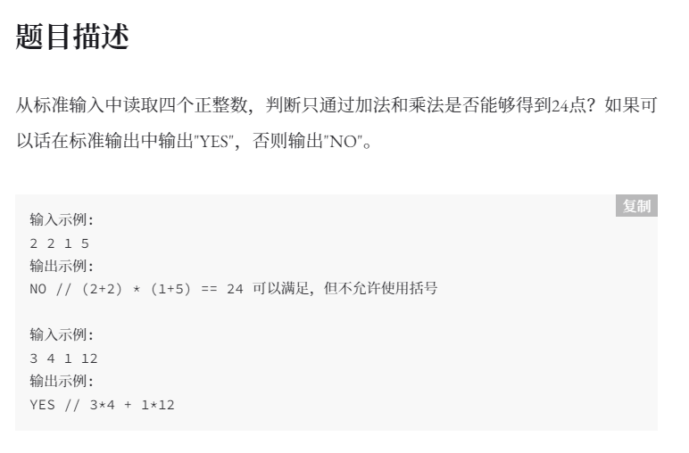

# USTC计科复试刷题记录

[【参考】](https://zdszero.github.io/posts/ustc-test-2021/)

## 2021专硕

### 1. 阶乘  【数学】



```C++
#include<cstdio>

int main(){
    int n;
    scanf("%d",&n);
    double sum=1.0;
    double multip=1.0;
    for(int k=2;k<=n;k++)
    {
        multip/=k;
        sum+=multip;
    }
    printf("%.4lf\n",sum);
    return 0;
}
```

### 2.海明距离 【数学  二进制】



```c++
#include<cstdio>

int main(){

    // 二进制表示中不同位的个数
    long long int a,b; // long long进入了c++11标准，定义为位数不低于64位
    scanf("%lld %lld",&a,&b);
    long long int num=a^b; // 相同则为1 不同则为0

    int count=0;
    while(num!=0){
        count+=(num&1);
        num=num>>1;
    }
    printf("%d",count);
    return 0;
}
```

### 3. 24点   【回溯法】



```
输入：2 2 1 5
输出：NO

输入：3 4 1 12
输出：YES
```


```c++
#include<cstdio>
#include<vector>

using namespace std;
#define VEC vector<pair<int,bool> >

bool judge24point(VEC cards){
    int n=cards.size();
    if(n==1) return cards[0].first==24; // 只剩下一个元素时即可认为该数字为最终结果
    for(int i=0;i<n;i++){ // 选择两个操作数
        for(int j=i+1;j<n;j++){
            // 将剩下的操作数以及运算结果加入临时变量，递归调用
            VEC temp;
            for(int k=0;k<n;k++){
                if(k==i||k==j) continue;
                temp.push_back(cards[k]);
            }
            // 尝试+
            temp.push_back(make_pair(cards[i].first+cards[j].first,true));
            if(judge24point(temp)) return true;
            temp.pop_back();

            // 尝试*
            // 如果两个操作数都是加法得到的 则跳过这种情况 因为没有括号
            if(cards[i].second&&cards[j].second) continue; 
            temp.push_back(make_pair(cards[i].first*cards[j].first,false));
            if(judge24point(temp)) return true;
            temp.pop_back();
        }
    }
    return false; // 所有情况都尝试过后 说明没有符合要求的
}

int main(){

    //从标准输入中读取四个正整数，判断只通过加法和乘法是否能够得到24点？
    //如果可以话在标准输出中输出"YES"，否则输出"NO"。
    VEC cards;
    for(int i=0;i<4;i++){
        int num;
        scanf("%d",&num);
        cards.push_back(make_pair(num,false)); // false表示该数字不是通过加法得到
    }
    if(judge24point(cards))s
        printf("YES\n");
    else
        printf("NO");
    return 0;
}
```

### 4. 进制转换 【数学】

从标准输入读取一个十进制正整数，将该整数转化为七进制输出到标准输出。

```c++
#include<cstdio>
#include<vector>
using namespace std;

int main(){
    int num;
    scanf("%d",&num);
    vector<int> ans;
    while(num!=0){
        ans.push_back(num%7); // 得到的余数是倒的
        num/=7;
    }
    for(int i=ans.size()-1;i>=0;i--)
        printf("%d",ans[i]);
    return 0;
}
```

## 2021学硕

###  1. 全排列【回溯】

来源：【[Leetcode](https://leetcode-cn.com/problems/permutations/)】

给定一个不含重复数字的数组 `nums` ，返回其 *所有可能的全排列* 。你可以 **按任意顺序** 返回答案。

```
输入：1 2 3
输出：
1 2 3
1 3 2
2 1 3
2 3 1
3 1 2
3 2 1
```

```cpp
#include<cstdio>
#include<vector>

using namespace std;

void backtracking(vector<int> cur,vector<int> target) // cur表示当前已经加入数组的元素，target表示余下的元素
{
    if(target.size()==0){ // 无剩余元素则将其打印出来
        for(int i=0;i<cur.size();i++)   printf("%d ",cur[i]);
        printf("\n");
        return ;
    }
    for(int i=0;i<target.size();i++) // 遍历当前的数组
    {
        cur.push_back(target[i]);
        vector<int> temp;
        for(int j=0;j<target.size();j++) // 将剩余元素加入临时数组作为下轮递归的目标数组
        {
            if(i==j) continue;
            temp.push_back(target[j]);
        }
        backtracking(cur,temp);

        cur.pop_back(); // 回溯
    }
}

int main()
{
    int x;
    vector<int> nums,cur;
    while(scanf("%d",&x))
    {
        //printf("%d ",x);
        nums.push_back(x);
    }
    backtracking(cur,nums);
    return 0;
}
```


### 2. N皇后【回溯】

来源：【[Leetcode](https://leetcode-cn.com/problems/n-queens/)】


### 3. 字符串查询


### 4. 最大无冲突序列【DP】


