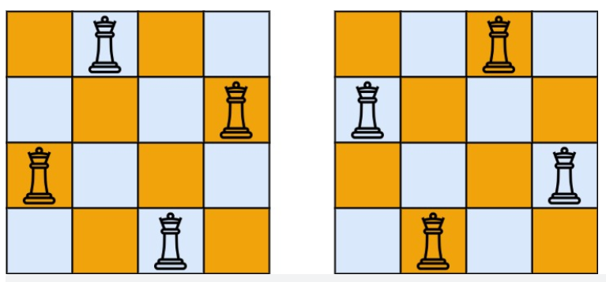

## 哈希表

### 1. 旧键盘打字

> **题目描述：**
> 旧键盘上有几个键损坏了，在输入一段文字时，对应的字符不会出现。现在给出应该输入的一段文字以及实际被输入的文字，请列出那些肯定坏掉的键。
> **输入格式：**
> 在两行中分别给出应该输入的文字以及实际被输入的文字。每段文字是不超过 80 个字符的串，由字母A～Z（包括大、小写）、数字 0~9以及下画线“_”（代表空格）组成。题目保证两个字符串均非空。
> **输出格式：**
> 按照发现顺序，在一行中输出坏掉的键。其中英文字母只输出大写，每个坏键只输出 1次。题目保证至少有1个坏键。

输入样例

```
7_this_is_a_test
_hs_s_a_es
```

输出样例

```
7TI
```

```cpp
#include<cstdio>
#include<cstring>

int main()
{
    bool hashTable[128]={false}; // 标记字符是否已经输出
    char str1[100];
    char str2[100];
    gets(str1);
    gets(str2);

    int i=0,j=0;
    while(i<strlen(str1)&&j<strlen(str2))
    {
        if(str1[i]<'z'&&str1[i]>'a') str1[i]=str1[i]-'a'+'A'; // 将小写字符变为大写
        if(str2[j]<'z'&&str2[j]>'a') str2[j]=str2[j]-'a'+'A';
        if(str1[i]==str2[j])
        {
            j++; // 两个字符串出现字符相同 则扫描下一个字符
        }
        else if(hashTable[str1[i]]==false)
        {
            printf("%c",str1[i]); // 两个字符不同且未输出过
            hashTable[str1[i]]=true; // 标记该字符已经输出
        }
        i++; //查看下一个字符
    }
    return 0;
}
```

## 动态规划

### 1. [数字金字塔](https://www.luogu.com.cn/problem/P1216)

```
输入：
5
7
3 8
8 1 0
2 7 4 4
4 5 2 6 5 
输出：30
```


```cpp
#include<cstdio>
#include<cstring>
#include<iostream>
using namespace std;

int main()
{
    int n;
    scanf("%d",&n); // 金字塔行数
    int dp[n][n]; // dp[i][j]表示从第1行到（i,j）的最长路径
    memset(dp,0, sizeof(dp)); // 数组初始化

    for(int i=0;i<n;i++)
    {
        for(int j=0;j<i+1;j++)
        {
            scanf("%d",&dp[i][j]); // 读入金字塔
            if(i>0){
                if(j==0) dp[i][j]+=dp[i-1][j]; // 每行第一列（除第一行以外） 直接加上上一行的路径
                else
                    dp[i][j]+=max(dp[i-1][j-1],dp[i-1][j]); // 取两肩最大的路径值
            }
        }
    }
    int maxPath=0;
    for(int i=0;i<n;i++)
    {
        maxPath=max(dp[n-1][i],maxPath); // 找到最后一行的最大值
    }
    printf("%d",maxPath);
    return 0;
}
```

### 2. [爬楼梯](https://leetcode-cn.com/problems/climbing-stairs/description/)

假设你正在爬楼梯。需要 `n` 阶你才能到达楼顶。

每次你可以爬 `1` 或 `2` 个台阶。你有多少种**不同的方法**可以爬到楼顶呢？

```
输入：n = 3
输出：3
解释：有三种方法可以爬到楼顶。
1. 1 阶 + 1 阶 + 1 阶
2. 1 阶 + 2 阶
3. 2 阶 + 1 阶
```

- 递归

```cpp
#include<cstdio>

int solve(int n)
{
    if(n<1) return 0;
    else if(n==1) return 1;// 1
    else if(n==2) return 2;// 1+1 或者 2
    else{
        return solve(n-1)+solve(n-2);
    }
}

int main()
{
    int n; // 楼梯层数
    scanf("%d",&n);
    printf("%d",solve(n));

    return 0;
}
```

- 动态规划

```cpp
#include<cstdio>

int solve(int n)
{
    if(n<1) return 0;
    else if(n==1) return 1;
    else if(n==2) return 2;
    else
    {
        int dp[n+1];
        dp[0]=0;
        dp[1]=1;
        dp[2]=2;
        for(int i=3; i<n+1; i++)
        {
            dp[i]=dp[i-1]+dp[i-2];
        }
        return dp[n];
    }
}

int main()
{
    int n; // 楼梯层数
    scanf("%d",&n);
    printf("%d",solve(n));
    return 0;
}

```

### 3. [打家劫舍](https://leetcode-cn.com/problems/house-robber-ii/description/)

$ i==j，dp[i][j]=nums[i]$

$i!=j,dp[i][j]=max(nums[j]+dp[i][j-2],dp[i][j-1])$

```cpp
#include<cstdio>
#include<cstring>
#include<vector>

using namespace std;

int solve(vector<int> nums)
{
    int n=nums.size();
    if(n==1) return nums[0];
    int dp[n][n];// dp[i][j]表示偷盗房屋[i,j]的最大金额
    memset(dp,0,sizeof(dp));
    for(int i=0; i<n; i++)
    {
        dp[i][i]=nums[i];
    }
    for(int j=0; j<n; j++)
    {
        for(int i=0; i<j; i++)
        {
            int steal;
            int n_steal;
            steal=nums[j]+(j-2>=0?dp[i][j-2]:0); // 偷盗房屋j 此时可偷房屋为i~j-2
            n_steal=j-1>=0?dp[i][j-1]:0; // 不偷房屋j 此时可偷房屋为i~j-1
            dp[i][j]=steal>n_steal?steal:n_steal; // 取两种策略的最大金额
        }
    }
    for(int i=0; i<n; i++)
    {
        for(int j=0; j<n; j++)
            printf("%d ",dp[i][j]);
        printf("\n");
    }
    return dp[1][n-1]>dp[0][n-2]?dp[1][n-1]:dp[0][n-2]; // 从0到n-1的房屋能偷盗的最大金额
}

int main()
{
    int n; //房屋数量
    scanf("%d",&n);
    vector<int> nums(n);
    for(int i=0; i<n; i++)
    {
        scanf("%d",&nums[i]);
    }

    printf("%d",solve(nums));
    return 0;
}
```

$dp[i]=max(nums[i]+dp[i-2],dp[i-1])$

$nums[i]表示房屋i的金额,dp[i]表示从房屋0到i偷盗的最大金额$

```cpp
#include<cstdio>
#include<vector>
#include<cstring>
using namespace std;

int solve(vector<int> nums)
{
    int n=nums.size();
    if(n==1) return nums[0];
    if(n==0) return 0;
    int dp[n];
    memset(dp,0,sizeof(dp));
    // 偷取第一个房屋
    dp[0]=nums[0];
    for(int i=1;i<n;i++)
    {
        int steal=nums[i]+(i-2>=0?dp[i-2]:0); // 偷取房屋i
        int n_steal=i-1>=0?dp[i-1]:0; // 不偷房屋i
        dp[i]=steal>n_steal?steal:n_steal; // 取两种策略的最大值
    }
    int ans=dp[n-2]; // 最后一个房屋不能偷
    memset(dp,0,sizeof(dp));
    // 不偷第一个房屋
    dp[0]=0;
    for(int i=1;i<n;i++)
    {
        int steal=nums[i]+(i-2>=0?dp[i-2]:0); // 偷取房屋i
        int n_steal=i-1>=0?dp[i-1]:0; // 不偷房屋i
        dp[i]=steal>n_steal?steal:n_steal; // 取两种策略的最大值
    }
    return ans>dp[n-1]?ans:dp[n-1];
}
int main()
{
    int n; //房屋数量
    scanf("%d",&n);
    vector<int> nums(n);
    for(int i=0; i<n; i++)
    {
        scanf("%d",&nums[i]);
    }

    printf("%d",solve(nums));
    return 0;
}
```

### 4.[最小路径和](https://leetcode-cn.com/problems/minimum-path-sum/)

```
输入：
3 3
1 3 1
1 5 1
4 2 1
输出：7
解释：因为路径 1→3→1→1→1 的总和最小。


输入：
2 3
1 2 3
4 5 6
输出：12
```

```cpp
#include<cstdio>
#include<vector>
#include<cstring>
#include <iostream>

using namespace std;
int m,n;
int minPathSum(vector<vector<int>>& grid)
{
	int dp[m][n]; // dp[i][j]表示当前(0,0)到(i,j)最小路径和
    memset(dp,127,sizeof(dp)); // 初始化为无穷大
    dp[0][0]=grid[0][0];
    for(int i=0;i<m;i++)
    {
        for(int j=0;j<n;j++)
        {
            if(j+1<n) // 向右移动
                dp[i][j+1]=min(dp[i][j]+grid[i][j+1],dp[i][j+1]);

            if(i+1<m) // 向下移动
                dp[i+1][j]=min(dp[i][j]+grid[i+1][j],dp[i+1][j]);
        }
    }
    return dp[m-1][n-1];
}
int main()
{
    scanf("%d %d",&m,&n);
    vector<vector<int> > grid(m,vector<int>(n));
    for(int i=0;i<m;i++)
    {
        for(int j=0;j<n;j++)
            scanf("%d",&grid[i][j]);
    }
    printf("%d",minPathSum(grid));
    return 0;
}
```

### 5. [等差数列划分](https://leetcode-cn.com/problems/arithmetic-slices/)

```
输入：nums = [1,2,3,4]
4
1 2 3 4
输出：3
解释：nums 中有三个子等差数组：[1, 2, 3]、[2, 3, 4] 和 [1,2,3,4] 自身。

输入：[1,2,3,8,9,10]
6
1 2 3 8 9 10
输出：2
```

```cpp
#include<cstdio>
#include<vector>
#include<cstring>
using namespace std;

int solve(vector<int> nums)
{
    int n=nums.size();
    if(n<3) return 0;
    int dp[n]; // dp[i]表示0~i区间的等差区间数
    memset(dp,0,sizeof(dp));
    for(int i=2; i<n; i++)
    {
        if(nums[i]-nums[i-1]==nums[i-1]-nums[i-2])
            dp[i]=dp[i-1]+1;
    }
    //因为递增子区间不一定以最后一个元素为结尾，可以是任意一个元素结尾，因此需要返回 dp 数组累加的结果。
    int cnt=0;
    for(int i=0;i<n;i++)
    {
        printf("%d ",dp[i]);
        cnt+=dp[i];
    }
    return cnt;
}

int main()
{
    int n;
    scanf("%d",&n);
    vector<int> nums(n);
    for(int i=0; i<n; i++)
    {
        scanf("%d",&nums[i]);
    }
    printf("%d",solve(nums));
    return 0;
}
```

### 6. [整数拆分](https://leetcode-cn.com/problems/integer-break/)

给定一个正整数 `n` ，将其拆分为 `k` 个 **正整数** 的和（ `k >= 2` ），并使这些整数的乘积最大化。

返回 *你可以获得的最大乘积* 。

```
输入: 2
输出: 1
解释: 2 = 1 + 1, 1 × 1 = 1。
```

```
输入: 10
输出: 36
解释: 10 = 3 + 3 + 4, 3 × 3 × 4 = 36。
```

```cpp
#include<cstdio>
#include<vector>
#include<cmath>
using namespace std;

int integerBreak(int n)
{
    if(n==1||n==2)
        return 1;
    else if(n==3)
        return 2;
    //分解为2 和3 相乘
    int a=n/3;
    int b=n%3;
    if(b==1)
    {
        return pow(3,a-1)*4; // 注意pow返回double类型
    }
    else if(b==2)
        return pow(3,a)*2;
    else
        return pow(3,a);
}
int main()
{
    int n;
    scanf("%d",&n);
    printf("%d",integerBreak(n));
    return 0;
}
```

```cpp
#include<cstdio>
#include<vector>
#include<cmath>
#include<iostream>
using namespace std;

int solve(int n)
{
    int dp[n+1]= {0}; // dp[i]表示 i拆分后的最大乘积
    dp[1] = 1;
    for(int i=2; i<=n; i++)
    {
        for (int j = 1; j <= i - 1; j++)
        {
            int m1=j * dp[i - j]; // 策略1: 拆分成 j, i-j,其中i-j继续拆分
            int m2=j*(i-j); // 策略2: 只拆分成两部分 j,i-j
            // 取两种策略中最大的 与 当前最大值比较 取最大
            dp[i] = max(dp[i], max(m1,m2));
        }
    }
    return dp[n];
}

int main()
{
    int n;
    scanf("%d",&n);
    printf("%d",solve(n));
    return 0;
}
```


### 7. [完全平方数](https://leetcode-cn.com/problems/perfect-squares/)

给你一个整数 n ，返回 和为 n 的完全平方数的**最少数量** 。

完全平方数 是一个整数，其值等于另一个整数的平方；换句话说，其值等于一个整数自乘的积。例如，1、4、9 和 16 都是完全平方数，而 3 和 11 不是。

```
输入：12
输出：3 
解释：12 = 4 + 4 + 4
```

```
输入：13
输出：2
解释：13 = 4 + 9
```

```cpp
#include<cstdio>
#include<vector>
#include<cmath>
#include<iostream>
using namespace std;

int solve(int n)
{
    int dp[n+1]; // dp[i]表示和为i的完全平方数的最少数量
    memset(dp,127,sizeof(dp)); // 初始化为最大值
    dp[0]=0;
    dp[1]=1;
    for(int i=2;i<=n;i++)
    {
        for(int j=sqrt(i);j>=1;j--)  // 从可能的最大的平方数开始测试
        {
            dp[i]=min(dp[i],1+dp[i-j*j]);
        }
    }
    return dp[n];
}

int main()
{
    int n;
    scanf("%d",&n);
    printf("%d",solve(n));
    return 0;
}
```


### 8. [最长递增子序列](https://leetcode-cn.com/problems/longest-increasing-subsequence/)

给你一个整数数组 nums ，找到其中最长严格递增子序列的长度。

子序列 是由数组派生而来的序列，删除（或不删除）数组中的元素而不改变其余元素的顺序。例如，[3,6,2,7] 是数组 [0,3,1,6,2,2,7] 的子序列。

```
输入：
8
10 9 2 5 3 7 101 18
输出：4
解释：最长递增子序列是 [2,3,7,101]，因此长度为4。

输入：
18
7 7 7 7 7 7 7 0 1 3 7 8 0 2 3 4 5 9
输出：7
```

- 贪心 + 二分查找

```cpp

```

- 动态规划

思路：dp[i]表示选择nums[i]，并且以nums[i]结尾的最长上升子序列的长度。两层循环，i：1～nums.length，

j：0～i，如果nums[i] > nums[j]，则构成一个上升对，dp[i]就从dp[i], dp[j]+1两个种选择较大者，最后返回dp数组总的最大数

```cpp
#include<iostream>
#include<cstdio>
#include<vector>
#include<cstring>

using namespace std;
int solve(vector<int> nums)
{
    int n=nums.size();
    int dp[n]; //dp[i]表示选择nums[i]，并且以nums[i]结尾的最长上升子序列的长度
    memset(dp,0,sizeof(dp));
    dp[0]=1;
    for(int i=1;i<n;i++)
    {
        for(int j=0;j<i;j++)
        {
            if(nums[i]>nums[j])
                dp[i]=max(dp[i],1+dp[j]);
        }
    }
    int ans=0;
    for(int i=0;i<n;i++)
    {
        if(ans<dp[i])
            ans=dp[i];
    }
    return ans;
}
int main()
{
    int n;
    scanf("%d",&n);
    vector<int> nums(n);
    for(int i=0;i<n;i++)
    {
        scanf("%d",&nums[i]);
    }
    printf("%d",solve(nums));
    return 0;
}
```

### 9. [最长公共子序列](https://leetcode-cn.com/problems/longest-common-subsequence/)

给定两个字符串 text1 和 text2，返回这两个字符串的最长 公共子序列 的长度。如果不存在 公共子序列 ，返回 0 。

一个字符串的 子序列 是指这样一个新的字符串：它是由原字符串在不改变字符的相对顺序的情况下删除某些字符（也可以不删除任何字符）后组成的新字符串。

例如，"ace" 是 "abcde" 的子序列，但 "aec" 不是 "abcde" 的子序列。
两个字符串的 公共子序列 是这两个字符串所共同拥有的子序列。

```
输入：text1 = "abcde", text2 = "ace" 
abcde
ace
输出：3  
解释：最长公共子序列是 "ace" ，它的长度为 3 。
```

```cpp
#include<cstdio>
#include<string>
#include<iostream>
using namespace std;
int solve(string text1, string text2)
{
    int m1=text1.size(),m2=text2.size();
    int dp[m1+1][m2+1]; // dp[i][j]表示text1[0]~text1[i]与text2[0]~text[j]最长公共子序列
    for(int i=0;i<=m1;i++)
    {
        for(int j=0;j<=m2;j++)
        {
            dp[i][j]=0;
        }
    }
    for(int i=1;i<=m1;i++)
    {
        for(int j=1;j<=m2;j++)
        {
            if(text1[i-1]==text2[j-1])
                dp[i][j]=dp[i-1][j-1]+1;
            else
                dp[i][j]=max(dp[i-1][j],dp[i][j-1]);
        }
    }
    return dp[m1][m2];
}
int main()
{
    string s1,s2;
    cin>>s1>>s2;
    cout<<solve(s1,s2);
    return 0;
}
```

## 背包问题

### 0-1 背包问题

#### 1. [分割等和子集](https://leetcode-cn.com/problems/partition-equal-subset-sum/)

给你一个 **只包含正整数** 的 **非空** 数组 `nums` 。请你判断是否可以将这个数组分割成两个子集，使得两个子集的元素和相等。

可以看成一个背包大小为 sum/2 的 0-1 背包问题。

```
输入：nums = [1,5,11,5]
4
1 5 11 5   
输出：true
解释：数组可以分割成 [1, 5, 5] 和 [11] 。

输入：
4
1 2 3 5  
输出：false
```

```cpp
#include<cstdio>
#include<iostream>
#include<vector>
#include<cstring>
using namespace std;

bool solve(vector<int> nums)
{
    int n=nums.size();
    int sum=0;
    for(int i=0; i<n; i++)	sum+=nums[i]; // 计算物品总重量
    if(sum & 1)	return false; // 总和为奇数则无法均分

    int target=sum/2;
    int dp[n+1][target+1]; // d[i][j]表示前i件物品在重量不超过j的情况下所能达到的最大重量
    memset(dp,0,sizeof(dp));
    for(int i=1;i<=n;i++)
    {
        for(int j=1;j<=target;j++)
        {
            int w=nums[i-1]; // 第i件物品的重量
            if(j>=w)
                dp[i][j]=max(dp[i-1][j],dp[i-1][j-w]+w); // 判断加入还是不加入w得到的重量最大
            else
                dp[i][j]=dp[i-1][j]; // w重量太大 只能放弃
        }
    }
    return dp[n][target]==target; // 判断前n件物品在重量不超过target 情况下所能达到的最大重量是否恰好等于target
}

int main()
{
    int n;
    scanf("%d",&n);
    vector<int> nums(n);
    for(int i=0; i<n; i++)
        scanf("%d",&nums[i]);
    printf("%d",solve(nums));
    return 0;
}


```


#### 2. [目标和](https://leetcode-cn.com/problems/target-sum/)

给你一个整数数组 nums 和一个整数 target 。

向数组中的每个整数前添加 '+' 或 '-' ，然后串联起所有整数，可以构造一个 表达式 ：

- 例如，nums = [2, 1] ，可以在 2 之前添加 '+' ，在 1 之前添加 '-' ，然后串联起来得到表达式 "+2-1" 。
  返回可以通过上述方法构造的、运算结果等于 target 的不同 表达式 的数目。

```
输入：nums = [1,1,1,1,1], target = 3
3
5
1 1 1 1 1
输出：5
解释：一共有 5 种方法让最终目标和为 3 。
-1 + 1 + 1 + 1 + 1 = 3
+1 - 1 + 1 + 1 + 1 = 3
+1 + 1 - 1 + 1 + 1 = 3
+1 + 1 + 1 - 1 + 1 = 3
+1 + 1 + 1 + 1 - 1 = 3

输入：nums = [1], target = 1
1
1
1
输出：1
```

- 动态规划

```cpp

```

- 回溯（超时）

```cpp
#include<cstdio>
#include<vector>
using namespace std;
int dfs(vector<int> &nums,int idx,int target)
{
    if (idx == (int)nums.size())   return target == 0?1:0; // 当遍历到最后一个元素时 判断target是否为0 为0说明选择的元素和正好等于n
    return dfs(nums,idx+1,target+nums[idx])+dfs(nums,idx+1,target-nums[idx]);
}
int main()
{
    int target;
    int n;
    scanf("%d",&target);
    scanf("%d",&n);
    vector<int> nums(n);
    for(int i=0; i<n; i++)
        scanf("%d",&nums[i]);
    printf("%d",dfs(nums,0,target));
    return 0;
}
```

### 完全背包问题

#### 1. [零钱兑换](https://leetcode-cn.com/problems/coin-change/)

给你一个整数数组 coins ，表示不同面额的硬币；以及一个整数 amount ，表示总金额。

计算并返回可以凑成总金额所需的 **最少的硬币个数** 。如果没有任何一种硬币组合能组成总金额，返回 -1 。

你可以认为每种硬币的数量是无限的。

```
输入：coins = [1, 2, 5], amount = 11
11 3
1 2 5
输出：3 
解释：11 = 5 + 5 + 1
```

- 动态规划：$dp[i]$表示凑总金额为$i$所需要的最少硬币个数

```cpp
#include<cstdio>
#include<vector>
#include<iostream>

using namespace std;
int amount,n;
const int INF=INT_MAX>>1;
int solve(vector<int> &coins)
{
    vector<int> dp(amount+1,INF); // dp[i]表示在总金额为i时凑成总金额所需的最少硬币个数 初始为最大值
    dp[0]=0;
    for(int i=1;i<=amount;i++){
        for(int j=0;j<n;j++){
            int val=coins[j];
            if(val<=i)
                dp[i]=min(dp[i-val]+1,dp[i]);
        }
    }
    return dp[amount]>=INF?-1:dp[amount];
}
int main()
{
    scanf("%d %d",&amount,&n);
    vector<int> coins(n);
    for(int i=0;i<n;i++)	scanf("%d",&coins[i]);
    printf("%d",solve(coins));
    return 0;
}

```


#### 2. [零钱兑换 II](https://leetcode-cn.com/problems/coin-change-2/)

给你一个整数数组 coins 表示不同面额的硬币，另给一个整数 amount 表示总金额。

请你计算并返回可以凑成总金额的**硬币组合数**。如果任何硬币组合都无法凑出总金额，返回 0 。

假设每一种面额的硬币有无限个。 

```
输入：amount = 5, coins = [1, 2, 5]
5 3
1 2 5
输出：4
解释：有四种方式可以凑成总金额：
5=5
5=2+2+1
5=2+1+1+1
5=1+1+1+1+1
```

```cpp
#include<cstdio>
#include<vector>
#include<iostream>

using namespace std;
int amount,n;
const int INF=INT_MAX>>1;
int solve(vector<int> &coins)
{
    vector<int> dp(amount+1,0); // dp[i]表示在总金额为i时凑成总金额所需的硬币组合个数
    dp[0]=1;
    // 排列数（错误）
//    for(int i=1;i<=amount;i++){
//        for(int& val:coins){
//            if(val<=i)
//                dp[i] += dp[i-val];
//        }
//    }
    // 组合数 （正确）
    for(int& val:coins){
        for(int i=0;i<=amount;i++){
            if(val<=i)
                dp[i]+=dp[i-val];
        }
    }
    return dp[amount];
}
int main()
{
    scanf("%d %d",&amount,&n);
    vector<int> coins(n);
    for(int i=0;i<n;i++)	scanf("%d",&coins[i]);
    printf("%d",solve(coins));
    return 0;
}
```


## 广度优先搜索

> 求解最短路径等 **最优解** 问题
>
> 使用 BFS 只能求解无权图的最短路径，无权图是指从一个节点到另一个节点的代价都记为 1。
> 在程序实现 BFS 时需要考虑以下问题：
>
> - 队列：用来存储每一轮遍历得到的节点；
> - 标记：对于遍历过的节点，应该将它标记，防止重复遍历。

### 1. [二进制矩阵中的最短路径](https://leetcode-cn.com/problems/shortest-path-in-binary-matrix/)

给你一个 n x n 的二进制矩阵 grid 中，返回矩阵中最短 畅通路径 的长度。如果不存在这样的路径，返回 -1 。

二进制矩阵中的 畅通路径 是一条从 左上角 单元格（即，(0, 0)）到 右下角 单元格（即，(n - 1, n - 1)）的路径，该路径同时满足下述要求：

- 路径途经的所有单元格都的值都是 0 。
  路径中所有相邻的单元格应当在 8 个方向之一 上连通（即，相邻两单元之间彼此不同且共享一条边或者一个角）。
  畅通路径的长度 是该路径途经的单元格总数。

```
输入：grid = [[0,1],[1,0]]
2
0 1
1 0
输出：2

输入：grid = [[0,0,0],[1,1,0],[1,1,0]]
3
0 0 0
1 1 0
1 1 0
输出：4

输入：grid = [[1,0,0],[1,1,0],[1,1,0]]
3
1 0 0 
1 1 0
1 1 0
输出：-1

输入：grid = [[1,0,0],[1,1,0],[1,1,0]]
4
0 0 0 0
0 0 0 0
0 0 0 0
0 0 0 0
输出：-1
```


```cpp
#include<iostream>
#include<queue>
#include<vector>
#include<cstdio>
#include<cstring>
using namespace std;
int solve(vector<vector<int> > &grid);
int main()
{
    int n;
    scanf("%d",&n);
    vector<vector<int> > grid(n,vector<int>(n));
    for(int i=0; i<n; i++)
    {
        for(int j=0; j<n; j++)
            scanf("%d",&grid[i][j]);
    }
    printf("%d",solve(grid));
    return 0;
}
int solve(vector<vector<int> >&grid)
{
    int n=grid.size();
    if(n==0) // 空矩阵或顶点不满足
        return -1;
    // 定义8个运动方向
    int move[8][2]= {{1, -1}, {1, 0}, {1, 1}, {0, -1}, {0, 1}, {-1, -1}, {-1, 0}, {-1, 1}};
    queue<pair<int,int> > Q;
    Q.push(make_pair(0,0)); // 将起始位置入队列
    int path=0;
    while(!Q.empty())
    {
        int num=Q.size();
        path++;
        // 一次性处理将当前路径下所有的位置元素
        while(num>0)
        {
            // 获取队列元素
            int x=Q.front().first;
            int y=Q.front().second;
            Q.pop();
            num--;
            // 排除已经处理过的位置
            if(grid[x][y]==1)
                continue;
            // 判断是否到达终点
            if(x==n-1&&y==n-1)
                return path;
            // 标记位置已经处理过
            grid[x][y]=1;
            // 将8个可能到达的位置入队
            for(int i=0; i<8; i++)
            {
                int mx=x+move[i][0];
                int my=y+move[i][1];

                if(mx<n&&mx>=0&&my<n&&my>=0&&grid[mx][my]==0)
                {
                    Q.push(make_pair(mx,my));
                    printf("(%d,%d)\n",mx,my);
                }
            }
        }
    }
    // 所有能到达的位置都找过 但仍然没有到达最终位置 说明没有符合要求的路径 返回-1
    return -1;

}

```

### 2. [完全平方数](https://leetcode-cn.com/problems/perfect-squares/)

给你一个整数 n ，返回 和为 n 的完全平方数的最少数量 。

完全平方数 是一个整数，其值等于另一个整数的平方；换句话说，其值等于一个整数自乘的积。例如，1、4、9 和 16 都是完全平方数，而 3 和 11 不是。

```
输入：n = 12
12
输出：3 
解释：12 = 4 + 4 + 4

输入：n = 7168
7168
输出：4 
[BFS容易超时]
```


- 动态规划 
- BFS

```cpp
#include<iostream>
#include<cstdio>
#include<vector>
#include<queue>
#include<cmath>
using namespace std;
int solve(int n);
int main()
{
    int n;
    scanf("%d",&n);
    printf("%d",solve(n));
    return 0;
}
int solve(int n)
{
    queue<int> Q;
    int l=sqrt(n); // 计算完全平方数范围的最大值
    for(int i=1;i<=l;i++)
    {
        Q.push(i*i);
    }
    int path=0;
    while(!Q.empty())
    {
        path++;
        int num=Q.size();
        while(num>0)
        {
            int cur=Q.front();
            Q.pop();
            num--;
            //判断是否已经满足和为n
            if(cur==n)
                return path;
            // 加入总和不超过n的数
            for(int i=1;i<=l;i++)
            {
                int res=cur+i*i;
                if(res<=n)
                    Q.push(res);
                else
                    break; // 一旦超过则跳出循环
            }
        }
    }
    return -1;
}
```

### 5. [马的遍历](https://www.luogu.com.cn/problem/P1443)

```
输入：3 3 1 1
输出：
0    3    2    
3    -1   1    
2    1    4    
```

```cpp
#include<cstdio>
#include<vector>
#include<queue>

using namespace std;
const int d[8][2]= {{2,1},{2,-1},{1,2},{1,-2},{-1,2},{-1,-2},{-2,1},{-2,-1}}; // 定义马移动的位置

int main()
{
    int n,m;
    scanf("%d %d",&n,&m);
    vector<vector<int> > g(n+1,vector<int>(m+1,-1)); // 棋盘初始化为-1 表示不可到达 g[i][j]表示最少要走几步
    int sc,sr;
    scanf("%d %d",&sc,&sr);
    g[sc][sr]=0; // 起始点

    queue<pair<int,int> > Q;
    Q.push(make_pair(sc,sr));
    int cnt=0; // 记录广度优先遍历层数 即走的步数
    while(!Q.empty())
    {
        cnt++;
        int num=Q.size();
        while(num)
        {
            int x=Q.front().first;
            int y=Q.front().second;
            Q.pop();
            for(int i=0; i<8; i++)
            {
                int mx=x+d[i][0];
                int my=y+d[i][1];
                if(mx<=n&&mx>=1&&my>=1&&my<=m&&g[mx][my]==-1)
                {
                    g[mx][my]=cnt;
                    Q.push(make_pair(mx,my));
                }
            }
            num--;
        }
    }
    // 打印棋盘
    for(int i=1; i<=n; i++)
    {
        for(int j=1; j<=m; j++)
        {
            printf("%d    ",g[i][j]);
        }
        printf("\n");
    }
    return 0;

}
```

## 深度优先搜索

> DFS 常用来求解这种 **可达性** 问题。
>
> 在程序实现 DFS 时需要考虑以下问题：
>
> - 栈：用栈来保存当前节点信息，当遍历新节点返回时能够继续遍历当前节点。可以使用递归栈。
> - 标记：和 BFS 一样同样需要对已经遍历过的节点进行标记。


## 回溯

> Backtracking（回溯）属于 DFS。
>
> - 普通 DFS 主要用在 **可达性问题** ，这种问题只需要执行到特点的位置然后返回即可。
> - 而 Backtracking 主要用于求解 **排列组合** 问题，例如有 { 'a','b','c' } 三个字符，求解所有由这三个字符排列得到的字符串，这种问题在执行到特定的位置返回之后还会继续执行求解过程。
>
> 因为 Backtracking 不是立即返回，而要继续求解，因此在程序实现时，需要注意对元素的标记问题：
>
> - 在访问一个新元素进入新的递归调用时，需要将新元素标记为已经访问，这样才能在继续递归调用时不用重复访问该元素；
> - 但是在递归返回时，需要将元素标记为未访问，因为只需要保证在一个递归链中不同时访问一个元素，可以访问已经访问过但是不在当前递归链中的元素。

### 1. 集合划分

```
输入：nums = [1,2,3]
3
1 2 3
输出：
{{1},{2},{3}}
{{1,3},{2}}
{{1},{2,3}}
{{1,2},{3}}
{{1,2,3}}
```

```cpp
#include<iostream>
#include<cstdio>
#include<vector>
using namespace std;
void printVec(vector<vector<int> >&ans)
{
    if(ans.size()==0) return;
    printf("{");
    for(int i=0;i<ans.size();i++)
    {
        printf("{");
        for(int j=0;j<ans[i].size();j++)
        {
            if(j==ans[i].size()-1)
                printf("%d",ans[i][j]);
            else
                printf("%d,",ans[i][j]);
        }
        if(i==ans.size()-1)
            printf("}");
        else
            printf("},");
    }
    printf("}\n");
}
void backtracking(vector<int>& nums,vector<vector<int>> &ans,int idx)
{
    if(idx==nums.size())
    {
        printVec(ans);
        return ;
    }
    // 新加入一个集合
    ans.push_back(vector<int>(1,nums[idx]));
    backtracking(nums,ans,idx+1);
    ans.pop_back();

	// 加入当前所有集合
    for(int i=0;i<ans.size();i++)
    {
        ans[i].push_back(nums[idx]);
        backtracking(nums,ans,idx+1);
        ans[i].pop_back(); // 回溯
    }
}
int main()
{
    int n;
    scanf("%d",&n);
    vector<int> nums(n);
    for(int i=0;i<n;i++)
        scanf("%d",&nums[i]);
    vector<vector<int> > ans;
    backtracking(nums,ans,0);
    return 0;
}
```

### 2.[子集](https://leetcode-cn.com/problems/subsets/)

给你一个整数数组 `nums` ，数组中的元素 **互不相同** 。返回该数组所有可能的子集（幂集）。

解集 **不能** 包含重复的子集。你可以按 **任意顺序** 返回解集。

```
输入：
3
1 2 3
输出：
{}
{3}
{2}
{2,3}
{1}
{1,3}
{1,2}
{1,2,3}
```

```cpp
#include<iostream>
#include<cstdio>
#include<vector>
using namespace std;
void backtracking(vector<int>& nums,vector<int> &ans,int idx)
{
    if(idx==nums.size())
    {
        printf("{");
        for(int i=0;i<ans.size();i++)
        {
            if(i==ans.size()-1)
                printf("%d",ans[i]);
            else
                printf("%d,",ans[i]);
        }
        printf("}\n");
        return ;
    }
    // 不加入当前集合
    backtracking(nums,ans,idx+1);

	// 加入当前集合
    ans.push_back(nums[idx]);
    backtracking(nums,ans,idx+1);
    ans.pop_back(); // 回溯
}
int main()
{
    int n;
    scanf("%d",&n);
    vector<int> nums(n);
    for(int i=0;i<n;i++)
        scanf("%d",&nums[i]);
    vector<int> ans;
    backtracking(nums,ans,0);
    return 0;
}
```


### 3. [N 皇后](https://leetcode-cn.com/problems/n-queens/)

> n 皇后问题 研究的是如何将 n 个皇后放置在 n×n 的棋盘上，并且使皇后彼此之间不能相互攻击，即**任两个皇后都不能处于同一条横行、纵行或斜线上**。
> 给你一个整数 n ，返回所有不同的 n 皇后问题 的解决方案。输出个数。
> 每一种解法包含一个不同的 n 皇后问题 的棋子放置方案，该方案中 'Q' 和 '.' 分别代表了皇后和空位。
>
> 当且仅当*n* = 1或*n* ≥ 4时问题有解

```
输入：n = 4
输出：[[".Q..","...Q","Q...","..Q."],["..Q.","Q...","...Q",".Q.."]]
解释：如下图所示，4 皇后问题存在两个不同的解法。
```



解题思路：一行一行地摆放，在确定一行中的那个皇后应该摆在哪一列时，需要用三个标记数组来确定某一列是否合法，这三个标记数组分别为：列标记数组、45 度对角线标记数组和 135 度对角线标记数组。

```cpp
#include<cstdio>
#include<iostream>
#include<vector>
using namespace std;
vector<vector<string>> solveNQueens(int n) {

}
int main()
{
    int n;
    scanf("%d",&n);
    vector<vector<string>> ans=solveNQueens(n);
    
    return 0;
}
```

### 4. [自然数的拆分问题](https://www.luogu.com.cn/problem/P2404)

```
输入：7
输出：
1+1+1+1+1+1+1
1+1+1+1+1+2
1+1+1+1+3
1+1+1+2+2
1+1+1+4
1+1+2+3
1+1+5
1+2+2+2
1+2+4
1+3+3
1+6
2+2+3
2+5
3+4
```

```cpp
#include<cstdio>
#include<vector>

using namespace  std;
int n=0;
void backtracking(vector<int> ans,int target,int idx)
{
    if(target==0) // n值被分配完 打印出来
    {
        if(ans.size()==1) return ;
        int i=0;
        for(i=0; i<ans.size()-1; i++)
        {
            if(ans[i]==0) continue;
            printf("%d+",ans[i]);
        }
        printf("%d\n",ans[i]);
        return ;
    }
    for(int i=idx; i<=target; i++)
    {
        if(i>(target>>1)&&i<target) continue;
        ans.push_back(i); // 分配一个值然后将剩下的值继续分配
        backtracking(ans,target-i,i);
        ans.pop_back();
    }
}

int main()
{
    scanf("%d",&n);
    vector<int> ans;
    backtracking(ans,n,1);
    return 0;
}
```

### 5. [组合](https://leetcode-cn.com/problems/combinations/)

给定两个整数 `n` 和 `k`，返回范围 `[1, n]` 中所有可能的 `k` 个数的组合。

```
输入：
4 2
输出：
2 4
3 4
2 3
1 2
1 3
1 4
```

```cpp
#include<cstdio>
#include<vector>

using namespace std;
int n,k;
void backtracking(vector<int> ans,int idx, int target)
{
    if(target==0) // target 记录还需要挑选的数字个数 等于0表示本次挑选结束
    {
        for(int i=0;i<k;i++)
            printf("%-5d",ans[i]);
        printf("\n");
    }
    for(int i=idx;i<=n;i++) // 从当前挑选之后的数字中挑选 防止重复
    {
        ans.push_back(i); // 表示将i挑选入
        backtracking(ans,i+1,target-1);
        ans.pop_back();
    }
}
int main()
{
    scanf("%d %d",&n,&k);
    vector<int> ans;
    backtracking(ans,1,k);
    return 0;
}
```


## 数学

### 1.[计数质数](https://leetcode-cn.com/problems/count-primes/)

给定整数 `n` ，返回 *所有小于非负整数 `n` 的质数的数量* 。

```
输入：n = 10
输出：4
解释：小于 10 的质数一共有 4 个, 它们是 2, 3, 5, 7 。

超时测试：
输入：5000000
输出：348513
```

- 一般方法
```cpp
#include<cstdio>
#include<iostream>
#include<cmath>
using namespace std;
bool isPrime(int n)
{
    if(n==1)
        return false;
    // 判断是否为素数：除本身和1以外没有别的因子
    for(int i=2;i<=sqrt(n);i++)
    {
        if(n%i==0)
            return false;
    }
    return true;
}
int main()
{
    int n;
    scanf("%d",&n);
    int ans=0;
    for(int i=2;i<n;i++)
    {
        if(isPrime(i))
            ans++;
    }
    printf("%d",ans);
    return 0;
}
```

- 埃拉托斯特尼筛法

```cpp
//每次找到一个素数时，将能被素数整除的数排除掉。
#include<cstdio>
#include<iostream>
#include<cmath>
#include<vector>
using namespace std;
int main()
{
    int n;
    scanf("%d",&n);
    vector<int> primeVec(n, 1);
    int ans = 0;
    for (int i = 2; i < n; ++i)
    {
        if (primeVec[i])
        {
            ans += 1;
            
            if((long long)i * i < n)
            {
                // 将在n范围以内 i的倍数排除
                for (int j = i * i; j < n; j += i)
                {
                    primeVec[j] = 0;
                }
            }
        }
    }
    printf("%d",ans);
    return 0;
}
```

### 2. [阶乘后的零](https://leetcode-cn.com/problems/factorial-trailing-zeroes/)

给定一个整数 `n` ，返回 `n!` 结果中尾随零的数量。

提示 `n! = n * (n - 1) * (n - 2) * ... * 3 * 2 * 1`

```
输入：n = 3
输出：0
解释：3! = 6 ，不含尾随 0

输入：n = 5
输出：1
解释：5! = 120 ，有一个尾随 0

输入：n = 0
输出：0
```

```cpp
#include<iostream>
#include<cstdio>
#include<vector>
using namespace std;
int solve(int n)
{
    int cnt=0;//记录阶乘因子中5出现的个数 因为因子2肯定比5多
    while(n)
    {
        n/=5;
        cnt+=n;
    }
    return cnt;
}
int main()
{
    int n;
    scanf("%d",&n);
    printf("%d",solve(n));
    return 0;
}

```

- 统计 N! 的二进制表示中最低位 1 的数量

```cpp
#include<iostream>
#include<cstdio>
#include<vector>
using namespace std;
int solve(int n)
{
    int cnt=0;//记录阶乘因子中2出现的个数
    while(n)
    {
        n/=2;
        cnt+=n;
    }
    return cnt;
}
int main()
{
    int n;
    scanf("%d",&n);
    printf("%d",solve(n));
    return 0;
}

```

### 3. [二进制求和](https://leetcode-cn.com/problems/add-binary/)

给你两个二进制字符串，返回它们的和（用二进制表示）。输入为 **非空** 字符串且只包含数字 `1` 和 `0`。

```
输入: 11 1
输出: 100

输入: 1010 1011
输出: 10101
```

```cpp
#include<cstdio>
#include<string>
#include<vector>
#include<iostream>
using namespace std;

string addBinary(string a, string b)
{
    if(a.size()<b.size())
        swap(a,b);
    int len1=a.size();
    int len2=b.size();
    int c=0; // 记录进位
    string ans;// 记录结果（逆序）
    for(int i=len1-1,j=len2-1; i>=0; i--,j--)
    {
        int m1= a[i]-'0';
        int m2=0;
        if(j>=0)
            m2=b[j]-'0';
        int res=m1+m2+c;
        c=res/2; // 计算下一个进位
        ans+=('0'+res%2); // 计算当前位置的计算结果
    }
    // 处理最后一个进位
    if(c==1)
        ans+='1';

    // 逆序输出
    int j=0;
    while(j<=(ans.size()-1)/2)
    {
        char ch=ans[ans.size()-1-j];
        ans[ans.size()-1-j]=ans[j];
        ans[j]=ch;
        j++;
    }
    return ans;
}
int main()
{
    string a,b;
    cin>>a>>b;

    cout<<addBinary(a,b);
    return 0;
}
```

### 4. [字符串相加](https://leetcode-cn.com/problems/add-strings/)

给定两个字符串形式的非负整数 num1 和num2 ，计算它们的和并同样以字符串形式返回。

你不能使用任何內建的用于处理大整数的库（比如 BigInteger）， 也不能直接将输入的字符串转换为整数形式。

```
输入：num1 = "11", num2 = "123"
11 123
输出："134"
134

输入：num1 = "456", num2 = "77"
456 77
输出："533"

输入：num1 = "0", num2 = "0"
输出："0"
```

```cpp
#include<cstdio>
#include<string>
#include<vector>
#include<iostream>
using namespace std;

string addStrings(string num1, string num2) {
	if(num1.size()<num2.size())
        swap(num1,num2);
    int len1=num1.size();
    int len2=num2.size();
    int c=0;
    string ans;
    for(int i=len1-1,j=len2-1;i>=0;i--,j--)
    {
        int m1=num1[i]-'0';
        int m2=0;
        if(j>=0)
            m2=num2[j]-'0';
        int res=m1+m2+c;
        c=res/10;
        ans+='0'+res%10;
    }
    // 处理最后进位
    if(c)	ans+='0'+c;
    // 翻转结果
    int idx=0;
    while(idx<=(ans.size()-1)/2){
        swap(ans[idx],ans[ans.size()-1-idx]);
        idx++;
    }
    return ans;
}
int main()
{
    string a,b;
    cin>>a>>b;
    cout<<addStrings(a,b);
    return 0;
}

```

### 5. [多数元素](https://leetcode-cn.com/problems/majority-element/)

给定一个大小为 n 的数组，找到其中的多数元素。多数元素是指在数组中出现次数 大于 ⌊ n/2 ⌋ 的元素。

你可以假设数组是非空的，并且给定的数组总是存在多数元素。

```
输入：[2,2,1,1,1,2,2]
7
2 2 1 1 1 2 2
输出：2
```

- 先对数组快速排序，最中间那个数出现次数一定多于 n / 2。

时间复杂度：$O(nlogn)$

- 多数投票算法

时间复杂度：$O(n)$

使用 cnt 来统计一个元素出现的次数，当遍历到的元素和统计元素不相等时，令 cnt--。如果前面查找了 i 个元素，且 cnt == 0，说明前 i 个元素没有 majority，或者有 majority，但是出现的次数少于 i / 2，因为如果多于 i / 2 的话 cnt 就一定不会为 0。此时剩下的 n - i 个元素中，majority 的数目依然多于 (n - i) / 2，因此继续查找就能找出 majority。

```cpp
#include<vector>
#iclude<iostream>
#include<cstdio>
using namespace std;
int majorityElement(vector<int>& nums) {
	int n=nums.size();
    int cur=nums[0];
    int cnt=1;
    int i=1;
    while(i<n){
        if(nums[i]==nums[cur])
            cnt++;
        else{
            cnt--;
        }
        if(cnt==0)
        {
            cur=i;
            cnt++;
        }
        i++;
    }
    cnt=0;
    for(int i=0;i<n;i++)
    {
        if(nums[i]==nums[cur])
            cnt++;
    }
    return nums[cur];
}
int main()
{
    int n;
    scanf("%d",&n);
    vector<int> nums(n);
    for(int i=0;i<n;i++)
        scanf("%d",&nums[i]);
    cout<<majorityElement(nums);
    return 0;
}
```

### 6. [有效的完全平方数](https://leetcode-cn.com/problems/valid-perfect-square/)

给定一个 正整数 num ，编写一个函数，如果 num 是一个完全平方数，则返回 true ，否则返回 false 。

进阶：不要 使用任何内置的库函数，如  sqrt 。

```
输入：num = 16
输出：true

输入：num = 14
输出：false
```

平方序列：1,4,9,16,..

间隔：3,5,7,...

**间隔为等差数列**，使用这个特性可以得到从 1 开始的平方序列。

```cpp
#include<iostream>
#include<cstdio>
#include<vector>
using namespace std;
bool isPerfectSquare(int num) 
{
	int subsum=1;
    while(num>0)
    {
        num-=subsum;
        subsum+=2;
    }
    return num==0; // 正好减为0时为完全平方数
}
int main()
{
    int n;
    scanf("%d",&n);
    cout<<isPerfectSquare(n);
    return 0;
}
```

### 7. [3 的幂](https://leetcode-cn.com/problems/power-of-three/)

给定一个整数，写一个函数来判断它是否是 3 的幂次方。如果是，返回 true ；否则，返回 false 。

整数 n 是 3 的幂次方需满足：存在整数 x 使得 $n == 3^x$

```
输入：n = 27
输出：true

输入：n = 0
输出：false

输入：n = 9
输出：true

输入：n = 45
输出：false
```

```cpp
#include<iostream>
#include<cstdio>
using namespace std;
bool solve(int n)
{
    if(n==1) return true;
    return n%3==0?solve(n/3):false;
}
int main()
{
    int n;
    scanf("%d",&n);
    printf("%d",solve(n));
    return 0;
}
```

### 8. [除自身以外数组的乘积](https://leetcode-cn.com/problems/product-of-array-except-self/)

给你一个整数数组 nums，返回 数组 answer ，其中 answer[i] 等于 nums 中除 nums[i] 之外其余各元素的乘积 。

题目数据 保证 数组 nums之中任意元素的全部前缀元素和后缀的乘积都在  32 位 整数范围内。

请不要使用除法，且在 O(n) 时间复杂度内完成此题。

```
输入: nums = [1,2,3,4]
4
1 2 3 4
输出: [24,12,8,6]

输入: nums = [-1,1,0,-3,3]
5
-1 1 0 -3 3
输出: [0,0,9,0,0]
```

```cpp
#include<iostream>
#include<cstdio>
#include<vector>
using namespace std;
vector<int> solve(vector<int> nums)
{
    int n=nums.size();
    vector<int> ans(n,1);
    // 计算每个i左侧的数字乘积
    for(int i=1;i<n;i++)	ans[i]=ans[i-1]*nums[i-1];
    int right=1;
    // 用已经计算出的左侧乘积 再乘以 每个i右侧数字乘积 
    for(int i=n-1;i>=0;i--)
    {
        ans[i]=ans[i]*right;
        right*=nums[i];
    }
    return ans;
}
int main()
{
    int n;
    scanf("%d",&n);
    vector<int> nums(n);
    for(int i=0;i<n;i++)
        scanf("%d",&nums[i]);
    vector<int> ans=solve(nums);
    for(int i=0;i<n;i++)
        printf("%d ",ans[i]);
    return 0;
}
```

### 9. [三个数的最大乘积](https://leetcode-cn.com/problems/maximum-product-of-three-numbers/)

给你一个整型数组 `nums` ，在数组中找出由三个数组成的最大乘积，并输出这个乘积。

```
输入：nums = [1,2,3,4]
输出：24

输入：nums = [-1,-2,-3]
输出：-6
```

- 我们在给数组排序后，分别求出三个最大正数的乘积，以及两个最小负数与最大正数的乘积，二者之间的最大值即为所求答案。

```cpp
#include<iostream>
#include<vector>
#inlcude<cstdio>
using namespace std;
long long solve(vector<int> nums)
{
    
}
int main()
{
    return 0;
}
```

## 树

### 1. 构建二叉树

> 给出一棵二叉树的后序遍历和中序遍历，求层次遍历

```
输入：
7
2 3 1 5 7 6 4
1 2 3 4 5 6 7
输出：
4 1 6 3 5 7 2
```

```cpp
#include<cstdio>
#include<cstring>
#include<queue>
#include<algorithm>
using namespace std;
const int maxn=50;
struct node{
    int data;
    node* lchild;
    node* rchild;
};
int pre[maxn],in[maxn],post[maxn]; // 先序、中序、后序
int n; // 结点个数

// 当前二叉树的后序序列区间[postL,postR]，中序序列区间[inL,inR]
// create函数返回构建的二叉树的根节点地址
node* create(int postL,int postR,int inL,int inR)
{
    if(postL>postR){
        return NULL; // 若后序序列长度小于等于0，则直接返回
    }
    node* root=new node; //新建结点 用于存放当前二叉树的根节点
    root->data=post[postR]; // 新节点的数据域位根节点的值
    int k;
    for(k=inL;k<=inR;k++){
        if(in[k]==post[postR]){ // 在中序序列中找到in[k]==post[postR]的结点
            break;
        }
    }
    int numLeft=k-inL; //左子树的结点个数
    // 返回左子树的根节点地址，赋值给root的左指针
    root->lchild=create(postL,postL+numLeft-1,inL,k-1);
    // 返回右子树的根节点地址，赋值给右指针
    root->rchild=create(postL+numLeft,postR-1,k+1,inR);
    return root;
}
int num=0; //记录已经输出的结点个数 
void BFS(node* root){
    queue<node*> q; // 队列中存放的是地址
    q.push(root); // 将根结点地址入队
    while(!q.empty())
    {
        node* now=q.front(); // 取出队首元素
        q.pop();
        printf("%d",now->data); // 访问队首元素
        num++;
        if(num<n) printf(" ");
        if(now->lchild!=NULL) q.push(now->lchild);
        if(now->rchild!=NULL) q.push(now->rchild);
    }
}
int main(){
    scanf("%d",&n);
    for(int i=0;i<n;i++){
        scanf("%d",&post[i]);
    }
    for(int i=0;i<n;i++){
        scanf("%d",&in[i]);
    }
    node* root=create(0,n-1,0,n-1); // 建立二叉树
    BFS(root); // 层序遍历
    return 0;
}
```

```cpp
#include<cstdio>
#include<vector>
#include<queue>

using namespace std;

struct node // 定义树结点
{
    int val;
    node* lchild;
    node* rchild;
};
// 根据后序和中序建立二叉树 返回二叉树的根节点
node* createTree(vector<int> &post,vector<int> &in,int postL,int postR,int inL,int inR)
{
    if(postL>postR) return NULL; // 后序序列长度小于1则返回空结点
    node* root=new node; // 新建二叉树的根节点
    root->val = post[postR]; // 其数据域为后序遍历的最后一个

    int k;
    for(k=inL;k<=inR;k++) // 找到中序序列的根节点所在位置
    {
        if(in[k]==post[postR])
            break;
    }
    int numLeft=k-inL; // 左子树结点个数
    // 递归调用 获得左子树的根节点 作为当前根节点的左子树
    root->lchild = createTree(post,in,postL,postL+numLeft-1,inL,k-1);
    root->rchild = createTree(post,in,postL+numLeft,postR-1,k+1,inR);
    return root;
}

// 层次遍历二叉树
void BFS(node* root)
{
    if(root==NULL) return; // 空树直接返回
    queue<node*> Q;
    Q.push(root); //先将根节点入队
    while(!Q.empty()){
        node* cur=Q.front(); // 出队 获取第一个结点
        Q.pop();
        printf("%d ",cur->val); // 访问结点
        if(cur->lchild!=NULL) Q.push(cur->lchild); // 将非空左子树入队
        if(cur->rchild!=NULL) Q.push(cur->rchild); // 将非空右子树根节点入队
    }
}

int main()
{
    int n; // 二叉树结点个数
    scanf("%d",&n);
    vector<int> post(n),in(n);
    for(int i=0;i<n;i++)
        scanf("%d",&post[i]);
    for(int i=0;i<n;i++)
        scanf("%d",&in[i]);
    node* root=createTree(post,in,0,n-1,0,n-1);
    BFS(root);
    return 0;
}
```

### 2. 哈夫曼树


## 图

### [最小生成树](https://www.luogu.com.cn/problem/P3366)

```
输入：
4 5 
1 2 2  
1 3 2
1 4 3
2 3 4
3 4 3
// 4 5 表示该图共有 4 个结点和 5 条无向边
// 1 2 2 表示顶点1与2之间有边且边的权值为2
输出：
7

输入：
5 9
4 5 309
1 2 303
1 3 201
1 5 222
2 3 234
2 4 187
1 4 534
3 4 423
3 5 119

输出：741

输入：
5 4
1 2 3
1 3 4
1 4 3
2 3 2
输出：orz
```

#### 普里姆算法(Prim)

**数据结构：小根堆**

Prim的做法就是把点分为已经加入最小生成树的和未被加入的，每次把距离已加入的点最近的边加入最小生成树。

不过记录边比较麻烦，我们可以记录点，记$v_i$为节点$i$到已加入部分最短的边的长度，而小根堆记录$v_i$和$i$：

1. 首先随便找一个点（一般选1号点）入小根堆。
2. 每次取出堆顶$v_u$并pop。
3. 判断$v_u$是否已经加入最小生成树
4. 如果不是，将$v_u$加入最小生成树的边权和，标记该点，表示该点已经加入最小生成树
5. 然后遍历该点所有连接的点 $x$，若$v_x>v_u$，则将$x$加入堆。
6. 重复步骤2、3、4、5直到堆为空或者已经加入了n-1条边;
7. 在结束后判断n个点是否都已经被标记，如果有点未被标记，则说明图不连通，输出 `orz`。

```cpp
#include<iostream>
#include<cstdio>
#include<vector>
#include<queue>
#include <climits>
using namespace std;
int Prim(vector<vector<int> >&g)
{
    int ans=0;
    int n=g.size()-1; // 顶点个数
    vector<bool> visited(n+1,false); // 标记顶点是否加入生成树
    priority_queue<pair<int,int>,vector<pair<int,int> >,greater<pair<int,int> > > Q;//小根堆 记录顶点i 以及顶点i到已加入生成树部分的最短距离
    // 选1号点入堆
    Q.push(make_pair(0,1));//1表示顶点，0表示该顶点与当前最小生成树的距离
    while(!Q.empty())
    {
        int d=Q.top().first;
        int cv=Q.top().second;

        Q.pop();//取出堆顶元素 即距离最小生成树最短的顶点
        if(visited[cv]==false)
        {
            visited[cv]=true;// 标记该顶点已经加入最小生成树
            ans+=d; // 将该节点与最小生成树的距离加入到最小生成树的权值和中
            // 遍历顶点cv所有的边 将未被访问的顶点的边加入堆中
            for(int i=1; i<=n; i++)
            {
                if(visited[i]==true)
                    continue;
                Q.push(make_pair(g[i][cv],i));
            }
        }
    }
    // 判断是否所有节点都被访问过 如果有未被访问的 说明该图不连通 返回 -1
    for(int i=1; i<=n; i++)
    {
        if(visited[i]==false) return -1;
    }
    return ans;
}
int main()
{
    int n,m; // 表示该图共有 n 个结点和 m 条无向边
    scanf("%d %d",&n,&m);
    // 用矩阵表示无向图 INT_MAX表示顶点之间无边 (顶点序号从1开始)
    vector<vector<int> > g(n+1,vector<int>(n+1,INT_MAX));
    for(int i=1; i<=m; i++)
    {
        int v1,v2,w;
        scanf("%d %d %d",&v1,&v2,&w);
        g[v1][v2]=w; // 加入边
        g[v2][v1]=w; // 无向图对称加入
    }
    int ans=Prim(g);
    if(ans==-1)
        printf("orz\n");
    else
        printf("%d\n",ans);
    return 0;
}
```


#### 克鲁斯卡尔算法（Kruskal）

**数据结构：并查集**

初始时每个顶点构成一棵生成树，然后每生长一次就将两棵树合并，最后合并成一棵树

合并的过程用并查集实现，需要保证合并的两棵树原来是不连通的，即不在同一个并查集里

步骤：

1. 把所有边按权重顺序从小到大排序。
2. 从第一条边开始枚举。
3. 如果边的两个顶点连通（用并查集判断），就跳过。
4. 否则就加入这条边，并合并两个顶点的集合。
5. 重复3,4步直到枚举完。

关于无法形成一个树：判断是否所有点都在同一个集合里。

```cpp
#include<iostream>
#include<cstdio>
#include<vector>
using namespace std;

struct Edge // 存储边
{
    int from; // 边的起始节点
    int to; // 边的终点
    int weight; //边的权值
};
void quickSort(vector<Edge> &nums,int l,int r)
{
    if(l>=r) return;
    Edge target=nums[l];
    int i=l,j=r;
    while(i<j)
    {
        while(i<j&&nums[j].weight<=target.weight) j--;
        nums[i]=nums[j];
        while(i<j&&nums[i].weight>=target.weight) i++;
        nums[j]=nums[i];
    }
    nums[i]=target;
    quickSort(nums,l,i-1);
    quickSort(nums,i+1,r);
}
int Kruskal(vector<Edge> &edges,int n,int m)
{
    // 并查集
    // 设置parent数组 parent[i]表示顶点i的双亲节点 初始时parent[i]=-1 表示顶点i没有双亲
    // 即该节点为所在生成树的根节点
    // 对于边(u,v) 设v1,v2分别为两个顶点所在树的根节点
    // 如果v1!=v2 则说明两个顶点位于不同的连通分量 令parent[v2]=v1，将两棵树合并

    quickSort(edges,0,m-1); // 将边按照权值从大到小排序 快速排序
    vector<int> parent(n+1,-1); // 初始化并查集 共n个顶点 从1开始
    int ans=0; // 记录加入到生成树的权值和
    int cnt=n-1; // 记录未加入到生成树的顶点个数
    while(!edges.empty())
    {
        int v1=edges[edges.size()-1].from;
        int v2=edges[edges.size()-1].to;
        int w=edges[edges.size()-1].weight;
        edges.pop_back();
        // 找两个顶点的根节点
        while(parent[v1]!=-1)
            v1=parent[v1];
        while(parent[v2]!=-1)
            v2=parent[v2];
        // 比较根节点是否相同 如果相同则跳过 不同则合并
        if(v1!=v2)
        {
            parent[v2]=v1;
            ans+=w; // 将当前边的权值加入
            cnt--;
        }
    }
    // 判断图中所有节点是否全加入到生成树中
    return cnt==0?ans:-1;
}
int main()
{
    int n,m;
    scanf("%d %d",&n,&m);
    vector<Edge> edges(m);
    for(int i=0; i<m; i++)
    {
        scanf("%d %d %d",&edges[i].from,&edges[i].to,&edges[i].weight);
    }
    int ans=Kruskal(edges,n,m);
    if(ans==-1)
        printf("orz\n");
    else
        printf("%d\n",ans);
    return 0;
}
```

### [单源最短路径](https://www.luogu.com.cn/problem/P4779)

- 权值为1：广度优先遍历
- 权值不为1：迪杰斯特拉算法（Dijstra）
- 扩展到多源最短路径：弗洛伊德算法(Floyd)

给定一个 n个点，m条有向边的带非负权图，请你计算从 s出发，到每个点的距离。

数据保证你能从 s 出发到任意点。

```
输入：
4 6 1
1 2 2
2 3 2
2 4 1
1 3 5
3 4 3
1 4 4
// 第一行：n m s
输出：
0 2 4 3
```
- 迪杰斯特拉算法
```cpp
#include<iostream>
#include<vector>
#include<climits>
using namespace std;
vector<int> Dijkstra(vector<vector<int> >&g,int s)
{
    int n=g.size()-1;
    vector<int> path(n+1,INT_MAX/2);//记录当前起点到各个顶点的最短路径 // INT_MAX/2 防止溢出
    path[s]=0; // 起点距离为0
    vector<bool> visited(n+1,false); // 标记当前已经计算出最短的路径的顶点

    int cnt=n; // 标记未找到最短路径的顶点数量
    while(cnt)
    {
        // 找到path数组中的最小值
        int min_path=INT_MAX;
        int v=0;
        for(int i=1; i<=n; i++)
        {
            if(visited[i]==true)
                continue;
            if(path[i]<min_path)
            {
                v=i;
                min_path=path[i];
            }
        }
        // 标记该顶点已经找到了最短路径
        visited[v]=true;
        cnt--;
        // 遍历以顶点v的为起始点的所有边
        for(int u=1; u<=n; u++)
        {
            //  如果小于当前的最短路径则更新
            if(visited[u]==false&&path[v]+g[v][u]<path[u]) // 溢出
            {
                path[u]=path[v]+g[v][u];
            }
        }
//        for(int i=1;i<=n;i++)
//        {
//            printf("%d ",path[i]);
//        }
//        printf("\n");
    }

    return path;
}
int main()
{
    int n,m,s;
    scanf("%d%d%d",&n,&m,&s);
    vector<vector<int> > g(n+1,vector<int>(n+1,INT_MAX/2));
    for(int i=0; i<m; i++)
    {
        int f,t,w;
        scanf("%d%d%d",&f,&t,&w);
        g[f][t]=w;
    }
    vector<int> path=Dijkstra(g,s);
    for(int i=1; i<=n; i++)
    {
        printf("%d ",path[i]);
    }
    printf("\n");

    return 0;
}
```


###  拓扑排序

- 定义：给定一个包含 n个节点的有向图 G，我们给出它的节点编号的一种排列，如果满足：对于图 G 中的任意一条有向边 (u, v)，u 在排列中都出现在 v的前面。那么称该排列是图 G的「拓扑排序」。
- **使用 DFS 来实现拓扑排序，使用一个栈存储后序遍历结果，这个栈的逆序结果就是拓扑排序结果。**

1. [课程表 II](https://leetcode-cn.com/problems/course-schedule-ii/)

现在你总共有 numCourses 门课需要选，记为 0 到 numCourses - 1。给你一个数组 prerequisites ，其中 prerequisites[i] = [ai, bi] ，表示在选修课程 ai 前 必须 先选修 bi 。

例如，想要学习课程 0 ，你需要先完成课程 1 ，我们用一个匹配来表示：[0,1] 。
返回你为了学完所有课程所安排的学习顺序。可能会有多个正确的顺序，你只要返回 任意一种 就可以了。如果不可能完成所有课程，返回 一个空数组 。

```
输入：numCourses = 2, prerequisites = [[1,0]]
输出：[0,1]
解释：总共有 2 门课程。要学习课程 1，你需要先完成课程 0。因此，正确的课程顺序为 [0,1] 。

输入：numCourses = 4, prerequisites = [[1,0],[2,0],[3,1],[3,2]]
输出：[0,2,1,3]
解释：总共有 4 门课程。要学习课程 3，你应该先完成课程 1 和课程 2。并且课程 1 和课程 2 都应该排在课程 0 之后。
因此，一个正确的课程顺序是 [0,1,2,3] 。另一个正确的排序是 [0,2,1,3] 。

输入：
4 4
1 0
2 0
3 1
3 2
输出：
0 1 2 3 
0 2 1 3

输入：
4 5
1 0
2 0
3 1
3 2
0 1
```

证明：对于任何先序关系：v->w，后序遍历结果可以保证 w 先进入栈中，因此栈的逆序结果中 v 会在 w 之前。

```cpp
#include<iostream>
#include<cstdio>
#include<vector>
#include<stack>
using namespace std;
const int INF=INT_MAX>>1; // 定义无穷大 除以2防止溢出
stack<int> ans; // 用vector容器模拟栈 保存遍历的结果
int visited[100]; // 标记数组 表示结点是否被访问过
void DFS(vector<vector<int> >&g,int start)
{
    visited[start]=true;
    for(int i=0; i<g.size(); i++)
    {
        if(visited[i]==false&&g[start][i]==1)
        {
            DFS(g,i);
        }
    }
    ans.push(start); // 所有相邻结点都遍历过以后将根入栈【后续遍历】
}
int main()
{
    int n,m;
    scanf("%d %d",&n,&m);
    vector<vector<int> > g(n,vector<int>(n,INF)); // 邻接矩阵表示有向图
    for(int i=0; i<m; i++)
    {
        int from,to;
        scanf("%d %d",&to,&from);
        g[from][to]=1; // 默认权重为1
    }
    for(int i=0; i<n; i++)
    {
        if(visited[i]==false)
            DFS(g,i); // 从结点i开始遍历
    }
    while(!ans.empty()){
        printf("%d ",ans.top());
        ans.pop();
    }
    return 0;
}
```

### [割点](https://www.luogu.com.cn/problem/P3388)

给出一个n个点，m条边的无向图，求图的割点。

```
输入：
// 第一行 n,m
// 下面 m行每行输入两个正整数 x,y 表示 x 到 y 有一条边。
6 7
1 2
1 3
1 4
2 5
3 5
4 5
5 6
输出：
//第一行输出割点个数。
//第二行按照节点编号从小到大输出节点，用空格隔开。
1 
5
```

割点：去掉无向连通图的某个点后，此图不连通，该点为割点

-  Tarjan算法


### 判断图是否有环

#### 1. 拓扑排序

- 无向图？
  1. 求出图中所有结点的度。
  2. 将所有度 <= 1 的结点入队。（独立结点的度为 0）
  3. 当队列不空时，弹出队首元素，把与队首元素相邻节点的度减一。如果相邻节点的度变为一，则将相邻结点入队。
  4. 循环结束时判断已经访问的结点数是否等于 n。等于 n 说明全部结点都被访问过，无环；反之，则有环。
- 有向图
  - 在判断无向图中是否存在环时，是将所有**度 <= 1** 的结点入队；
  - 在判断有向图中是否存在环时，是将所有**入度 = 0** 的结点入队。

#### 2. 遍历

- 无向图/有向图

  如果在遍历的过程中，发现某个结点有一条边指向已访问过的结点，并且这个已访问过的结点不是上一步访问的结点，则表示存在环。

#### 3. 并查集

- 对于无向图来说，在遍历边（u-v）时，如果结点 u 和结点 v 的“父亲”相同，那么结点 u 和结点 v 在同一个环中。

- 对于有向图来说，在遍历边（u->v）时，如果结点 u 的某个父结点是 v，那么结点 u 和结点 v 在同一个环中。

#### 例题

1. [课程表](https://leetcode-cn.com/problems/course-schedule/)

你这个学期必须选修 numCourses 门课程，记为 0 到 numCourses - 1 。

在选修某些课程之前需要一些先修课程。 先修课程按数组 prerequisites 给出，其中 prerequisites[i] = [ai, bi] ，表示如果要学习课程 ai 则 必须 先学习课程  bi 。

例如，先修课程对 [0, 1] 表示：想要学习课程 0 ，你需要先完成课程 1 。
请你判断是否可能完成所有课程的学习？如果可以，返回 true ；否则，返回 false 。

```
输入：numCourses = 2, prerequisites = [[1,0]]
输出：true
解释：总共有 2 门课程。学习课程 1 之前，你需要完成课程 0 。这是可能的。

输入：numCourses = 2, prerequisites = [[1,0],[0,1]]
输出：false
解释：总共有 2 门课程。学习课程 1 之前，你需要先完成课程 0 ；并且学习课程 0 之前，你还应先完成课程 1 。这是不可能的。

输入：// 第一行 n 个顶点 m条边 // 后面m行 表示 每条边的终点和起点
2 1 
1 0
输出：
true

输入：
2 2
1 0
0 1
输出：
false

输入：
4 4
1 2
2 3
3 4
4 2
输出：
false
```

**本题不需要使用拓扑排序，只需要检测有向图是否存在环即可。**

- 并查集判断有向图是否存在环

```cpp
//并查集判断有向图是否存在环
#include<iostream>
#include<cstdio>
#include<vector>
using namespace std;

int main()
{
    int n,m;
    scanf("%d %d",&n,&m);
    vector<int> parent(n,-1); // 并查集
    for(int i=0;i<m;i++)
    {
        int from,to;
        scanf("%d %d",&to,&from);
        int v1=from; // 记录起始结点
        // 找顶点from的各个父节点

        while(parent[from]!=-1){
            if(parent[from]==to) // 如果某个父节点与to相等，则说明该无向图有环
            {
                printf("false\n");
                return 0;
            }
            else
                from=parent[from]; // 不同则继续找父节点
        }
        parent[to]=v1; // 找到最后的根节点以后 将新插入的边并入并查集
    }
    printf("true\n");
    return 0;
}
```

2. [冗余连接](https://leetcode-cn.com/problems/redundant-connection/)

并查集可以动态地连通两个点，并且可以非常快速地判断两个点是否连通。(判断无向图是否存在环)

删除一条边使得剩余部分是一棵n个节点的树。如果有多个答案，则返回最后出现的边。

```
输入：
1 2
1 3
2 3
输出：
2 3
输入：
1 2
2 3
3 4
1 4
1 5
输出：
1 4
```

```cpp
#include<iostream>
#include<fstream>
#include<vector>
using namespace std;
ifstream ifs("input.in");
int main()
{
    vector<int> parent(100,-1); // 并查集 初始化为-1表示根节点
    int v1,v2;
    vector<pair<int,int> >ans; // 记录会产生环的边
    while(ifs>>v1>>v2)
    {
        int a=v1,b=v2; // 保存读入的边
        // 找v1和v1的根节点
        while(parent[v1]!=-1)
            v1=parent[v1];
        while(parent[v2]!=-1)
            v2=parent[v2];

        // 不同则合并：parent[v2]=v1;
        if(v1!=v2)
            parent[v2]=v1;
        else // 如果根节点相同，则并入会导致出现环 记录下该条边
        {
            ans.push_back(make_pair(a,b));
        }
    }
    // 打印最后加入的边
    int n=ans.size();
    printf("%d %d",ans[n-1].first,ans[n-1].second);
    return 0;
}
```


## 排序

### 快速排序

```cpp
void quickSort(vector<int> &vec,int l,int r) // 注意是引用传递
{
    // 从大到小排序
    if(l>=r) return; // ！！！跳出条件
    int target=vec[l];
    int i=l,j=r;
    while(i<j){
        while(i<j&&vec[j]<=target) j--; // 注意两个判断条件 第二个条件有等于号
        vec[i]=vec[j];
        while(i<j&&vec[i]>=target) i++;
        vec[j]=vec[i];
    }
    vec[i]=target; // 注意将目标值放到最终位置上
    quickSort(vec,l,i-1);
    quickSort(vec,i+1,r);
}
```

## 位运算

> 常用位运算：
>
> 将二进制最低位的1移除：n & (n - 1)
>
> 获取二进制表示的最低位1以及之后的0：n&(-n)

### 1. [只出现一次的数字](https://leetcode-cn.com/problems/single-number/)

> 给定一个非空整数数组，除了某个元素只出现一次以外，其余每个元素均出现两次。找出那个只出现了一次的元素。
>
> 说明：
>
> 你的算法应该具有线性时间复杂度。 你可以不使用额外空间来实现吗？

```
输入: [2,2,1]
输出: 1
```

```
输入: [4,1,2,1,2]
输出: 4
```

两个相同的数异或的结果为 0，对所有数进行异或操作，最后的结果就是单独出现的那个数。

### 2. [丢失的数字](https://leetcode-cn.com/problems/missing-number/)

> 给定一个包含 `[0, n]` 中 `n` 个数的数组 `nums` ，找出 `[0, n]` 这个范围内没有出现在数组中的那个数。

- 高斯求和公式

实际值：nums数组的和sum1

理论值：sum2=(1+n)*n/2

缺失的值：sum2-sum1

- 位运算

添加[0,n] n+1个数，总共2n+1个数，问题转化为求只出现一次的数字问题。求异或值，得到的即为未出现的数

### 3. [只出现一次的数字 III](https://leetcode-cn.com/problems/single-number-iii/)

> 给定一个整数数组 nums，其中恰好有两个元素只出现一次，其余所有元素均出现两次。 找出只出现一次的那两个元素。你可以按 任意顺序 返回答案。
>
> 进阶：你的算法应该具有线性时间复杂度。你能否仅使用常数空间复杂度来实现？
>

- 哈希映射统计数组中每一个元素出现的次数
- 位运算

### 4. [颠倒二进制位](https://leetcode-cn.com/problems/reverse-bits/)

> 颠倒给定的 32 位无符号整数的二进制位。

```
输入：n = 00000010100101000001111010011100
输出：964176192 (00111001011110000010100101000000)
解释：输入的二进制串 00000010100101000001111010011100 表示无符号整数 43261596，
     因此返回 964176192，其二进制表示形式为 00111001011110000010100101000000。
```

- 逆序读入，再计算
- 位运算

### 5. 不用额外变量交换两个整数

```
a=a^b;
b=a^b;
a=a^b;
```

### 6. [2 的幂](https://leetcode-cn.com/problems/power-of-two/)

> 给你一个整数 n，请你判断该整数是否是 2 的幂次方。如果是，返回 true ；否则，返回 false 。
> 如果存在一个整数 x 使得 $n == 2^x$ ，则认为 n 是 2 的幂次方。

- 二进制表示只能有1个1

一个数 n是 2的幂，当且仅当 n是正整数，并且 n的二进制表示中仅包含 1个 1。

使用位运算，将 n的二进制表示中最低位的那个 1提取出来，再判断剩余的数值是否为 0即可。

### 7. [比特位计数](https://leetcode-cn.com/problems/counting-bits/)

> 给你一个整数 `n` ，对于 `0 <= i <= n` 中的每个 `i` ，计算其二进制表示中 **`1` 的个数** ，返回一个长度为 `n + 1` 的数组 `ans` 作为答案。

- 动态规划

  移除最低有效位的1得到的数字变小，再加上1

  $dp[i]=dp[i\&(i-1)]+1$