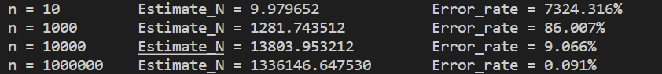
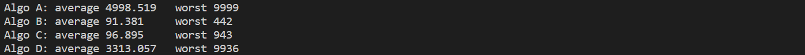
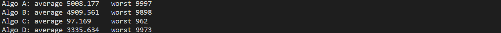
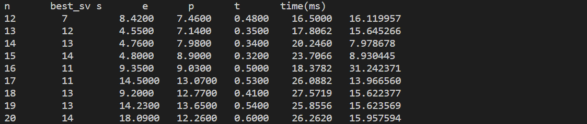
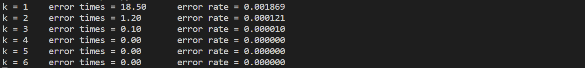

本文为中科大研究生课程——《算法设计与分析》概率算法部分的习题作业。这门课我最喜欢的就是概率算法这部分，感觉提到的一些算法和例子都非常有趣。本文参考了网上一些前辈的资料，并结合自己的理解做出解答。

<!--more-->

# 分析与解答

**Ex.1【P20】若将$y\leftarrow uniform(0,1)$改为$y\leftarrow x$，则上述的算法估计的值是什么？**

> 求$\pi$近似值的算法(右上$\frac{1}{4}$象限为样本)
>
> Darts (n) {
> 	k $\leftarrow$ 0;
> 			for i $\leftarrow$ 1 to n do {
> 				x $\leftarrow$ uniform(0, 1);
> 				y $\leftarrow$ uniform(0, 1);					// 随机产生点(x,y)
> 				if ($x^2 + y^2 ≤ 1$) 	then k++; 	// 圆内
> 			}
> 			return 4k/n;		
> }

$$
4*\frac{k}{n}=4*\frac{\pi r^2}{4r^2}=\pi
$$

**解：**如果将$y\leftarrow uniform(0,1)$改为$y\leftarrow x$，则算法变为

> Darts (n) {
> 	k $\leftarrow$ 0;
> 			for i $\leftarrow$ 1 to n do {
> 				x $\leftarrow$ uniform(0, 1);	
> 				y $\leftarrow$ x;					// 随机产生点(x,y)
> 				if ($2x^2≤ 1$) 	then k++;  // $x^2<=\frac{1}{2}$
> 			}
> 			return 4k/n;		
> }

当x=y时， 随机产生点(x,y)都位于$y=x,0\le x \le 1$的线段上，长度为1，而只有$0\le x \le \frac{\sqrt{2}}{2}$范围内的点落在圆内，长度为$\frac{\sqrt{2}}{2}$,所以算法估计的值为：
$$
4*\frac{k}{n}=4*\frac{\sqrt{2}}{2}=2\sqrt{2}
$$

- 实验代码

```python
import random
def Darts(n):
    k = 0
    for i in range(n):
        x = random.uniform(0, 1)
        y = x
        if x*x+y*y <= 1:
            k = k+1
    return 4*k/n

n = 1000000
print("n:",n)
print(Darts(n))
```

- 实验结果

> n=1000000
> 2.828896


**Ex.2【P23】在机器上用$4\int_{0}^{1}\sqrt[]{1-x^2}dx$估计π值，给出不同的n值及精度。**

**解：**

- 实验代码：

```python
import random
import math

def HitorMisss(func, n):
    k = 0
    for i in range(n):
        x = random.uniform(0, 1)
        y = random.uniform(0, 1)
        if y <= func(x):
            k = k+1
    return k/n

def func1(x):
    return math.sqrt(1-x*x)

# 计算不同n值下的pi估算值
for n in [1000000,10000000,100000000]:
    print("n = {:<10d} pi = {}".format(n, 4*HitorMisss(func1, n)))
```

- 实验结果： π=3.141592654

> n = 1百万    pi = 3.142484（2位精确）
> n = 1千万    pi = 3.140752（2位精确）
> n = 1亿		pi = 3.14163212（3位精确）


**Ex.3【P23】 设a, b, c和d是实数，且$a ≤ b, c ≤ d, f:[a, b] → [c, d]$是一个连续函数，写一概率算法计算积分：**
$$
\int_{a}^{b}f(x)dx
$$
注意，函数的参数是a, b, c, d, n和f, 其中f用函数指针实现，请选一连续函数做实验，并给出实验结果。

**解：**选取指数函数作为研究对象，$f(x)=e^x,a=0,b=1,c=0,b=e$，计算$\int_{0}^{1}e^xdx$

- 理论结果：

  根据牛顿-莱布尼兹公式$F(x)=e^x$
  $$
  \int_{0}^{1}e^xdx=F(1)-F(0)=e-1
  $$
  e-1  = 1.718281828459045

- 实验代码

```python
import random
import math

# 积分概率算法
def calculate(func, n, a=0, b=1, c=0, d=1):
    k = 0
    for i in range(n):
        x = random.uniform(a, b)
        y = random.uniform(c, d)  # 随机生成矩形内的点(x,y)
        if y <= func(x):
            k = k+1
    S_1 = (b-a)*(d-c)  # 计算矩形面积
    return S_1*k/n

def func2(x):
    return math.exp(x)

print("e-1 = ", math.exp(1)-1)
for n in [1000000, 10000000, 100000000]:
    print("n = {:<10d} result = {}".format(
        n, calculate(func2, n, 0, 1, 0, math.exp(1))))
```

- 实验结果 

> e-1 =  1.718281828459045
> n = 1000000（1百万）     result = 1.7169592244369005	 (2精确度)
> n = 10000000 （1千万）  result = 1.7181025337739504	(3精确度)
> n = 100000000 （1亿）    result = 1.718124551856761	 (3精确度)


**Ex.4【P24】 设$\varepsilon,\delta $是(0,1)之间的常数，证明：**
**若$I$是$\int_{0}^{1}f(x)dx$的正确值，h是由HitorMiss算法返回的值，则当$n\ge \frac{I(1-I)}{\varepsilon^2\delta}$时有：**
$$
Prob[|h-I|\le \varepsilon] ≥ 1-\delta
$$
**上述的意义告诉我们：$Prob[|h-I|\ge\varepsilon]\le\delta$, 即：当$n\ge \frac{I(1-I)}{\varepsilon^2\delta}$时，算法的计算结果的绝对误差超过$\varepsilon$的概率不超过$\delta$，因此我们根据给定$\varepsilon$和$\delta$可以确定算法迭代的次数**
$$
n=\frac{I(1-I)}{\varepsilon^{2} \delta} \leq\left[\frac{1}{4 \varepsilon^{2} \delta}\right] \quad\left(\because I(1-I) \leq \frac{1}{4}\right)
$$
**解此问题时可用切比雪夫不等式，将$I$看作是数学期望。**

**解：**

h 是一个随机变量，记其期望和方差为$E(h)$和$D(h)$。根据切比雪夫不等式
$$
Prob(|h-E(h)|\ge \varepsilon)\le \frac{D(h)}{\varepsilon^2}
$$
显然 $E(h)=I$。另一方面，在 HitorMiss 算法中，若随机取 n 个点，有 k 个点在积分范围内，则有 h=k / n。因为 n 个点中每一个点，其要么在积分范围内，要么不在积分范围内，因此 k 服从于二项分布$B(n, I)$，其中 $I$为点落在积分范围内的概率， $D(k)=n*I(1-I)$。又因为$k=h*n$，所以 $D(h)=I(1-I)/n$ 

当$n\ge \frac{I(1-I)}{\varepsilon^2\delta}$时，
$$
Prob(|h-E(h)|\le \varepsilon)\ge 1-\frac{D(h)}{\varepsilon^2}
$$
因为$E(h)=I$且$D(h)=I(1-I)/n$，所以：
$$
Prob(|h-I|\le \varepsilon)\ge 1-\frac{I(1-I)}{n\varepsilon^2}\ge1-\delta
$$

**Ex.5【P36】 用上述算法，估计整数子集1~n的大小，并分析n对估计值的影响。**

- 实验代码

```python
# 用上述算法，估计整数子集1~n的大小，并分析n对估计值的影响。
from random import choice
import math
REPEAT_COUNT = 1000  # 重复次数
def SetCount(X):
    k = 0
    S = set()
    a = choice(X)
    while True:
        k = k + 1
        S.add(a)
        a = choice(X)
        if a in S:
            break
    return 2 * k * k / math.pi


for n in [10, 1000, 10000, 1000000]:
    X = []
    for i in range(1, n + 1):
        X.append(i)
    sum = 0
    Error_rate = 0.0
    for i in range(REPEAT_COUNT):
        sum += SetCount(X)
        Error_rate += math.fabs(SetCount(X) - n) / n  # 计算每次估计值的误差
    Estimate_N = sum/REPEAT_COUNT  # 计算n的估计值
    print("n = {:<10d} Estimate_N = {:<20.6f} Error_rate = {:.3%}".format(
        n, Estimate_N, Error_rate/n))
```

- 实验结果

计算每次估计误差，重复1000次，求最后的平均误差，结果如下：



n 越大，每次估计误差越小，估值越准确。  


**Ex.6【P54】 分析dlogRH的工作原理，指出该算法相应的u和v**

**解：** Sherwood 算法的一般过程：

- 将被解的实例变换到一个随机实例。 //预处理函数 u

- 用确定算法解此随机实例，得到一个解。

- 将此解变换为对原实例的解。 //后处理函数 v

dlogRH 对其中的 $a=g^x \ mod \ p \ $作随机预处理，得到与其对应的随机实例 c=u(x, r)，并且对 c 使用确定性算法得到 y ，最后再把随机实例的结果 y 变换为输入实例 a 的解 x=v(y, r)。其中

$$
u: u(x, r) = log_{g,p} c = (r+x) mod (p-1) \\
v: v(y, r) = (y-r) mod (p-1)
$$


**Ex.7【P67】  写一Sherwood算法C，与算法A, B, D比较，给出实验结果。**

**解：**

- 算法 C :在 B 的基础上修改，不是取前$\sqrt n$个元素作为基准，而是随机取$\sqrt n$个元素作为基准。


- 实验代码

```python
import random
from math import sqrt

n = 10000
val = []  # 记录值数组
ptr = []  # 指针数组
head = 0  # 链头
sa = []
sb = []
sc = []
sd = []

# 初始化静态链表数组 （链中指向数组编号从1开始 0表示结尾）
for i in range(0, n):
    val.append(i)
random.shuffle(val) # 将序列的所有元素随机排序 该行注释表示基本有序的静态链表
# 将指针数组按照值从小到大链接
for i in val:
    if i != n - 1:
        ptr.append(val.index(i + 1)) # val.index() 查找数组中元素的序号
    else:
        ptr.append(-1)
head = val.index(0)

def search(x, i):
    """从位置i开始查找x,返回x所在位置序号和查找长度"""
    count = 0
    while x > val[i]:
        i = ptr[i]
        count += 1
    return i, count 


def A(x):  # o(n)
    return search(x, head)


def B(x):  # o(sqrt(n))
    i = head
    max = val[i]
    for j in range(0, int(sqrt(n))):
        y = val[j]
        if max < y <= x:
            i = j
            max = y
    return search(x, i)


def C(x):  # o(sqrt(n)) Sherwood
    i = head
    max = val[i]
    for j in range(0, int(sqrt(n))):
        jj = random.randint(0, n - 1)
        y = val[jj]
        if max < y <= x:
            i = jj
            max = y
    return search(x, i)


def D(x):  # o(n)
    count = 0
    i = random.randint(0, n - 1)
    y = val[i]
    if x < y:
        return search(x, head)
    elif x > y:
        return search(x, ptr[i])
    else:
        return i, 0

REPEAT_COUNT = 10000 # 重复查找次数
for i in range(REPEAT_COUNT):
    x = random.randint(0, n - 1)
    sa.append(A(x)[1])
    sb.append(B(x)[1])
    sc.append(C(x)[1])
    sd.append(D(x)[1])

print("Algo A: average {:<10.3f} worst {:<10d}".format(sum(sa) / len(sa),max(sa)))
print("Algo B: average {:<10.3f} worst {:<10d}".format(sum(sb) / len(sa),max(sb)))
print("Algo C: average {:<10.3f} worst {:<10d}".format(sum(sc) / len(sa),max(sc)))
print("Algo D: average {:<10.3f} worst {:<10d}".format(sum(sd) / len(sa),max(sd)))
```

- 实验结果

n=10000 ，随机生成静态有序链表，链表元素随机打乱，每次查询随机的元素，重复 10000次，计算平均查找次数和最坏查找次数，结果如下： 



n=10000 ，随机生成静态有序链表，链表元素按顺序排列，每次查询随机的元素，重复 10000次，计算平均查找次数和最坏查找次数，结果如下： 



从上述实验结果可以看到，在随机打乱的静态链表中，算法B,C的平均查找次数以及最坏查找次数远小于算法A,D；如果链表基本有序，随机化的 Sherwood 算法 C 的表现与随机链表相同， 而未随机化的算法 B 退化成了 O(n) 的算法。 


**Ex.8【P77】证明：当放置（k+1)th皇后时，若有多个位置是开放的,则算法QueensLV选中其中任一位置的概率相等。**

**证明：**当放置第（ k+1） th 皇后时，如果有 n 个位置开放，依次记为{S1,S2,…,Sn}。当uniform(1,…,i)=1且对于所有 j>i有$uniform(1,…,j)\ne0$时，Si被选中。 uniform(1,…,i)=1的概率为 $1/i$，$uniform(1,…,j)\ne0$的概率为$1-\frac{1}{j}=\frac{j-1}{j}$。所以Si被选中的概率为：
$$
P_i=(\frac{1}{i}\times\frac{i}{i+1}\times...\times\frac{n-1}{n})=\frac{1}{n}
$$
所以算法QueensLV选中其中任一位置的概率相等。


**Ex.9【P83】 写一算法，求n=12~20时最优的StepVegas值。**

- 实验思路

  迭代计算 p,s,e,求出每个stepVegas下的 t（搜索的平均节点数），取t最小的stepVegas作为最优StepVegas值。

- 实验代码

```python
# 写一算法，求n=12~20时最优的StepVegas值
import time
from random import randint
try_count = []
try_count.append(0)
def queensLV(stepVegas, try_, n, try_count):
    """贪心的LV算法(改进)"""
    col = set()
    diag45 = set()
    diag135 = set()
    k = 0  # 行号
    while k < n:
        if k == stepVegas:  # 完全使用回溯法
            return backtrace(k+1, try_, col, diag45, diag135, try_count)
        nb = 0  # 计数器，nb值为（k+1)th皇后的open位置总数
        j = 0  # 记录随机摆放皇后的列位置
        for i in range(1, n+1):  # i是列号, 试探（k+1,i）安全否
            if (i not in col) and (i - k not in diag45) and (i + k not in diag135):
                # 列i对（k+1）th皇后可用，但不一定马上将其放在第i列
                nb += 1
                # 在nb个安全的位置上随机选择1个位置j放置之
                if randint(1, nb) == 1:  # 或许放在第i列
                    j = i
        # nb=0时无安全位置，第k+1个皇后尚未放好
        if nb > 0:
            # 在所有nb个安全位置上，(k+1)th皇后选择位置j的概率为1/nb
            try_count[0] += 1  # 1个皇后放好算是搜索树上的1个结点
            k += 1  # try[1..k+1]是(k+1)-promising
            try_[k] = j  # 将选定的(k+1)th皇后放入
            col.add(j)
            diag45.add(j - k)
            diag135.add(j + k)
        else:  # 当前皇后找不到合适的位置
            return False


def backtrace(k, try_, col, diag45, diag135, try_count):
    """传统的回溯法"""
    if k > n:  # k表示行号 行号大于n表示皇后放置结束
        return True
    for j in range(1, n+1):  # 从当前列j起向后逐列试探 寻找安全列号
        if (j not in col) and (j - k not in diag45) and (j + k not in diag135):
            # 找到安全列j 放置(k+1)th皇后
            try_[k] = j
            col.add(j)
            diag45.add(j - k)
            diag135.add(j + k)
            try_count[0] += 1  # 1个皇后放好算是搜索树上的1个结点
            # 探索下一行
            if backtrace(k+1, try_, col, diag45, diag135, try_count):
                return True
            else:  # 回溯 移去该行已放置的皇后
                col.remove(j)
                diag45.remove(j - k)
                diag135.remove(j + k)
    return False  # 探索完所有列仍然没有符合要求的


REPEAT_COUNT = 100  # 运行次数
print("n\tbest_sv\ts\te\tp\tt\ttime(ms)")
for n in range(12, 21):
    best_sv = n
    best_s = 0
    best_e = 0
    best_p = 0
    best_t = 0
    best_time= 0
    min_t = 1000000
    for stepVegas in range(0, n+1):
        p_count = 0  # 成功次数
        s_count = 0
        e_count = 0
        t1 = time.time()
        for _ in range(REPEAT_COUNT):
            try_count[0] = 0
            try_ = [-1 for _ in range(n+1)]  # 序号1...k 初始化为-1
            if queensLV(stepVegas, try_, n, try_count):
                p_count += 1
                s_count += try_count[0]
            else:
                e_count += try_count[0]
        t2 = time.time()
        total_time = (t2-t1)*1000
        s = s_count/REPEAT_COUNT  # 成功时搜索的结点的平均数
        e = e_count/REPEAT_COUNT  # 失败时搜索的结点的平均数
        p = p_count/REPEAT_COUNT  # 成功的概率（一次成功）
        t = s+(1-p)*e/(p+0.0001)  # 搜索的平均节点数
        if t < min_t:
            min_t = t
            best_sv = stepVegas  # 取最小化t的stepVegas
            best_s = s
            best_e = e
            best_p = p
            best_t = t
            best_time = total_time
        # print("{:<10d}{:<10d}{:<10.4f}{:<10.4f}{:<10.4f}{:<10.4f}{:<15.6f}".format(
        #     n, stepVegas, s, e, p, t, total_time))
    print("{:<10d}{:<10d}{:<10.4f}{:<10.4f}{:<10.4f}{:<10.4f}{:<15.6f}".format(
        n, best_sv, best_s, best_e, best_p, best_t, best_time))

```

- 实验结果



**Ex.10【147】**

> PrintPrimes{  //打印1万以内的素数
> 		   print 2，3；
> 		   n ←5；
> 		    repeat
> 			if RepeatMillRab(n,$ \left \lfloor \lg_{}{n} \right \rfloor $) then print n;
> 			n ←n+2;
> 	        until  n=10000;
> 	}

与确定性算法相比较，并给出100~10000以内错误的比例。

- 实验思路：分别在不同k值下对100~10000以内整数进行RepeatMillRab素性测试，得到的结果与确定性算法比较，记录错误个数，重复实验，得到平均错误个数和平均错误比例。
- 实验代码

```python 
# RepeatMillRab素性测试与确定性算法相比较，并给出100~10000以内错误的比例。
from math import sqrt, log10
from random import randint


def Btest(a, n):
    """返回真说明n是强伪素数或素数"""
    s = 0
    t = n - 1  # t开始为偶数
    while t % 2 == 0:
        s = s + 1
        t = t // 2
    x = a ** t % n
    if x == 1 or x == n - 1:
        return True
    for i in range(1, s):
        x = x ** 2 % n
        if x == n - 1:
            return True
    return False


def MillRab(n):
    """Miller-Rabin测试:奇n>4 返回真时表示素数 假表示合数"""
    a = randint(2, n - 2)
    return Btest(a, n)  # 测试n是否为强伪素数


def RepeatMillRab(n, k):
    """重复调用k次之后返回true"""
    for i in range(k):
        if MillRab(n) == False:
            return False  # 一定是合数
    return True  # 高概率为素数


def is_prime(n):
    """确定性算法确定是否为素数"""
    for i in range(2, int(sqrt(n)) + 1):
        if n % i == 0:
            return False
    return True


start = 100
end = 10000
REPEAT_COUNT = 10  # 重复次数
for k in range(1, 6):
    error = 0
    for _ in range(REPEAT_COUNT):
        for i in range(start, end):
            if RepeatMillRab(i, k) != is_prime(i):
                error += 1
    error /= REPEAT_COUNT  # 平均错误次数
    print("k = {:<4d} error times = {:<10.2f} error rate = {:<10.6f}".format(
        k, error, error/(end-start)))

```

- 实验结果



可以看到在k>4以后错误比例基本为0了。

# 参考链接

- [课程主页](http://home.ustc.edu.cn/~zzy0929/CSAlg22/)
- [算法作业之概率算法&近似算法（中科大黄刘生总裁版）](https://blog.csdn.net/jackzhang11/article/details/109479996)
- [中国科学技术大学算法设计与分析课程作业](https://github.com/1970633640/Design-and-Analysis-of-Algorithm)