本文记录中科大研究生课程——《存储与文件系统》的EC实验。使用Jerasure纠删码函数库实现经典的EC算法。

<!--more-->

# 实验介绍

Jerasure是一个C/C++纠删码函数库，提供了编解码过程中可直接调用的工具函数。本次实验要求将多个经典的EC编码实现在Jerasure库中。  

可使用函数：

```c
int *cauchy_good_general_coding_matrix(int k, int m, int w)
//函数功能：生成编码矩阵（柯西矩阵）的函数，返回编码矩阵的最后m行
//k: 数据块个数
//m: 校验块个数
//w: word size
void jerasure_matrix_dotprod(int k, int w, int *matrix_row,int *src_ids, int dest_id,
char **data_ptrs, char **coding_ptrs, int size)
//函数功能：编解码矩阵的某一行与k个块进行乘法运算
//k: 数据块个数
//w: word size
//matrix_row：编解码矩阵的某一行
//src_ids: 计算所用的源块
//dest_id: 计算目标块号
//data_ptrs: 数据块指针
//coding_ptrs: 校验块指针
//size: 数据块大小
void galois_w08_region_multiply(char *region, int multby, int nbytes, char *r2, int add)
//函数功能：在有限域$GF(2^8)$下对region所有数据乘以常数multby，结果存在r2中
//region：进行乘法的数据
//multby：乘数
//nbytes：region大小
//r2：乘法结果
//add：目的块r2是否初始化，0表示未初始化，1表示已经初始化
//galois_w16_region_multiply() 和 galois_w32_region_multiply() 类似，分别表示在有限域和 下进行乘法运算:
void galois_region_xor(char *src, char *dest,int nbytes)
//函数功能：src和dest指向的两个块进行异或运算，结果存在dest中
//src:源块
//dest：目标块
//nbytes：块大小
```


# 实验环境

| CPU         | Intel(R) Xeon(R) Silver 4110 CPU @ 2.10GHz |
| ----------- | ------------------------------------------ |
| 内存        | 4194304 kB                                 |
| 操作系统    | Ubuntu 20.04.3   (64位)                    |
| C/C++编译器 | gcc version 9.4.0                          |

# 任务三 实现RAID-6编码

## 任务

- 给定一个大小为1GB的文件的路径，生成由(4,2) RAID-6编码得到的数据块和校验块文件（块大小：16MB），并计算编码吞吐量；
- 模拟当一个节点故障，修复该节点上的所有块，计算修复的吞吐量。    

## 编码

RAID-6编码采用P+Q两冗余分块以容许任意两磁盘并发同时失效的存储级别。以(4,2) RAID-6为例，一个条带的编码过程可以表示为：  

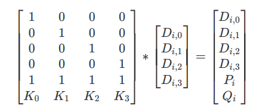

实现步骤：

- 调用Jerasure提供的接口`cauchy_good_general_coding_matrix `生成一个m*k的基于有限域的柯西矩阵。

```c
case RAID6:
		matrix = cauchy_good_general_coding_matrix(k, m, w); // 生成编码矩阵（柯西矩阵）的函数，返回编码矩阵的最后m行
		break;
```

- 调用接口`jerasure_matrix_dotprod`，将生成的柯西编码矩阵与k个数据块进行乘法运算，最后得到m个校验块。

```c
void raid6_encode(int k, int m, int w, int *matrix,
				  char **data_ptrs, char **coding_ptrs, int size)
{
	int i;
	// 编码矩阵(柯西矩阵)与k个数据块进行乘法运算 得到m个校验块
	for (i = 0; i < m; i++)
	{
		jerasure_matrix_dotprod(k, w, matrix + (i * k), NULL, k + i, data_ptrs, coding_ptrs, size);
	}
}
```


## 解码

当某一数据块不可用时，需要从剩余块中读取4个块，并解码恢复出数据块。例如，当$D_{i,0}$不可用时，可以读取$D_{i,1},D_{i,2},D_{i,3},P_i$进行解码，计算过程如下：  

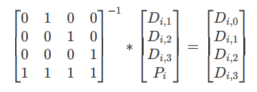

RAID-6解码过程最核心的就是求出编码矩阵的逆矩阵，与剩余完好的盘块矩阵相乘即可恢复。这里参考了`jerasure_matrix_decode`接口函数的解码过程，使用lastdrive对数据盘和校验盘分开处理，只有在有坏块且坏块是数据盘才需要生成逆矩阵，对于损坏的校验盘直接重新生成。

实现步骤：

- 根据erasures生成erased数组 记录每个磁盘的状态
- 生成解码矩阵（只有在有坏块且坏块是数据盘才需要生成逆矩阵）
- 根据生成的解码矩阵 解码数据磁盘块 
- 重新生成所有剩下的坏磁盘块（此时应该只有校验盘块需要被修复）

解码函数如下：

```c
int raid6_decode(int k, int m, int w, int *matrix, int row_k_ones, int *erasures,
                 char **data_ptrs, char **coding_ptrs, int size)
{
    int i, edd, lastdrive;
    int *tmpids;
    int *erased, *decoding_matrix, *dm_ids;

    if (w != 8 && w != 16 && w != 32)
        return -1;
    /* 根据erasures生成erased数组 记录每个磁盘的状态 */
    erased = talloc(int, (k + m));
    for (i = 0; i < m + k; i++)
        erased[i] = 0;
    for (i = 0; i < m - 1; i++)
    {
        if (erased[erasures[i]] == 0)
        {
            erased[erasures[i]] = 1;
        }
    }
    /* 记录被擦除的磁盘块数 */
    edd = 0;
    lastdrive = k;
    for (i = 0; i < k; i++)
    {
        if (erased[i])
        {
            edd++;
            lastdrive = i; // 记录最后一个坏数据盘号
        }
    }
    // 如果没有数据盘被损坏或者第一个校验盘被损坏则将k记录最后要扫描的磁盘号
    // 因为校验盘不需要生成逆矩阵
    if (!row_k_ones || erased[k]) 
        lastdrive = k; 


    /* 生成解码矩阵 只有在有坏块且坏块是数据盘才需要生成逆矩阵*/

    dm_ids = NULL;
    decoding_matrix = NULL;

    if (edd > 1 || (edd > 0 && (!row_k_ones || erased[k])))
    {
        dm_ids = talloc(int, k);
        decoding_matrix = talloc(int, k *k);
        if (jerasure_make_decoding_matrix(k, m, w, matrix, erased, decoding_matrix, dm_ids) < 0)
        {
            free(erased);
            free(dm_ids);
            free(decoding_matrix);
            return -1;
        }
    }
    /* 根据生成的解码矩阵 解码数据磁盘块 */
    for (i = 0; edd > 0 && i < lastdrive; i++)
    {
        if (erased[i])
        {
            jerasure_matrix_dotprod(k, w, decoding_matrix + (i * k), dm_ids, i, data_ptrs, coding_ptrs, size);
            edd--;
        }
    }

    /* 如果还有磁盘未被修复 则应该是包括最后的一个数据块 */

    if (edd > 0)
    {
        tmpids = talloc(int, k);
        for (i = 0; i < k; i++)
        {
            tmpids[i] = (i < lastdrive) ? i : i + 1;
        }
        jerasure_matrix_dotprod(k, w, matrix, tmpids, lastdrive, data_ptrs, coding_ptrs, size);
        free(tmpids);
    }

    /* 重新生成所有剩下的坏磁盘块 此时应该只有校验盘块需要被修复 */

    for (i = 0; i < m; i++)
    {
        if (erased[k + i])
        {
            jerasure_matrix_dotprod(k, w, matrix + (i * k), NULL, i + k, data_ptrs, coding_ptrs, size);
        }
    }

    free(erased);
    if (dm_ids != NULL)
        free(dm_ids);
    if (decoding_matrix != NULL)
        free(decoding_matrix);

    return 0;
}
```


## 测试

- 使用随机生成的矩阵模拟磁盘数据，测试解码和编码，结果如下：

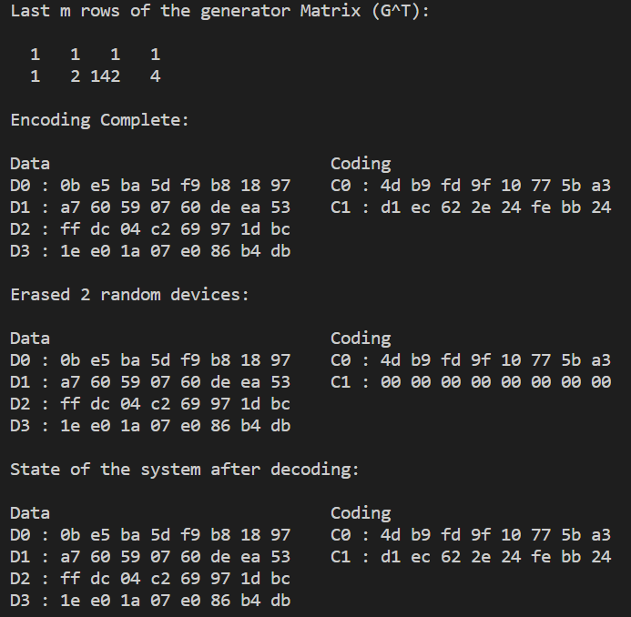

- 生成指定大小为1G的文件

```shell
dd if=./data/test.txt of=./data/test_1G.txt count=1 bs=1G
```

查看生成文件大小：

```shell
cd ./data
ll -h
```

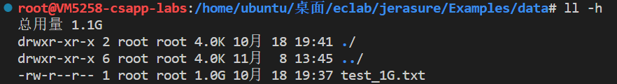

在Example文件夹下新建文件`a_my_encoder.c`和``a_my_decoder.c``，复制`encoder.c`和`decoder.c`中的内容到新建的文件中。修改文件输入算法列表，添加RAID-6的编码和解码算法。并将新建的文件添加到`Makefile.am`文件中，这样就可以生成可执行文件了。


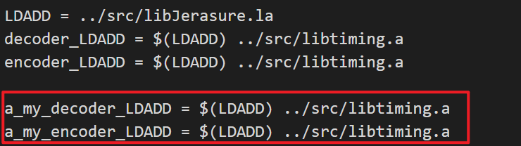

- **编译：**在项目根目录下使用make编译。
- **编码：**再进入Example文件夹下，使用RAID-6算法对之前生成的1G文件进行编码，在当前目录的Coding文件夹下生成4个数据块文件、2个校验块文件和1个元数据文件。

```shell
./a_my_encoder 'data/test_1G.txt' 4 2 'RAID6' 8 8 1024
```

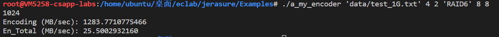

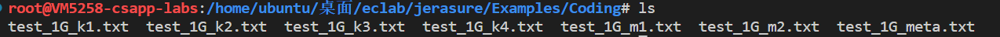

- **解码：**删掉1个数据文件`test_1G_k1.txt`，解码出原始文件`test_1G_decoded.txt`。

```shell
./a_my_decoder 'data/test_1G.txt'
```

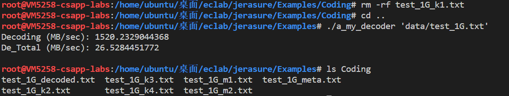


# 任务四 实现Rotated RS编码

## 任务

- 给定一个大小为1.5GB的文件的路径，生成由(6,3) Rotated RS编码得到的数据块和校验块文件（块大小：16MB），并计算编码吞吐量；  
- 模拟当一个数据节点发生故障，修复该节点上的所有块，计算修复的吞吐量；  
- 模拟当一个校验节点发生故障，修复该节点上的所有块，计算修复的吞吐量。  

## 编码 

Rotated RS和标准的RS码相比减少了降级读和修复时的磁盘IO。Rotated RS编码原理如下：

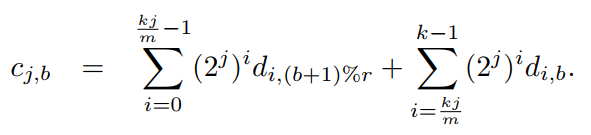

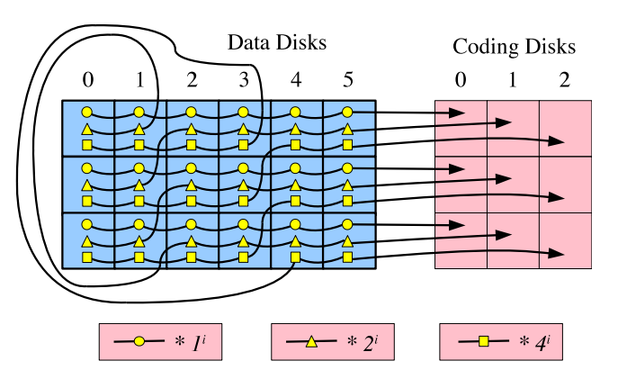

实现思路：利用上述公式进行编码，将每块磁盘分成 r 块。根据参考论文的实验，(6,3) Rotated RS编码在r=4时效果比较好。

```c
void rotatedrs_encode(int k, int m, int w, char **data_ptrs, char **coding_ptrs, int size)
{
  int r = 4;
  int ssize = size / r;  // size : 一个磁盘块数据的大小
  int i, j;
  char *temp_data;
 
  /*首先计算第一个校验盘:C0*/
  memcpy(coding_ptrs[0], data_ptrs[0], size); // C0 = D0
  for (i = 1; i < k; i++) // C0 = D0^D1^D2^D3^D4^D5 k=6
    galois_region_xor(data_ptrs[i], coding_ptrs[0], size);

  temp_data = talloc(char, size);
  /* 按照系数计算剩余的校验盘*/
  for (j = 1; j < m; j++){
    int mid = k * j / m; 						// 分左右两边不同处理
    memcpy(coding_ptrs[j], data_ptrs[0], size); // 初始化校验盘C[j]
    for (i = k - 1; i >= 0; i--){
      if (i < mid){ 							// 将左边的每个区间的数据按模r偏移
        int b;
        for (b = 0; b < r; b++)
        	memcpy(temp_data + b * ssize, data_ptrs[i] + ssize * ((b + 1) % r), ssize);
      }
      else 										// 右边区间数据保持顺序不变
          memcpy(temp_data, data_ptrs[i], size);
      switch (w) 								// 将要进行异或的盘块乘以相应的系数 2^{i*j}
      {
      case 8:
        galois_w08_region_multiply(temp_data, 1 << (i * j), size, temp_data, 0);
        break;
      case 16:
        galois_w16_region_multiply(temp_data, 1 << (i * j), size, temp_data, 0);
        break;
      case 32:
        galois_w32_region_multiply(temp_data, 1 << (i * j), size, temp_data, 0);
        break;
      default:
        return;
      }
      galois_region_xor(temp_data, coding_ptrs[j], size); // 对处理好的盘块数据依次异或
    }
    galois_region_xor(data_ptrs[0], coding_ptrs[j], size); // 异或将初始化的值去除
  }
}

```


## 解码

当发生磁盘故障，需要对数据进行修复时，部分情况下Rotated RS有着更低的IO开销。如下图所示，当Data Disk 0发生故障时，使用Rotated RS只需要读取16个块，而使用RS需要读取24个块。 

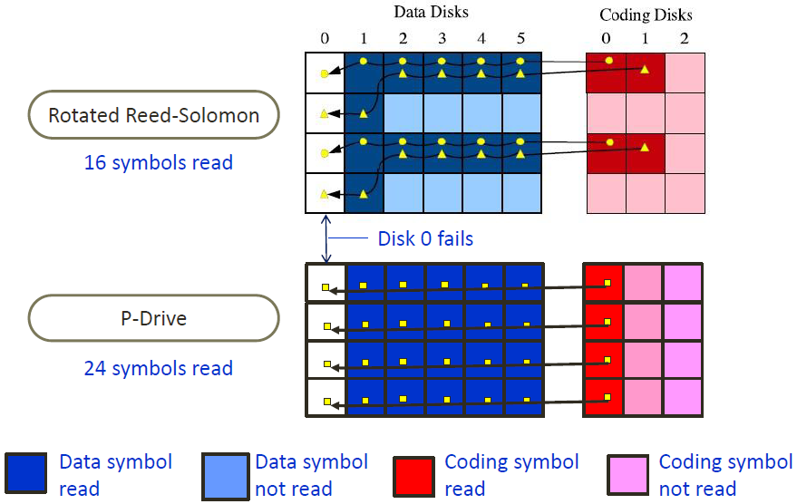

实现思路：分别考虑1个数据盘或1个校验盘损坏的情况。

- 在校验盘损坏时，直接使用编码算法重新生成损坏的校验盘。
- 若数据盘损坏，使用上文提到的解码算法，用两个完好的校验盘恢复数据，减少IO开销。

下面详细介绍数据盘的恢复：

因为r=4，需要分别恢复4个磁盘区间的数据，用b=0，1，2，3标记正在恢复的磁盘区间。

- b=0以及b=2区间，只需要通过第一个校验盘与其他数据盘块对应的区间异或即可恢复，以b=0为例：

```c
// 恢复 b=0 此时系数全为1 只要异或即可
    j = 0;
    memcpy(data_ptrs[lastdrive], coding_ptrs[j], ssize); // lastdrive为需要恢复的盘块号
    for (i = init_id; i >= 0; i--)
    {
      if (i == lastdrive) // 跳过需要恢复的盘块区间
        continue;
      galois_region_xor(data_ptrs[i], data_ptrs[lastdrive], ssize);
    }
```

- b=1以及b=3区间，在异或时不仅需要考虑系数，还需要考虑不同盘块异或区间的改变，以b=1为例：

```c
// 恢复 b=1 此时系数为 2^{i*j}
    j = 1;
    mid = k * j / m;
    temp_data = talloc(char, ssize);
    memcpy(data_ptrs[lastdrive] + ssize, coding_ptrs[j], ssize); // 初始化
    for (i = init_id; i >= 0; i--){
      if (i == lastdrive) 	// 跳过需要恢复的块
        continue;
      if (i < mid) 			// 左边的使用与恢复区间相同的盘块
        memcpy(temp_data, data_ptrs[i] + ssize, ssize);
      else 					// 右边的使用上一个盘块
        memcpy(temp_data, data_ptrs[i], ssize);
      switch (w)			// 乘系数
      {
      case 8:
        galois_w08_region_multiply(temp_data, 1 << (i * j), ssize, temp_data, 0);
        break;
      case 16:
        galois_w16_region_multiply(temp_data, 1 << (i * j), ssize, temp_data, 0);
        break;
      case 32:
        galois_w32_region_multiply(temp_data, 1 << (i * j), ssize, temp_data, 0);
        break;
      default:
        return -1;
      }
      galois_region_xor(temp_data, data_ptrs[lastdrive] + ssize, ssize); // 异或
    }
```

## 测试

- 使用随机生成的矩阵模拟磁盘数据，测试解码和编码，成功恢复了数据。

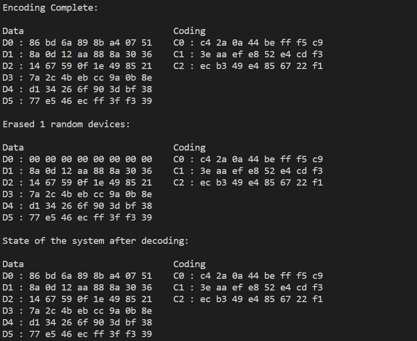

- 编码

```shell
./a_my_encoder 'data/test_1G.txt' 6 3 'Rotate_RS' 8 8 1024
```

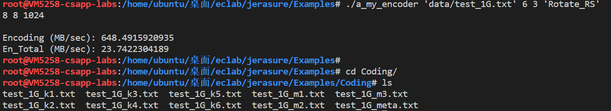

- 解码（数据盘）

删除文件`test_1G_k1.txt`

```shell
./a_my_decoder 'data/test_1G.txt'
```

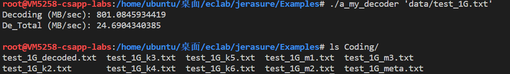

- 解码（校验盘）

删除编码文件，重新生成后再删除文件`test_1G_m2.txt`，解码结果如下：

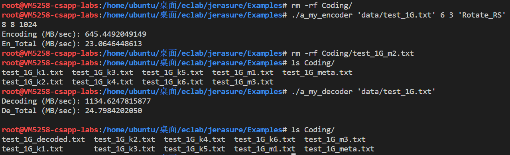

