记录一下高级数据库系统课程中的作业，作业一般是课堂重点内容或者拓展，认真做的话感觉对课堂内容的理解非常有帮助。

<!--more-->

# B+树索引优化

> 1、假设我们在数据库中设计了如下基本表来存储文献：paper(id: int, title: varchar(200), abstract: varchar(1000))。最常见的文献查询可以描述为“查询 title 中同时包含给定关键词的文献”，关键词可以是一个，也可以是多个。请回答下面问题（假设所有文献都是英文文献）：
>
> 1）假如在 title 上创建了 B+-tree 索引，能不能提高此查询的效率（须解释理由）？
>
> 2）由于文献 title 的关键词中存在很多重复词语，因此上述文献查询可以借鉴我们课上讲述的支持重复键值的辅助索引技术来进一步优化。请基于此思想画出一种优化的索引结构，简要说明该索引上的记录插入过程以及文献查询过程。

**解：**1）如果查询字段上建有B+树索引，查询效率与模糊查询的方式有关。分两种情况：

LIKE a%：若LIKE中的查询条件是由常量字符串开头的，则B+树索引有效。因为查询时可首先通过B+树的根节点确定字符串所在的子树，并且根据前缀字符串可以继续往下比较，缩小搜索范围。因此，与没有B+树索引时相比，有B+树索引时最后查询的范围可缩小到前缀字符串开头的键值集合，从而提高了查询效率。

LIKE %a：若LIKE中的查询条件是由通配符开头的，则B+树索引无助于查询效率的提高。因为即使有B+树索引，查询时最坏情况下仍要搜索整个索引和整个记录集合，因为引入了索引查找的额外代价，所以与没有索引时相比，查询效率不但没有提高，反而下降了。

“查询 title 中同时包含给定关键词的文献”的sql语句可以表示为：

```sql
select * 
from paper
where title LIKE %keyword1% and title LIKE %keyword2% and ....
```

除非查询的是开头的关键词，否则无法提高查询效率。

2）使用辅助索引中的间接桶进行优化。如图所示：



**记录插入过程：**当插入一个新的paper记录时， 对其title字段分词，得到多个keyword，如果 keyword 已经存在则将其插入到相应的桶中，如果不存在则创建桶，并将paper的指针写入。 

**文献查询过程：**假设有n个关键词，先通过辅助索引找出所有关键词的指针集合（即间接桶中的所有元素），然后求指针集的交集，就可以得到包含所有关键词的文献指针，再根据得到的指针去访问外存。如图中所示，假设查询title同时包含keyword2和keyword3的文献，可以根据该方法直接定位到paper3。

# 散列表

> **2.**  假设有如下的键值，现用 5 位二进制序列来表示每个键值的 hash 值。回答问题： 
>
> **A [11001] B [00111]  C [00101]  D [00110]  E [10100] F [01000]   G [00011] **
>
> **H [11110]   I [10001] J [01101]   K [10101]  L [11100] M [01100] N [11111]**
>
> 1） 如果将上述键值按 A 到 N 的顺序插入到可扩展散列索引中，若每个桶大小为一个磁盘块，每个磁盘块最多可容纳 3 个键值，且初始时散列索引为空，则全部键值插入完成后该散列索引中共有几个桶？并请写出键值 E 所在的桶中的全部键值。
>
> 2） 前一问题中，如果换成线性散列索引，其余假设不变，同时假设只有当插入新键值后空间利用率大于 80%时才增加新的桶，则全部键值按序插入完成后该散列索引中共有几个桶？并请写出键值 B 所在的桶中的全部键值（包括溢出块中的键值）。

 **解：**1）**可扩展散列索引：**全部插入后共有6个桶，E所在桶中的全部键值为：E [10100],I [10001],K [10101]

插入过程如下：

（1）插入A [11001] B [00111]  C [00101]  D [00110]  E [10100]



（2）插入F [01000]扩展



（3）插入G [00011] 扩展



（4）插入H [11110]   I [10001]再扩展



（5）插入J [01101]   K [10101]  L [11100] M [01100] N [11111]



2）**线性散列索引：**插入完成后该散列索引中共有6个桶，B所在桶中全部键值：B [00111] ，G [00011] ，N [11111]

插入过程如下：




最后：


# 压缩B+树

> 3、对于 B+树，假设有以下的参数：
>
> | **参数** | **含义**                     | **参数** | **含义**                                               |
> | -------- | ---------------------------- | -------- | ------------------------------------------------------ |
> | *N*      | 记录数                       | *S*      | 读取一个磁盘块时的寻道时间                             |
> | *n*      | B+树的阶，即节点能容纳的键数 | *T*      | 读取一个磁盘块时的传输时间                             |
> | *R*      | 读取一个磁盘块时的旋转延迟   | *m*      | 在内存的 *m* 条记录中查找 1 条记录的时间  （线性查找） |
>
> 假设所有磁盘块都不在内存中。现在我们考虑一种压缩 B+树，即对 B+树的节点键值进行压缩存储。假设每个节点中的键值压缩 1 倍，即每个节点在满的情况下可压缩存储 2*n*个压缩前的键值和 2*n*+1 个指针。额外代价是记录读入内存后必须解压，设每个压缩键值的内存解压时间为 *c*。给定 N 条记录，现使用压缩 B+树进行索引，请问在一棵满的 *n* 阶压缩 B+ 树中查找给定记录地址的时间是多少？（使用表格中的参数表示，*n*＋1 或 *n*-1 可近似表示为 *n*）？

**解：**满n阶B+树非叶节点n个子节点，所以N条记录的B+树深度为$log_n{N}$

未压缩时查找给定记录地址的时间：

- 每次查找访问的节点数量 = B+树深度 = $log_n{N}$
- 读一个磁盘块的时间 = 寻道时间+旋转延迟+传输时间 = S+R+T
- B+树的非叶子节点大小 = 页大小，读取一页需要一次IO

- 查找给定记录地址的IO次数 = 查找时访问的节点数量 =$log_n{N}$
- 查找给定记录地址的时间 =  查找时访问的节点数量*（节点内线性查找的时间+节点读入内存时间） = $(m+S+R+T)log_n{N}$

压缩后查找给定记录地址的时间：

- *n* 阶B+树一个节点存储 *n* 个键值和 *n*+1 个指针 
- 键值压缩 1 倍相当于一个节点存储之前的两个节点数据，所以查找时访问的节点数量减半
- 查找给定记录地址的IO次数 = 查找时访问的节点数量 =$\frac{1}{2}log_n{N}$
- 节点读入内存后键值解压时间 = 节点中键值数\*单个键值的内存解压时间 = $2n*c$
- *n* 阶压缩 B+ 树查找给定记录地址的时间 =  查找时访问的节点数量\*（节点读入内存时间+压缩键值的内存解压时间+节点内线性查找的时间） = $(S+R+T+2nc+m)/2*log_n{N}$

**补充：**B+树的阶n是事先计算得到的，计算的依据是让键值和指针的大小正好等于页的大小。原因如下：

> B+ 树在搜索过程中，需要从磁盘IO来读取节点的数据。我们知道磁盘IO一次读取的数据大小为一页。
> 如果非叶子节点的大小 > 页大小，那么意味着搜索过程中，为了获取一个完整节点来查找数据，我们需要多次IO来获取这个节点，这显然非常消耗时间。所以非叶子节点的大小不能超过一页。
> 那如果非叶子节点的体积非常小呢？这就意味着B+树的分叉就少，B+树的总节点数会变多、深度变大。B+树利用指针构成的树形结构，意味着每个节点在磁盘上是不连续的，B+树的深度变大了，意味着搜索时访问的节点数量变多，IO次数也变多了。
> 因此，非叶子节点过大、过小，都会导致IO次数增加。所以最合适的非叶子节点大小 = 页大小。

# 参考

- [数据库中可扩展散列索引](https://blog.csdn.net/weixin_45457983/article/details/103646162)
- [B+ 树搜索时间复杂度到底是什么：mlogmN / logN？](https://zhuanlan.zhihu.com/p/402951795)
- [关于B+树的时间复杂度分析](https://blog.csdn.net/wufeifan_learner/article/details/109724836)