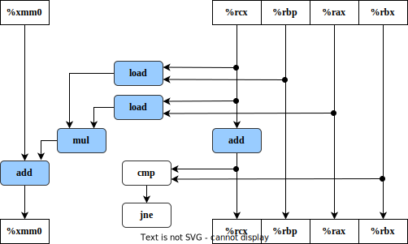

本文为中科大研究生课程——计算机系统作业3的题目解答记录。使用的教材为《深入理解计算机系统》（第3版）。

<!--more-->

## 题目与解答

## 5.13

假设我们想编写一个计算两个向量 u 和 v 内积的过程 。 这个函数的一个抽象版本对整数和浮点数类型，在 x86-64 上 CPE 等 于 14~ 18 。通过进行与我们将抽象程序 combine1 变换为更有效的 combine4 相同类型的变换，我 们得到如下代码：

```c
/* Inner product. Accumulate in temporary */
void inner4(vec_ptr u, vec_ptr v, data_t *dest)
{
    long i;
    long length = vec_length(u);
    data_t *udata = get_vec_start(u);
    data_t *vdata = get_vec_start(v);
    data_t sum = (data_t)0;

    for (i = O; i < length; i++)
    {
        sum = sum + udata[i] * vdata[i];
        *dest = sum;
    }
}
```

测试显示，对于整数这个函数的 CPE 等于 1. 50, 对于浮点数据 CPE 等于3.00 。对于数据类型 double, 内循环的 x86-64 汇编代码如下所示：

```assembly
Inner loop of inner4 . data_t = double, OP = *
udata in %rbp, vdata in %rax, sum in %xmm0
i in %rcx, limit in %rbx
.L15:                                  loop :
vmovsd  0(%rbp,%rcx,8), %xmm1           Get udata[i]
vmulsd  (%rax,%rcx,8), %xmm1, %xmm1     Mltiply by vdata[i]
vaddsd  %xmm1, %xmm0, %xmm0             Add to sum
addq    $1, %rcx                        Increment i
cmpq    %rbx, %rcx                      Compare i: limit
jne .L15                                If!=, goto loop
```

假设功能单元的特性如图 5-12 所示。

A. 按照图 5-13 和图 5-14 的风格，画出这个指令序列会如何被译码成操作，并给出它们之间的数据相关如何形成一条操作的关键路径。

B. 对于数据类型 double, 这条关键路径决定的 CPE 的下界是什么？

C. 假设对于整数代码也有类似的指令序列，对于整数数据的关键路径决定的 CPE 的下界是什么？

D. 请解释虽然乘法操作需要 5 个时钟周期，但是为什么两个浮点版本的 CPE 都是 3.00。

**解：**

A.

（1）内循环代码的图形化表示


（2）重新排列了操作符， 更清晰地表明了数据相关



（3）操作在一次迭代中使用某些值，产生出在下一次迭代中需要的新值 ，得到关键路径


B. double类型，关键路径CPE的下界为浮点数加法的延迟界限：3.00

C. 整数数据的关键路径决定的 CPE 的下界是整数加法的延迟界限：1.00

D. 因为只有浮点加法在关键路径上，当执行这个函数时，浮点加法器成为了制约资源。循环中需要的其他操作，如从内存中读数据以及浮点乘法可以提前并行地进行。所以 CPE 都是 3.00

## 5.17

库函数 memset 的原型如下：  

```c
void *memset(void *s, int c, size_t n);
```

这个函数将从 s 开始的 n 个字节的内存区域都填充为 c 的低位字节。例如，通过将参数 c 设置为0, 可以用这个函数来对一个内存区域清零，不过用其他值也是可以的。下面是 memset 最直接的实现：  

```c
/* Basic implementation of memset */
void *basic_memset(void *s, int c, size_t n)
{
    size_t cnt = 0;
    unsigned char *schar s;
    while (cnt n)
    {
        *schar++ = (unsigned char)c;
        cnt++;
        return s;
    }
}
```

实现该函数一个更有效的版本，使用数据类型为 unsigned long 的字来装下 8 个 C, 然后用字级的写遍历目标内存区域 。 你可能发现增加额外的循环展开会有所帮助。在我们的参考机上，能够把 CPE 从直接实现的 1. 00 降低到 0.127 。即程序每个周期可以写 8 个字节 。

这里是一些额外的指导原则 。 在此，假设 K 表示你运行程序的机器上的 sizeof (unsigned long) 的值。

- 你不可以调用任何库函数 。
- 你的代码应该对任意 n 的值都能 工 作，包括当它不是 K 的倍数的时候 。 你可以用类似于使用循环展开时完成最后几次迭代的方法做到这一点。
- 你写的代码应该无论 K 的值是多少，都能够正确编译和运行 。 使用操作 sizeof 来做到这一点。
- 在某些机器上，未对齐的写可能比对齐的写慢很多。（在某些非 x86 机器上 ，未对齐的写甚至可能会导致段错误。）写出这样的代码，开始时直到目的地址是 K 的倍数时，使用字节级的写，然后进行字级的写，（ 如果需要 ）最后采用字节级的写 。
- 注意 cnt 足够小以至于一些循环上界变成负数的情况 。 对于涉及 sizeof 运算符的表达式，可以用无符号运算来执行测试 。 （ 参见 2 . 2. 8 节和家庭作业 2. 72 。)

**解：**

```c
#include <stdio.h>
#include <stdint.h>
#include <stdlib.h>
#include <string.h>
#include <assert.h>
#include <time.h>

/* basic_memset直接的实现 */
void *basic_memset(void *s, int c, size_t n)
{
    size_t cnt = 0;
    unsigned char *schar = s;
    while (cnt < n)
    {
        *schar++ = (unsigned char)c;
        cnt++;
    }
    return s;
}

/*
 * K = sizeof(unsigned long)
 * cs store K chars for memset
 */
void *effective_memset(void *s, unsigned long cs, size_t n)
{
    size_t K = sizeof(unsigned long);
    size_t cnt = 0;
    unsigned char *schar = s;
    // 字节对齐： 进行字级的写 直到目的地址是K的倍数
    while (cnt < n)
    {
        if ((size_t)schar % K == 0)
            break;
        *schar++ = (unsigned char)cs; // 填充为cs的低位字节
        cnt++;
    }

    // 循环展开：循环前部分 每次循环写K个字节 
    unsigned long *slong = (unsigned long *)schar;
    size_t rest = n - cnt;
    size_t loop = rest / K;
    size_t tail = rest % K;

    for (size_t i = 0; i < loop; i++)
        *slong++ = cs;

    // 循环展开：处理尾部剩余部分 字节级写入
    schar = (unsigned char *)slong;
    for (size_t i = 0; i < tail; i++)
    {
        *schar++ = (unsigned char)cs;
    }
    return s;
}

int main(int argc, char *argv[])
{
    size_t space = sizeof(char) * 65537;
    // careful! malloc SIZE_MAX size memory will make sys slow
    // or crash down
    // size_t space = SIZE_MAX;

    void *basic_space = malloc(space);
    void *effective_space = malloc(space);

    int basic_fill = 0xFF;
    unsigned long effective_fill = ~0;
    clock_t start = clock();
    basic_memset(basic_space, basic_fill, space);
    clock_t end = clock();
    printf("basic_memset:     %.3lfms\n",(double)(end-start)*1000/CLOCKS_PER_SEC);
    start = clock();
    effective_memset(effective_space, effective_fill, space);
    end = clock();
    printf("effective_memset: %.3lfms\n",(double)(end-start)*1000/CLOCKS_PER_SEC);
    // 检查是否一致
    if(memcmp(basic_space, effective_space, space) == 0) printf("ok\n");
    else printf("fail\n");
    free(basic_space);
    free(effective_space);
    return 0;
}
```

运行结果：

```shell
basic_memset:     0.244ms
effective_memset: 0.099ms
ok
```

可以看到循环展开版本的 memset 比直接实现快了一个数量级。

## 6.25

下面的表给出了一些不同的高速缓存的参数。对于每个高速缓存，填写出表中缺失的字段。记住 m 是物理地址的位数， C 是高速缓存大小（数据字节数）， B 是以字节为单位的块大小， E 是相联度， S 是高速缓存组数， t 是标记位数， s 是组索引位数，而 b 是块偏移位数。

| 高速缓存 | m      | C        | B      | E       | S    | t    | s    | b    |
| -------- | ------ | -------- | ------ | ------- | ---- | ---- | ---- | ---- |
| **1.**   | **32** | **1024** | **4**  | **4**   | 64   | 24   | 6    | 2    |
| **2.**   | **32** | **1024** | **4**  | **256** | 1    | 30   | 0    | 2    |
| **3.**   | **32** | **1024** | **8**  | **1**   | 128  | 22   | 7    | 3    |
| **4.**   | **32** | **1024** | **8**  | **128** | 1    | 29   | 0    | 3    |
| **5.**   | **32** | **1024** | **32** | **1**   | 32   | 22   | 5    | 5    |
| **6.**   | **32** | **1024** | **32** | **4**   | 8    | 24   | 3    | 5    |


## 6.34

考虑下面的矩阵转置函数：

```c
typedef int array[4][4];
void transpose2(array dst, array src)
{
    int i, j;
    for (i = 0; i < 4; i++){
        for (j = 0; j < 4; j++){
            dst[j][i] = src[i][j];
        }
    }
}
```

假设这段代码运行在一台具有如下属性的机器上：

- `sizeof(int)==4 `

- 数组 src 从地址 0 开始，而数组 dst 从地址 64 开始（十进制）。

- 只有一个 L1 数据高速缓存，它是直接映射、直写、写分配的，块大小为 16 字节。

- 这个高速缓存总共有 32 个数据字节，初始为空。

- 对 src 和 dst 数组的访问分别是读和写不命中的唯一来源。

对于每个 row 和 col, 指明对 src [row] [col] 和 dst [row ] [col] 的访问是命中(h) 还是不命中(m)。
例如，读 src [0] [0] 会不命中，而写 dst [0] [0] 也会不命中。  

**解：**

```c
src : [0]4byte [4]4byte [8]4byte [12]4byte [16]...
dst : [64]4byte [68]4byte [72]4byte [76]4byte [80]...    
```

数据高速缓存总共有 32 个字节，块大小为 16 字节，所以共有2行，直接映射所以分为2组，s=1,b=4。对于写分配的高速缓存，每次写不命中时，需要读取数据到高速缓存中。

- src[0]映射到高速缓存第0行；src[1]映射到第1行，src[2]映射到0行，src[3]映射到1行；

- dst[0]映射到高速缓存第0行；dst[1]映射到第1行，dst[2]映射到0行，dst[3]映射到1行；

对于相同的i,j，src\[i][j]和dst\[i][j]对应相同的组。

- 过程：
  - 读src\[0][0]不命中，读入src[0]到高速缓存第0行；写dst\[0][0]不命中，将dst[0]读入高速缓存0行；
  - 读src\[0][1]不命中，读入src[0]到高速缓存第0行；写dst\[1][0]不命中，将dst[1]读入高速缓存1行；
  - 读src\[0][2]命中；写dst\[2][0]不命中，将dst[2]读入高速缓存0行；
  - 读src\[0][3]不命中，读入src[0]到高速缓存第0行；写dst\[3][0]不命中，将dst[3]读入高速缓存1行；
  - ...

- dst 数组

|         | 列0   | 列1  | 列2  | 列3  |
| ------- | ----- | ---- | ---- | ---- |
| **行0** | **m** | m    | h    | m    |
| **行1** | m     | h    | m    | h    |
| **行2** | m     | m    | h    | m    |
| **行3** | m     | h    | m    | h    |

- src 数组

|         | **列0** | **列1** | **列2** | **列3** |
| ------- | ------- | ------- | ------- | ------- |
| **行0** | **m**   | m       | m       | m       |
| **行1** | m       | m       | m       | m       |
| **行2** | m       | m       | m       | m       |
| **行3** | m       | m       | m       | m       |

## 6.38

3M决定在白纸上印黄方格，做成 Post-lt小贴纸 。 在打印过程中， 他们需要设置方格中每个点的CMYK ( 蓝色 ，红色，黄色，黑色）值。 3M雇佣你判定下面算法在一个具有 2048 字节 、 直接映射、块大小为 32 字节的数据高速缓存上的效率。 有 如下定义：  

```c
struct point_color{
    int c;
    int m;
    int y;
    int k;
};
struct point_color square[16][16];
int i,j;
```

有如下假设：

- `sizeof(int) == 4 `。
- square 起始于内存地址 0 。
- 高速缓存初始为空。
- 唯一的内存访问是对于 square 数组中的元素。变量 i 和 j 存放在寄存器中。 

确定下列代码的高速缓存性能：

```c
for(i = 0; i < 16; i++){
    for (j = 0; j < 16; j++){
        square[i][j].c = 0;
        square[i][j].m = 0;
        square[i][j].y = 1;
        square[i][j].k = 0;
    }
}
```

A. 写总数是多少？

B. 在高速缓存中不命中的写总数是多少？

C. 不命中率是多少？

**解：**

point_color 结构体大小为16字节，高速缓存块大小为 32 字节，每个 32 字节的高速缓存行包含着2个连续的 point_color 结构 。 每个循环按照内存顺序访问这些结构，每次写一个整数元素 。 所以，每个2次循环的模式就是1次不命中、7次命中，依此类推。  

A. 4 * 16 * 16 =1024

B. 4 * 16 * 16 * 1/8=128

C. 12.5%


## 6.41

你正在编写一个新的 3D 游戏， 希望能名利双收。现在正在写一个函数，使得在画下一帧之前先清空屏幕缓冲区。工作的屏幕是 640 × 480 像素数组。工作的机器有一个 64KB 直接映射高速缓存，每行 4 个字节。 使用下面的 C 语言数据结构：

```c
struct pixel{
    char r;
    char g;
    char b;
    char a;
};

struct pixel buffer[480][640];
int i,j;
char *cptr;
int *iptr;
```

有如下假设：

- `sizeof(char)==1`  和  `sizecf(int)==4` 。

- buffer 起始于内存地址 0 。

- 高速缓存初始为空。

- 唯一的内存访问是对于 buffer 数组中元素的访间。变量 *i 、 j 、 cptr* 和 *iptr* 存放在寄存器中。

下面代码中百分之多少的写会在高速缓存中不命中？

```c
for(i = 0; i < 640; i++){
    for (j = 0; j < 480; j++){
        buffer[i][j].r = 0;
        buffer[i][j].g = 0;
        buffer[i][j].b = 0;
        buffer[i][j].a = 0;
    }
}
```

**解：**

pixel 结构体大小为 4 字节，高速缓存块大小为 4 字节，每个 4 字节的高速缓存行可以存储1个 pixel 结构 。 每个循环按照内存顺序访问这些结构，每次写一个字节 。 所以，每次循环的模式就是1次不命中、4次命中，依此类推，所以命中率为25%。