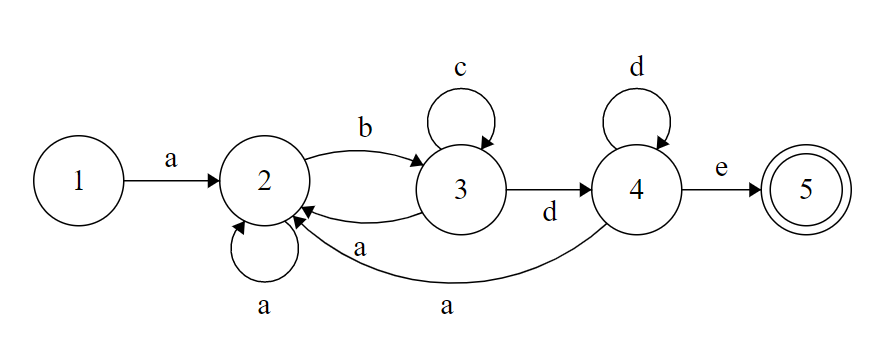

本文为2011年中科大计算机学院复试机试刷题记录，使用C++作为编程语言，并在Linux 平台下使用gcc编译器进行编译以及测试运行。输入输出风格偏向于C，有些题目会用到C++的STL标准函数库。

<!--more-->

## 题目详解

### 进制转换

> 给两个十进制数，先异或，然后输出其二进制形式。

C语言中的`printf`函数可以直接打印十进制，八进制，十六进制，输出控制符分别为%d, %o, %x, 但是它不能直接输出二进制，所以这里考虑使用位操作输出二进制。

```cpp
#include <cstdio>

/* 给两个十进制数，先异或，然后输出其二进制形式。 */
int main()
{
    int a, b;
    scanf("%d %d", &a, &b);
    int c = a ^ b;
    int bits[32];
    for (int i = 0; i < 32; i++) // 每次取最低一位 得到逆位输出
    {
        bits[i] = c & 1;
        c >>= 1;
    }
    // 反向输出即为正确答案
    for (int i = 31; i >= 0; i--)
        printf("%d", bits[i]);
    printf("\n");
    return 0;
}
```

运行与测试：

```shell
$ g++ -o ex1 ex1.cpp
$ ./ex1
1 2
00000000000000000000000000000011
$ ./ex1
3 5
00000000000000000000000000000110
```


### 球的取法

> 一共有十二个球，其颜色有红、黄、黑三种，红黄黑分别有 x，y，k 个，现在从其中取出八个球，共有多少种取法，输出到文件中？（x，y，k 从键盘输入，同种颜色的球不区分）

输出格式：

```c
1.  红球， 黄球， 黑球;
2.  红球， 黄球， 黑球;
3.
....
```

- 思路

直接用双重循环暴力枚举前两种球被抽到的个数。注意这题要求输出到文件，使用C语言的fprint函数。

```cpp
#include <cstdio>

int main()
{
  int x, y, k;
  scanf("%d %d %d", &x, &y, &k);
  int cnt = 0;
  FILE * fp;
  fp = fopen ("3.txt", "w+");
  for (int i = 0; i <= 8 && i <= x; i++)
  {
    for (int j = 0; j <= 8 - i && j <= y; j++)
    {
      if (8 - i - j <= k)
      {
        fprintf(fp,"%2d. %d红球，%d黄球，%d黑球\n", ++cnt, i, j, 8 - i - j);
      }
    }
  }
  fclose(fp);
  return 0;
}
```

- 运行与测试

```shell
$ g++ -o ex2 ex2.cpp
$ ./ex2  3 4 5
// 3.txt
 1. 0红球，3黄球，5黑球
 2. 0红球，4黄球，4黑球
 3. 1红球，2黄球，5黑球
 4. 1红球，3黄球，4黑球
 5. 1红球，4黄球，3黑球
 6. 2红球，1黄球，5黑球
 7. 2红球，2黄球，4黑球
 8. 2红球，3黄球，3黑球
 9. 2红球，4黄球，2黑球
10. 3红球，0黄球，5黑球
11. 3红球，1黄球，4黑球
12. 3红球，2黄球，3黑球
13. 3红球，3黄球，2黑球
14. 3红球，4黄球，1黑球
```


### 模式匹配

在文件`3.txt`中查看是否有模式`abc*d?e`。若有，输出`找到abc*d?e匹配`；若无，则输出`没有找到abc*d?e匹配`，将结果输出到控制台。其中*代表任意个数（0或1或多个），？代表一个或零个，即正则表达式。

- 思路：本题可以采用《编译原理》里面的确定的有限状态机（DFA）解决。先画出模式的DFA图，然后根据 DFA 列出如下的状态跳转表，之后我们就可以采用 **表驱动法** 进行编程实现了。可以参考力扣题目：[65. 有效数字](https://leetcode.cn/problems/valid-number/)，也是有关DFA的，有很详细的解答。



| state | a    | b    | c    | d    | e    |
| ----- | ---- | ---- | ---- | ---- | ---- |
| 1     | 2    | 1    | 1    | 1    | 1    |
| 2     | 2    | 3    | 1    | 1    | 1    |
| 3     | 2    | 1    | 3    | 4    | 1    |
| 4     | 2    | 1    | 1    | 4    | 5    |


```cpp
#include <cstdio>
int main()
{
    FILE *fp;
    fp = fopen("3.txt", "r+");
    int state;
    int move[5][5] = {
        {1, 1, 1, 1, 1}, // 多一行方便一一对应
        {2, 1, 1, 1, 1},
        {2, 3, 1, 1, 1},
        {2, 1, 3, 4, 1},
        {2, 1, 1, 4, 5},
    };
    state = 1;
    while ((!feof(fp)) && (state != 5))
    {
        char ch = fgetc(fp);
        if (('a' <= ch) && (ch <= 'e'))
        {
            state = move[state][ch - 'a'];
        }
        else
            state = 1;
    }
    if (state == 5)
    {
        printf("找到abc*d?e匹配\n");
    }
    else
    {
        printf("没有找到abc*d?e匹配\n");
    }
	fclose(fp);
    return 0;
}
```

- 测试：

```shell
//3.txt
aaaaaabbccddeeabeabccccde
//run ex3
$ g++ -o ex3 ex3.cpp
$ ./ex3
找到abc*d?e匹配
```


### 二叉树后序遍历

从文件`4.txt`中读入一个二叉树，然后后序遍历该二叉树，将结果输出到文件`4.out`。

```c
输入格式：
// 表示节点个数
// 当前节点编号 左孩子编号 右孩子编号
4 
1 2 4 
2 0 3
3 0 0
4 0 0

输出格式：
3 2 4 1
```
- 思路

这题的得分点其实挺多的，写出来树节点的结构体，创建树等等。读入每行树节点时，可以使用一个数组记录每个子树根节点的指针，方便使用节点编号就可以直接访问节点，从而添加孩子节点，最后从根即可访问到所有节点。

```cpp
#include <cstdio>

FILE *in_fp;
FILE *out_fp;

// 树节点
struct node
{
    int val;
    node *lchild, *rchild;
    node(int v) : val(v), lchild(NULL), rchild(NULL) {}
};

// 后序遍历（递归）
void postOrder(node *root)
{
    if (root == NULL)
        return;
    postOrder(root->lchild);
    postOrder(root->rchild);
    fprintf(out_fp, "%d ", root->val);
}
int main()
{
    int n; // 树节点个数
    in_fp = fopen("4.txt", "r+");
    out_fp = fopen("4.out", "w+");
    fscanf(in_fp, "%d", &n);
    node *tree[n + 1] = {NULL}; // 保存节点的指针
    int r, a, b;
    int cnt = 0;
    int rootId = 0;
    while (fscanf(in_fp, "%d %d %d", &r, &a, &b)!=EOF)
    {
        if (cnt == 0)
            rootId = r; // 记录根节点的位置
        if (tree[r] == NULL)
            tree[r] = new node(r);
        if (tree[a] == NULL && a != 0)
            tree[a] = new node(a);
        if (tree[b] == NULL && b != 0)
            tree[b] = new node(b);
        tree[r]->lchild = tree[a];
        tree[r]->rchild = tree[b];
        cnt++;
    }
    postOrder(tree[rootId]);
    fclose(in_fp);
    fclose(out_fp);
    return 0;
}
```

- 测试

```shell
// 4.txt
4 
1 2 4 
2 0 3
3 0 0
4 0 0
$g++ -o ex4 ex4.cpp
$./ex4
// 4.out
3 2 4 1 
```


## 参考链接

- [中科大2011年复试机试题详解](https://zdszero.github.io/posts/ustc-test-2011/)

- [中科大计算机考研复试详解](https://zhuanlan.zhihu.com/p/377692017) 这篇有很详细的复试介绍以及资料，非常推荐！

- [中科大2011计算机考研复试上机(第三题)代码，附回忆版上机试题 ](http://www.cskaoyan.com/thread-60279-1-10.html)